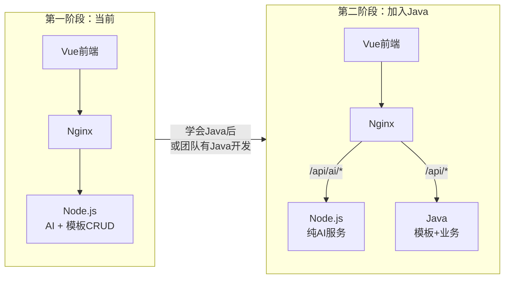
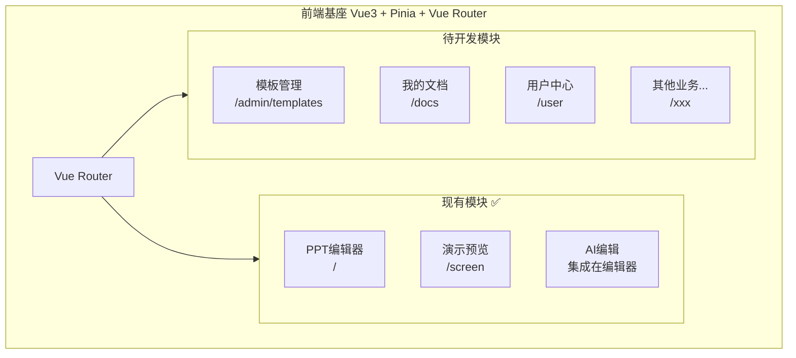
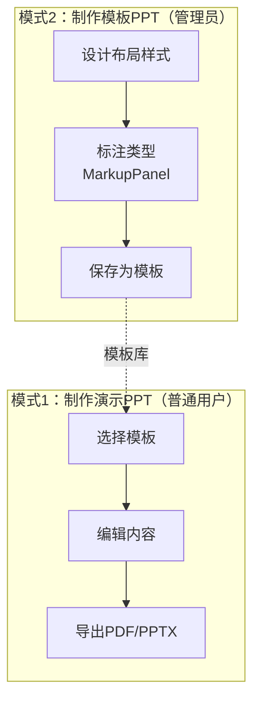
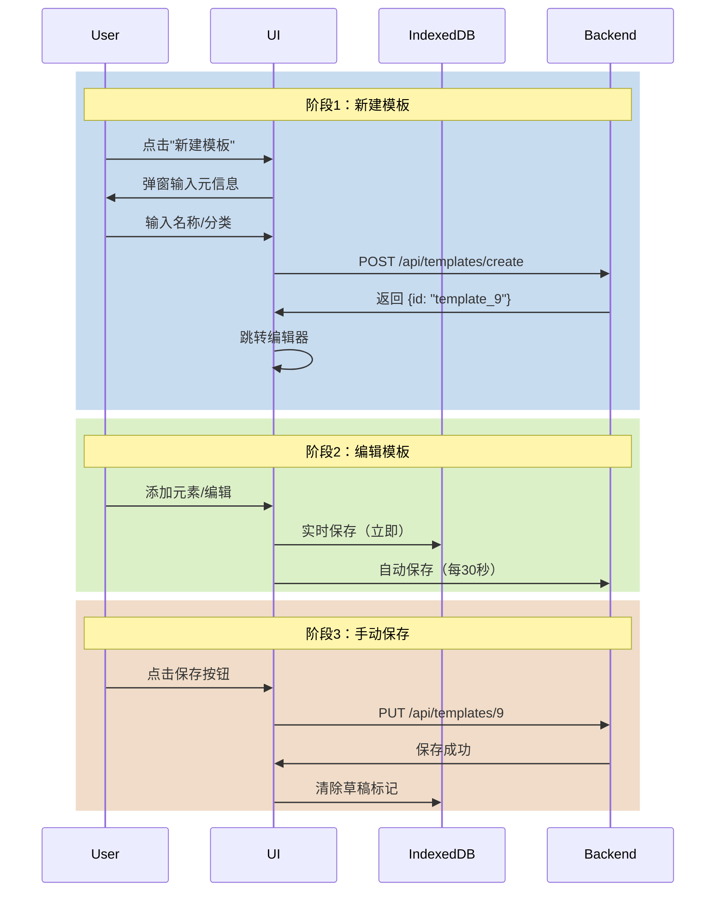
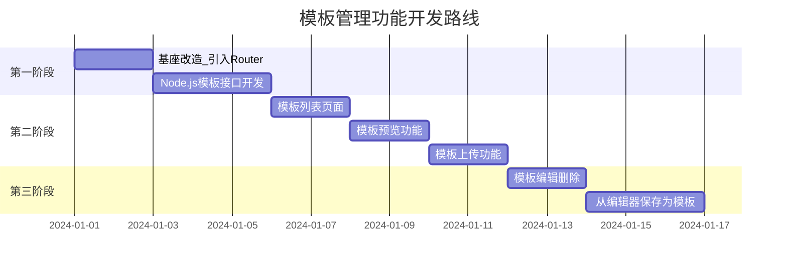
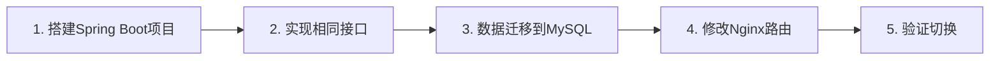

# PPT基座项目整合与模板管理规划

## 一、整体架构设计

### 1.1 目标架构（Nginx网关分发模式）

````mermaid
flowchart TB
    subgraph Frontend["前端 Vue3 + Pinia"]
        Vue["Vue应用<br/>统一访问 /api"]
    end
    
    subgraph Gateway["网关层"]
        Nginx["Nginx<br/>路由分发"]
    end
    
    subgraph Backend["后端服务"]
        Node["Node.js :5001<br/>AI服务 + 模板CRUD"]
        Java["Java :8080<br/>业务服务（待开发）"]
    end
    
    subgraph Storage["数据存储"]
        FileSystem["文件系统<br/>模板JSON + 封面图"]
        MySQL["MySQL<br/>（Java接入后）"]
    end
    
    Vue --> Nginx
    Nginx -->|"/api/ai/*<br/>/api/templates/*"| Node
    Nginx -->|"/api/users/*<br/>/api/docs/*"| Java
    Node --> FileSystem
    Java --> MySQL
    Java -.->|"可选调用AI"| Node
```

### 1.2 架构决策说明

| 决策点 | 选择 | 理由 |

|--------|------|------|

| **网关** | Nginx路由分发 | 前端只知一个地址，便于扩展 |

| **AI服务** | 保留Node.js | 流式响应(SSE)处理更方便 |

| **模板CRUD** | 先Node.js，后迁移Java | 快速验证，你是前端更熟悉JS |

| **AI请求路径** | 前端 → Nginx → Node | 不经过Java转发，避免流式响应复杂度 |

| **数据存储** | 先文件系统，后MySQL | 渐进式升级 |

### 1.3 分阶段演进路线



### 1.4 前端模块规划



### 1.5 核心原则

1. **AI服务不走Java转发** —— 流式响应(SSE)让Node直接处理更简单
2. **先快速验证再迁移** —— 模板CRUD先用Node实现，跑通后再迁Java
3. **接口设计保持一致** —— 迁移时前端只需改Nginx路由配置
4. **职责分离** —— Node专注AI，Java专注业务（未来）

---

## 二、两种PPT制作模式

### 2.1 模式区分

系统支持两种PPT制作模式，需要区分入口和流程：



| 对比项 | 演示PPT | 模板PPT |

|--------|---------|---------|

| 使用者 | 普通用户 | 管理员/设计师 |

| 入口 | `/editor` | `/admin/template-editor` |

| 目的 | 做汇报、展示 | 定义可复用的样式布局 |

| 内容 | 具体业务内容 | 占位文本（如"请输入标题"） |

| 产出 | 导出PDF/PPTX | 保存到模板库 |

| 特殊操作 | 无 | 标注textType/slideType |

### 2.2 现有能力分析

**已有功能（无需开发）**：

| 功能 | 状态 | 位置 |

|------|------|------|

| PPT编辑器 | ✅ | `src/views/Editor/` |

| 类型标注面板 | ✅ | `src/views/Editor/MarkupPanel.vue` |

| TextType定义 | ✅ | `src/types/slides.ts`（20+种文本类型） |

| SlideType定义 | ✅ | `src/types/slides.ts`（10种页面类型） |

| ImageType定义 | ✅ | `src/types/slides.ts`（3种图片类型） |

**需要开发的功能**：

| 功能 | 状态 | 说明 |

|------|------|------|

| 保存为模板 | ❌ | 制作完成后保存到模板库 |

| 模板管理后台 | ✅ | 查看、编辑、删除模板（已完成） |

| 模板编辑器入口 | ✅ | 复用现有Editor，通过URL参数加载模板（已完成） |

---

## 三、模板管理功能设计

### 3.1 功能需求（按优先级排序）

| 功能 | 描述 | 优先级 | 依赖 |

|------|------|--------|------|

| 新建模板 | 确定元信息后创建空模板 | P0 | 后端接口 | ✅ 已完成 |

| 多层保存机制 | 本地缓存+自动保存+手动保存 | P0 | IndexedDB + 后端接口 | ✅ 已完成 |

| 模板列表 | 分页展示所有模板（含草稿） | P0 | 后端接口 | ✅ 已完成 |

| 模板预览 | 查看模板全部页面 | P0 | - |

| 模板编辑元信息 | 修改名称、封面、分类 | P1 | 后端接口 |

| 模板删除 | 删除模板（草稿物理删除，已发布软删除） | P1 | 后端接口 | ✅ 已完成 |

| 模板发布 | 将草稿模板发布为可用模板 | P1 | 后端接口 | ✅ 已完成 |

### 3.2 数据结构设计

#### 模板元信息

```typescript
interface TemplateMetadata {
  id: string              // 模板ID（自增，如template_9）
  name: string            // 显示名称（用户输入）
  cover: string           // 封面图URL
  category: string        // 分类: business/education/creative
  origin: string          // 来源: official/community/user
  status: TemplateStatus  // 状态: draft/published/archived
  slideCount: number      // 页面数量
  createdAt: Date
  updatedAt: Date
  createdBy?: string      // 创建人（可选）
}

type TemplateStatus = 'draft' | 'published' | 'archived'
```

#### 模板完整数据（JSON格式）

```typescript
interface TemplateData {
  title: string           // 模板名称
  width: 1000             // 画布宽度
  height: 562.5           // 画布高度
  theme: SlideTheme       // 主题配置
  slides: Slide[]         // 幻灯片数组（已标注type）
}

// 单个模板文件大小：约150KB（38页）
```

### 3.3 命名规则设计

| 层面 | 负责方 | 格式 | 示例 | 是否可变 |

|------|--------|------|------|----------|

| 显示名称 | 用户输入 | 中文/英文 | "年终汇报" | 可修改 |

| 模板ID | 后端生成 | `template_数字` | `template_9` | 不可变 |

| 文件名 | 自动生成 | `{ID}.json` | `template_9.json` | 不可变 |

**ID生成策略：自增ID（与现有template_1~8保持一致）**

```javascript
function generateTemplateId() {
  const index = getTemplateIndex()
  const maxId = Math.max(0, ...index.map(t => 
    parseInt(t.id.replace('template_', ''))
  ))
  return `template_${maxId + 1}`
}
```

### 3.4 多层保存机制（核心设计）

#### 保存机制对比

| 保存方式 | 触发时机 | 目标 | 速度 | 可靠性 | 用途 |

|----------|----------|------|------|--------|------|

| 本地缓存 | 每次操作 | IndexedDB | 极快 | 中 | 防止意外关闭 |

| 自动保存 | 每30秒 | 后端文件 | 较快 | 高 | 定期备份 |

| 手动保存 | 用户点击 | 后端文件 | 快 | 最高 | 确认保存 |

#### 完整流程



### 3.5 存储方案

#### 文件系统存储结构（Node.js阶段）

```
online-ppt-backend/data/
├── templates/              # 模板JSON文件
│   ├── template_1.json
│   ├── template_9.json     # 新建的模板
│   └── ...
├── covers/                 # 封面图
│   ├── template_1.png
│   ├── template_9.png
│   └── ...
└── template-index.json     # 模板元信息索引
```

**template-index.json 示例：**

```json
[
  {
    "id": "template_9",
    "name": "年终汇报",
    "cover": "/data/covers/template_9.png",
    "category": "business",
    "status": "draft",
    "slideCount": 12,
    "createdAt": "2024-01-01T00:00:00Z",
    "updatedAt": "2024-01-01T10:30:00Z"
  }
]
```

#### 迁移到Java后的设计

| 阶段 | 技术栈 | 存储 | 说明 |

|------|--------|------|------|

| 第一阶段（现在） | Node.js Express | 文件系统 | 快速实现 |

| 第二阶段（未来） | Java Spring Boot | MySQL + 文件 | 元信息入库，JSON存文件 |

**迁移保障**：接口规范保持一致，前端零改动

---

## 四、模板管理具体实现

### 4.1 后端接口设计（Node.js扩展）

在 `online-ppt-backend/src/routes/` 新增 `templates.js`：

| 接口 | 方法 | 路径 | 说明 |

|------|------|------|------|

| 新建模板 | POST | /api/templates/create | 创建空模板，返回ID |

| 获取模板列表 | GET | /api/templates | 分页、筛选（含草稿） |

| 获取模板详情 | GET | /api/templates/:id | 包含完整JSON |

| 更新模板 | PUT | /api/templates/:id | 更新模板内容（自动保存/手动保存） |

| 更新元信息 | PATCH | /api/templates/:id/meta | 修改名称、封面、分类 |

| 发布模板 | POST | /api/templates/:id/publish | 草稿 → 发布 |

| 删除模板 | DELETE | /api/templates/:id | 软删除 |

#### 接口详细设计

**1. POST /api/templates/create - 新建模板**

```typescript
Request: {
  name: string          // 模板名称
  category: string      // 分类
  initialLayout: 'blank' | 'basic'  // 初始布局
}

Response: {
  success: true,
  data: {
    id: "template_9",
    name: "年终汇报",
    status: "draft",
    createdAt: "2024-01-01T00:00:00Z"
  }
}
```

**2. GET /api/templates - 获取模板列表**

```typescript
Query: {
  page?: number         // 页码，默认1
  pageSize?: number     // 每页数量，默认20
  category?: string     // 筛选分类
  status?: 'draft' | 'published'  // 筛选状态
}

Response: {
  success: true,
  data: {
    list: [
      {
        id: "template_9",
        name: "年终汇报",
        cover: "/data/covers/template_9.png",
        category: "business",
        status: "draft",
        slideCount: 12,
        updatedAt: "2024-01-01T10:30:00Z"
      }
    ],
    total: 100,
    page: 1,
    pageSize: 20
  }
}
```

**3. GET /api/templates/:id - 获取模板详情**

```typescript
Response: {
  success: true,
  data: {
    id: "template_9",
    name: "年终汇报",
    category: "business",
    status: "draft",
    templateData: {        // 完整JSON
      title: "年终汇报",
      width: 1000,
      height: 562.5,
      theme: {...},
      slides: [...]
    },
    updatedAt: "2024-01-01T10:30:00Z"
  }
}
```

**4. PUT /api/templates/:id - 更新模板**

```typescript
Request: {
  templateData: {        // 完整JSON
    title: string,
    theme: {...},
    slides: [...]
  },
  cover?: string,        // 封面（base64，手动保存时传）
  autoSave: boolean      // 是否自动保存
}

Response: {
  success: true,
  data: {
    updatedAt: "2024-01-01T10:35:00Z"
  }
}
```

**5. POST /api/templates/:id/publish - 发布模板** ✅ 已实现

```typescript
Response: {
  success: true,
  data: {
    id: "template_9",
    status: "published"
  }
}
```

**实现说明**：

- 后端接口：`online-ppt-backend/src/routes/templates.js`
- 前端调用：`EditorHeader` 中的"发布"按钮
- 流程：先保存模板，再更新状态为 `published`

**6. DELETE /api/templates/:id - 删除模板** ✅ 已实现

```typescript
// 草稿模板：物理删除
Response: {
  success: true,
  data: {
    id: "template_9",
    deleted: true
  }
}

// 已发布模板：软删除（归档）
Response: {
  success: true,
  data: {
    id: "template_9",
    status: "archived"
  }
}
```

**实现说明**：

- 后端逻辑：草稿（draft）物理删除文件，已发布（published）软删除改为归档
- 前端：仅在模板列表页的草稿模板卡片底部显示"删除"按钮
- 删除前弹出确认对话框，删除成功后刷新列表

### 4.2 前端页面设计

在 `online-ppt-web/src/views/` 新增模板管理模块：

```
views/
├── Editor/                  # 现有PPT编辑器
├── Screen/                  # 现有演示模块
├── Admin/                   # 新增：管理后台
│   ├── index.vue                  # 后台布局
│   ├── TemplateList.vue           # 模板列表
│   ├── TemplateEditor.vue         # 模板编辑器（带MarkupPanel）
│   ├── TemplatePreview.vue        # 模板预览
│   └── components/
│       ├── CreateTemplateDialog.vue   # 新建模板对话框
│       └── SaveIndicator.vue          # 保存状态指示器
├── hooks/
│   ├── useTemplateDraft.ts        # 本地缓存Hook
│   ├── useAutoSave.ts             # 自动保存Hook
│   └── useTemplateEditor.ts       # 模板编辑器状态管理
└── ...
```

### 4.3 路由配置

新增 `src/router/index.ts`：

```typescript
import { createRouter, createWebHistory } from 'vue-router'

const routes = [
  {
    path: '/',
    name: 'Editor',
    component: () => import('@/views/Editor/index.vue'),
    meta: { title: 'PPT编辑器' }
  },
  {
    path: '/screen',
    name: 'Screen',
    component: () => import('@/views/Screen/index.vue'),
    meta: { title: '演示模式' }
  },
  {
    path: '/admin',
    component: () => import('@/views/Admin/index.vue'),
    children: [
      {
        path: 'templates',
        name: 'TemplateList',
        component: () => import('@/views/Admin/TemplateList.vue'),
        meta: { title: '模板管理' }
      },
      {
        path: 'template-editor/:id?',
        name: 'TemplateEditor',
        component: () => import('@/views/Admin/TemplateEditor.vue'),
        meta: { title: '模板编辑器' }
      }
    ]
  }
]

export default createRouter({
  history: createWebHistory(),
  routes
})
```

### 4.4 核心功能实现

#### 本地缓存Hook（useTemplateDraft.ts）

```typescript
import { useIndexedDB } from '@/utils/indexedDB'
import { watch } from 'vue'

export function useTemplateDraft(templateId: string) {
  const db = useIndexedDB('template-drafts')
  
  // 保存草稿到本地
  const saveDraft = async (slides: Slide[]) => {
    await db.put({
      id: templateId,
      slides,
      timestamp: Date.now()
    })
  }
  
  // 加载草稿
  const loadDraft = async () => {
    const draft = await db.get(templateId)
    return draft
  }
  
  // 清除草稿
  const clearDraft = async () => {
    await db.delete(templateId)
  }
  
  return { saveDraft, loadDraft, clearDraft }
}
```

#### 自动保存Hook（useAutoSave.ts）✅ 已实现

**实现位置**：`src/hooks/useAutoSave.ts`

**功能说明**：

- 每30秒自动检测是否有未保存变更
- 有变更时自动调用 `PUT /api/templates/:id`（`autoSave: true`）
- 在 `EditorHeader` 中集成，仅在模板编辑模式（`/?templateId=xxx`）下生效
- 监听 `slidesStore.slides` 变化，自动标记为有未保存变更
```typescript
export function useAutoSave(templateId: string | undefined, getTemplateData: () => TemplateData) {
  const saving = ref(false)
  const lastSaveTime = ref<number>(0)
  const hasUnsavedChanges = ref(false)
  
  // 自动保存函数
  const autoSave = async () => {
    if (!templateId || saving.value || !hasUnsavedChanges.value) return
    
    saving.value = true
    try {
      const template = getTemplateData()
      await axios.put(`${SERVER_URL}/templates/${templateId}`, {
        templateData: template,
        autoSave: true,
      })
      lastSaveTime.value = Date.now()
      hasUnsavedChanges.value = false
    } catch (error) {
      console.error('[useAutoSave] 自动保存失败', error)
    } finally {
      saving.value = false
    }
  }
  
  // 启动定时器（30秒）
  const timer = setInterval(autoSave, 30000)
  
  // 标记有变更
  const markAsChanged = () => {
    hasUnsavedChanges.value = true
  }
  
  onUnmounted(() => clearInterval(timer))
  
  return { autoSave, saving, lastSaveTime, hasUnsavedChanges, markAsChanged }
}
```


#### 模板编辑器组件（TemplateEditor.vue）

```vue
<template>
  <div class="template-editor">
    <!-- 顶部工具栏 -->
    <Header>
      <div class="left">
        <Button @click="goBack">← 返回</Button>
        <span class="template-name">{{ templateName }}</span>
      </div>
      
      <div class="center">
        <SaveIndicator 
          :saving="saving"
          :has-unsaved="hasUnsavedChanges"
          :last-save-time="lastSaveTime"
        />
      </div>
      
      <div class="right">
        <Button @click="manualSave" :loading="saving">保存</Button>
        <Button @click="publish" type="primary">发布</Button>
      </div>
    </Header>
    
    <!-- 编辑器主体（复用现有Editor，增强MarkupPanel） -->
    <Editor 
      :mode="'template'"
      :template-id="templateId"
      @change="handleChange"
    />
    
    <!-- MarkupPanel（始终显示） -->
    <MarkupPanel v-if="showMarkupPanel" />
  </div>
</template>

<script setup>
import { useRoute, useRouter } from 'vue-router'
import { useTemplateDraft } from '@/hooks/useTemplateDraft'
import { useAutoSave } from '@/hooks/useAutoSave'

const route = useRoute()
const router = useRouter()
const templateId = route.params.id

// 本地缓存
const { saveDraft, loadDraft, clearDraft } = useTemplateDraft(templateId)

// 自动保存
const { autoSave, saving, lastSaveTime, hasUnsavedChanges, markAsChanged } = 
  useAutoSave(templateId, getTemplateData)

// 监听变化
const handleChange = () => {
  markAsChanged()
  saveDraft(getCurrentSlides())
}

// 手动保存
const manualSave = async () => {
  const template = getTemplateData()
  const cover = await generateCover()
  
  await api.updateTemplate(templateId, {
    templateData: template,
    cover,
    autoSave: false
  })
  
  clearDraft()
  message.success('保存成功')
}

// 页面关闭提示
onBeforeUnload((e) => {
  if (hasUnsavedChanges.value) {
    e.preventDefault()
    e.returnValue = ''
  }
})
</script>
```

---

## 五、基座项目改造要点

### 4.1 引入Vue Router

当前项目是单页面，需要添加路由支持多页面：

1. 安装 `vue-router`
2. 创建路由配置
3. 修改 `App.vue` 为路由出口
4. 现有Editor作为默认路由

### 4.2 服务层抽象

现有 `src/services/templateService.ts` 已做好抽象准备，只需：

1. 添加后端API调用
2. 切换数据源（从本地mock到API）

### 4.3 权限预留

虽然当前不做认证，但结构上预留：

```typescript
// src/utils/auth.ts
export function isAdmin(): boolean {
  // 暂时返回true，后续对接认证
  return true
}
```

---

## 六、实施路线图



---

## 七、关键文件清单

| 文件 | 操作 | 说明 |

|------|------|------|

| `package.json` | 修改 | 添加vue-router依赖 |

| `src/router/index.ts` | 新增 | 路由配置 |

| `src/App.vue` | 修改 | 改为RouterView |

| `src/views/Admin/*` | 新增 | 管理后台页面 |

| `src/services/templateService.ts` | 修改 | 对接后端API |

| `online-ppt-backend/src/routes/templates.js` | 新增 | 模板CRUD接口 |

| `online-ppt-backend/src/services/templateService.js` | 新增 | 模板数据存储 |

---

## 八、后续扩展预留

| 后续需求 | 扩展方式 |

|----------|----------|

| 用户认证 | 添加登录页 + token拦截器 |

| PPT保存 | 新增documents接口 + 我的文档页 |

| 其他模块 | 在Admin下新增路由和页面 |

---

## 九、Java迁移指南（未来）

当你学会Java或团队有Java开发时，按以下步骤迁移：

### 8.1 迁移范围

| 模块 | 迁移到Java | 保留在Node |

|------|------------|------------|

| 模板CRUD | 是 | - |

| 用户认证 | 是 | - |

| PPT保存 | 是 | - |

| AI生成PPT | - | 是（流式响应） |

| AI对话编辑 | - | 是（流式响应） |

| 图片推荐 | - | 是 |

### 8.2 迁移步骤



1. **搭建Spring Boot项目**

    - 创建 `online-ppt-java` 项目
    - 配置MySQL数据源
    - 实现模板CRUD接口（路径保持 `/api/templates/*`）

2. **接口规范保持一致**
```java
// Java接口需与Node.js保持一致
GET    /api/templates          // 获取列表
GET    /api/templates/:id      // 获取详情
POST   /api/templates          // 创建
PUT    /api/templates/:id      // 更新
DELETE /api/templates/:id      // 删除
```

3. **修改Nginx路由**
```nginx
# 修改前（指向Node）
location /api/templates {
    proxy_pass http://node-backend:5001;
}

# 修改后（指向Java）
location /api/templates {
    proxy_pass http://java-backend:8080;
}

# AI接口保持不变
location /api/ai {
    proxy_pass http://node-backend:5001;
}
```


````