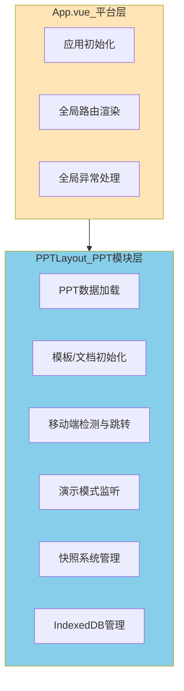

# PPT模块业务逻辑拆分方案

## 一、架构设计

### 1.1 目标架构

将当前单体应用改造为模块化结构，PPT模块作为平台的一个独立业务模块：

```
平台层（App.vue）
  └── PPT模块（/ppt/*）
       ├── PPT布局容器（PPTLayout.vue）- 承载PPT特定逻辑
       ├── 编辑器页面（/ppt/editor）
       ├── 演示页面（/ppt/screen）
       └── 移动端页面（/ppt/mobile）
```

### 1.2 路由结构改造

**改造前**：

```
/ → Editor
/screen → Screen  
/mobile → Mobile
/admin → Admin
```

**改造后**：

```
/ppt → PPTLayout
  ├── /ppt/editor → Editor
  ├── /ppt/screen → Screen
  └── /ppt/mobile → Mobile
/admin → Admin
```

同时保留根路径兼容性：`/` 重定向到 `/ppt/editor`

### 1.3 职责划分



## 二、实施步骤

### 步骤1：创建PPT模块布局组件

**创建文件**：`src/views/PPT/Layout.vue`

**功能职责**：

1. 承载从App.vue迁移过来的所有PPT特定逻辑
2. 作为PPT模块的根容器，渲染子路由（Editor/Screen/Mobile）
3. 处理PPT数据初始化（模板加载、文档加载、默认数据）
4. 监听templateId/documentId变化，动态加载数据
5. 监听screening状态，自动切换演示模式
6. 移动端检测与跳转
7. IndexedDB生命周期管理

**核心代码结构**：

```vue
<template>
  <template v-if="slides.length">
    <RouterView />
  </template>
  <FullscreenSpin v-else loading :mask="false" tip="数据初始化中..." />
</template>

<script setup>
// 1. 数据加载逻辑
const loadSlidesForRoute = async () => { /* 从App.vue迁移 */ }

// 2. 移动端检测（仅在非移动端路由时执行）
onMounted(() => {
  if (!isPC() && !route.path.includes('/mobile')) {
    router.replace('/ppt/mobile')
  }
})

// 3. 监听模板/文档ID变化
watch(() => route.query.templateId, loadSlidesForRoute)
watch(() => route.query.documentId, loadSlidesForRoute)

// 4. 监听演示模式切换
watch(screening, (newVal) => {
  if (newVal && route.path !== '/ppt/screen') {
    router.push('/ppt/screen')
  } else if (!newVal && route.path === '/ppt/screen') {
    router.push('/ppt/editor')
  }
})

// 5. IndexedDB管理
onMounted(() => {
  deleteDiscardedDB()
  snapshotStore.initSnapshotDatabase()
})

beforeUnmount(() => {
  // 记录需要清理的数据库
})
</script>
```

### 步骤2：改造路由配置

**修改文件**：`src/router/index.ts`

**改造内容**：

1. **新增PPT模块嵌套路由**：
```typescript
{
  path: '/ppt',
  component: () => import('@/views/PPT/Layout.vue'),
  children: [
    {
      path: 'editor',
      name: 'Editor',
      component: () => import('@/views/Editor/index.vue'),
      meta: { title: 'PPT编辑器' }
    },
    {
      path: 'screen',
      name: 'Screen',
      component: () => import('@/views/Screen/index.vue'),
      meta: { title: '演示模式' }
    },
    {
      path: 'mobile',
      name: 'Mobile',
      component: () => import('@/views/Mobile/index.vue'),
      meta: { title: '移动端', requireMobile: true }
    }
  ]
}
```

2. **添加根路径重定向**（保持向后兼容）：
```typescript
{
  path: '/',
  redirect: '/ppt/editor'
}
```

3. **保留Admin路由**（不受影响）

4. **可选：添加路由守卫**（移动端检测的补充方案）：
```typescript
router.beforeEach((to, from, next) => {
  // 如果访问需要移动端的路由，但当前是PC端
  if (to.meta.requireMobile && !isMobile()) {
    next('/ppt/editor')
  }
  // 如果访问PC端路由，但当前是移动端
  else if (to.path.includes('/ppt') && !to.path.includes('/mobile') && isMobile()) {
    next('/ppt/mobile')
  }
  else {
    next()
  }
})
```


### 步骤3：精简App.vue

**修改文件**：`src/App.vue`

**保留内容**：

- 基础的RouterView渲染
- 开发环境的beforeunload保护（`window.onbeforeunload = () => false`）
- 可选：全局loading状态（如果未来其他模块也需要）

**移除内容**：

- `loadSlidesForRoute` 函数及相关逻辑
- 所有PPT store的引用（slidesStore、snapshotStore等）
- templateId监听
- screening监听
- 移动端检测逻辑
- IndexedDB相关逻辑（迁移到PPTLayout）

**精简后的代码**：

```vue
<template>
  <RouterView />
</template>

<script lang="ts" setup>
// 仅保留开发环境保护
if (import.meta.env.MODE !== 'development') {
  window.onbeforeunload = () => false
}
</script>

<style lang="scss">
#app {
  height: 100%;
}
</style>
```

### 步骤4：调整相关引用

**可能需要调整的地方**：

1. **路由跳转路径**：

   - 搜索所有 `router.push('/')` 或 `router.replace('/')`
   - 改为 `router.push('/ppt/editor')`

2. **路由判断逻辑**：

   - 搜索所有 `route.path === '/'` 的判断
   - 改为 `route.path.includes('/ppt/editor')` 或使用路由name判断

3. **screening监听**（可能在其他地方也有）：

   - 检查 `useScreening` hook的实现
   - 确保路由切换逻辑与新路由结构一致

**关键文件检查清单**：

- [`src/hooks/useScreening.ts`](src/hooks/useScreening.ts) - 演示模式相关hook
- [`src/views/Editor/EditorHeader/index.vue`](src/views/Editor/EditorHeader/index.vue) - 可能有路由跳转
- [`src/views/Screen/index.vue`](src/views/Screen/index.vue) - 退出演示时的路由跳转
- [`src/views/Mobile/index.vue`](src/views/Mobile/index.vue) - 可能有路由跳转
- [`src/store/screen.ts`](src/store/screen.ts) - 演示状态管理

### 步骤5：测试验证

**测试场景清单**：

1. **基础路由访问**：

   - ✅ 访问 `/` 能否正确重定向到 `/ppt/editor`
   - ✅ 直接访问 `/ppt/editor` 是否正常
   - ✅ 直接访问 `/ppt/screen` 是否正常
   - ✅ 直接访问 `/ppt/mobile` 是否正常

2. **数据加载功能**：

   - ✅ 带templateId参数访问：`/ppt/editor?templateId=xxx`
   - ✅ 带documentId参数访问：`/ppt/editor?documentId=xxx`
   - ✅ 无参数访问，加载默认数据

3. **演示模式切换**：

   - ✅ 点击"演示"按钮，是否跳转到 `/ppt/screen`
   - ✅ 在演示页面按ESC，是否返回 `/ppt/editor`

4. **移动端适配**：

   - ✅ 移动端访问 `/ppt/editor`，是否自动跳转到 `/ppt/mobile`
   - ✅ PC端访问 `/ppt/mobile`，是否保持或跳转

5. **IndexedDB管理**：

   - ✅ 快照功能是否正常
   - ✅ 刷新页面，数据是否正常恢复
   - ✅ 关闭页面，IndexedDB是否正确记录清理

## 三、关键技术点

### 3.1 路由参数传递

PPTLayout需要识别当前是编辑模板还是编辑文档：

```typescript
const loadSlidesForRoute = async () => {
  const templateId = route.query.templateId as string | undefined
  const documentId = route.query.documentId as string | undefined
  
  if (templateId) {
    // 加载模板
  } else if (documentId) {
    // 加载文档
  } else {
    // 加载默认数据
  }
}
```

### 3.2 移动端检测时机

**问题**：移动端检测应该在何时执行？

**方案**：

- **首次进入**：在PPTLayout的`onMounted`中检测
- **路由切换**：通过路由守卫补充检测（可选）
- **检测条件**：仅当不在`/ppt/mobile`路由时才跳转
```typescript
onMounted(() => {
  if (!isPC() && !route.path.includes('/mobile')) {
    router.replace('/ppt/mobile')
  }
})
```


### 3.3 IndexedDB生命周期管理

**当前问题**：IndexedDB清理逻辑在App.vue的`beforeunload`中，迁移后需要注意：

**解决方案**：

1. 在PPTLayout的`onMounted`中初始化快照数据库
2. 在PPTLayout的`beforeUnmount`中记录需要清理的数据库ID
3. 在浏览器`beforeunload`事件中统一清理（保持全局监听）
```typescript
// PPTLayout.vue
onMounted(() => {
  deleteDiscardedDB()
  snapshotStore.initSnapshotDatabase()
})

// 保留在window上的全局监听（可以在PPTLayout中设置）
window.addEventListener('beforeunload', () => {
  const discardedDB = localStorage.getItem(LOCALSTORAGE_KEY_DISCARDED_DB)
  const discardedDBList: string[] = discardedDB ? JSON.parse(discardedDB) : []
  discardedDBList.push(databaseId.value)
  localStorage.setItem(LOCALSTORAGE_KEY_DISCARDED_DB, JSON.stringify(discardedDBList))
})
```


### 3.4 演示模式路由切换

**当前逻辑**：在App.vue中watch `screening`状态，自动切换路由

**迁移后**：在PPTLayout中实现相同逻辑，但路径改为 `/ppt/screen` 和 `/ppt/editor`

```typescript
watch(screening, (newVal) => {
  if (newVal && route.path !== '/ppt/screen') {
    router.push('/ppt/screen')
  } else if (!newVal && route.path === '/ppt/screen') {
    router.push('/ppt/editor')
  }
})
```

## 四、兼容性考虑

### 4.1 外部链接兼容

如果有外部系统链接到旧路由（如 `/?templateId=xxx`），通过重定向保持兼容：

```typescript
// 路由配置中
{
  path: '/',
  redirect: (to) => {
    // 保留query参数
    return {
      path: '/ppt/editor',
      query: to.query
    }
  }
}
```

### 4.2 书签兼容

用户可能收藏了旧路由，同样通过重定向处理。

### 4.3 浏览器历史记录

使用`router.replace`而非`router.push`进行初始重定向，避免历史记录堆积。

## 五、未来扩展路径

### 5.1 新增其他业务模块

当新增其他模块（如客户管理）时：

```typescript
// 路由配置
{
  path: '/crm',
  component: () => import('@/views/CRM/Layout.vue'),
  children: [
    { path: 'customers', component: ... },
    { path: 'contacts', component: ... }
  ]
}
```

### 5.2 抽取公共逻辑

当第二个模块需要移动端检测时：

```typescript
// composables/useMobileDetection.ts
export function useMobileDetection(mobileRoute: string) {
  const router = useRouter()
  const route = useRoute()
  
  onMounted(() => {
    if (!isPC() && !route.path.includes('/mobile')) {
      router.replace(mobileRoute)
    }
  })
}

// 在各模块Layout中使用
useMobileDetection('/ppt/mobile')
```

### 5.3 平台级导航

未来可在平台层添加全局导航：

```vue
<!-- App.vue -->
<template>
  <PlatformHeader v-if="showHeader" />
  <RouterView />
</template>
```

## 六、风险点与注意事项

### 风险1：路由切换逻辑散落各处

**缓解措施**：

- 第3步中仔细搜索所有路由跳转代码
- 使用路由name而非path进行跳转（更稳定）
- 统一使用常量管理路由路径

### 风险2：IndexedDB清理时机错误

**缓解措施**：

- 保持`beforeunload`在全局监听
- 在PPTLayout卸载时只记录，不立即清理
- 测试多次进出PPT模块，确保数据正确

### 风险3：演示模式状态混乱

**缓解措施**：

- 确保screening状态只在PPTLayout生命周期内有效
- 退出PPT模块时重置screening状态
- 测试演示模式下的所有操作

### 风险4：移动端检测死循环

**缓解措施**：

- 检测条件中必须排除`/mobile`路由
- 使用`router.replace`而非`router.push`
- 添加检测标记，避免重复跳转

## 七、实施检查清单

- [ ] 创建 `src/views/PPT/Layout.vue`
- [ ] 从App.vue迁移所有PPT逻辑到Layout.vue
- [ ] 修改 `src/router/index.ts`，添加嵌套路由
- [ ] 添加根路径重定向
- [ ] 精简 `src/App.vue`，移除PPT逻辑
- [ ] 搜索并修改所有路由跳转代码（`/` → `/ppt/editor`）
- [ ] 搜索并修改所有路由判断代码
- [ ] 检查 `useScreening` hook
- [ ] 测试：基础路由访问
- [ ] 测试：模板/文档加载
- [ ] 测试：演示模式切换
- [ ] 测试：移动端适配
- [ ] 测试：IndexedDB管理
- [ ] 检查控制台是否有错误
- [ ] 检查网络请求是否正常
- [ ] 验证快照功能
- [ ] 验证自动保存功能

## 八、回滚方案

如果拆分后出现严重问题，可以快速回滚：

1. 保留原App.vue的备份（App.vue.backup）
2. Git上创建拆分前的分支或tag
3. 回滚步骤：

   - 还原App.vue
   - 还原router/index.ts
   - 删除PPT/Layout.vue
   - 清除浏览器缓存和localStorage

## 九、总结

这次拆分遵循**渐进式重构**原则：

- ✅ 不破坏现有功能
- ✅ 职责更清晰（平台层 vs 业务层）
- ✅ 为未来扩展预留空间
- ✅ 保持向后兼容
- ✅ 降低回滚风险

拆分完成后，代码结构将更符合**单一职责原则**和**开闭原则**，为后续的平台化演进打下坚实基础。