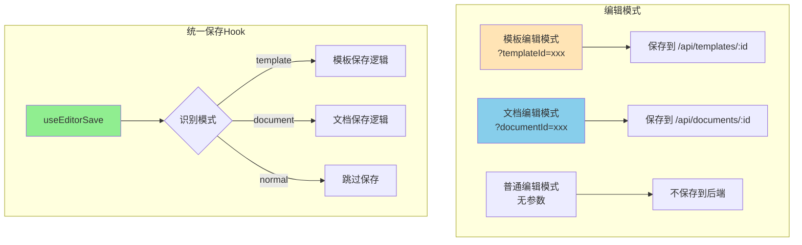
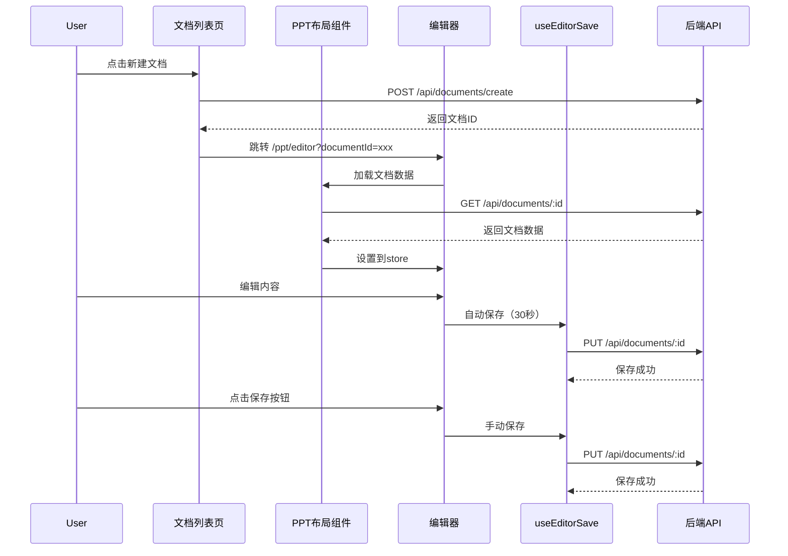

# PPT编辑器保存机制与"我的文档"功能完整方案

## 一、架构设计

### 1.1 核心概念




### 1.2 路由结构

基于当前 `/ppt/*` 路由结构：

- 编辑器路由：`/ppt/editor?templateId=xxx` 或 `/ppt/editor?documentId=xxx`
- 文档列表路由：`/ppt/docs` （新增，在PPT模块下）
- 模板管理路由：`/ppt/admin/templates` （已有）

### 1.3 数据流程




## 二、后端接口设计

### 2.1 文档接口清单

参考 `PPT保存与我的文档设计方案.md` 中的接口设计：| 接口 | 方法 | 路径 | 说明 ||------|------|------|------|| 创建文档 | POST | `/api/documents/create` | 基于空白或已有文档创建 || 获取文档列表 | GET | `/api/documents` | 分页、筛选、排序 || 获取文档详情 | GET | `/api/documents/:id` | 包含完整documentData || 更新文档 | PUT | `/api/documents/:id` | 保存文档内容 || 删除文档 | DELETE | `/api/documents/:id` | 物理删除或软删除 || 复制文档 | POST | `/api/documents/:id/duplicate` | 复制文档 || 重命名文档 | PATCH | `/api/documents/:id/rename` | 修改文档名称 |

### 2.2 接口字段统一

**方案：统一使用 `data` 字段（推荐）**

```typescript
// 模板接口
PUT /api/templates/:id
{
  data: { title, theme, slides },
  autoSave?: boolean
}

// 文档接口
PUT /api/documents/:id
{
  data: { title, theme, slides },
  autoSave?: boolean
}
```

如果后端暂时无法统一，前端兼容两种字段名：

```typescript
{
  templateData: data,  // 模板接口使用
  documentData: data,  // 文档接口使用
}
```


### 2.3 存储结构

```javascript
online-ppt-backend/data/
├── templates/              # 模板文件（已有）
├── documents/              # 文档文件（新增）
├── covers/                 # 封面图（共用）
├── template-index.json     # 模板索引（已有）
└── document-index.json     # 文档索引（新增）
```


## 三、前端实现

### 3.1 统一保存Hook

**创建 `src/hooks/useEditorSave.ts`**核心功能：

1. 通过URL参数自动识别编辑模式（template/document/normal）
2. 统一的保存函数，根据模式调用不同接口
3. 自动保存机制（30秒）
4. 保存状态管理（saving、lastSaveTime、hasUnsavedChanges）

关键代码结构：

```typescript
export function useEditorSave() {
  const route = useRoute()
  const slidesStore = useSlidesStore()
  
  const editMode = computed<'template' | 'document' | 'normal'>(() => {
    if (route.query.templateId) return 'template'
    if (route.query.documentId) return 'document'
    return 'normal'
  })
  
  const currentId = computed(() => {
    return (route.query.templateId || route.query.documentId) as string | undefined
  })
  
  const save = async (autoSave = false) => {
    // 根据 editMode 调用对应接口
    // template -> /api/templates/:id
    // document -> /api/documents/:id
  }
  
  // 自动保存、状态管理等...
}
```


### 3.2 PPTLayout组件扩展

**修改 `src/views/PPT/Layout.vue`**添加文档加载支持：

```typescript
const loadSlidesForRoute = async () => {
  if (!route.path.includes('/ppt/editor')) {
    return
  }

  const templateId = route.query.templateId as string | undefined
  const documentId = route.query.documentId as string | undefined

  // 加载模板
  if (templateId) {
    // ... 现有模板加载逻辑
  }
  
  // 加载文档（新增）
  else if (documentId) {
    try {
      const resp = await fetch(`${SERVER_URL}/documents/${documentId}`)
      if (resp.ok) {
        const json = await resp.json()
        if (json.success && json.data?.documentData) {
          const { documentData } = json.data
          // 设置文档数据到 store
          // 文档模式不打开标注面板
          return
        }
      }
    } catch (error) {
      console.error('[PPTLayout] 加载文档失败:', error)
    }
  }

  // 默认数据加载
  // ...
}
```


### 3.3 EditorHeader集成

**修改 `src/views/Editor/EditorHeader/index.vue`**替换现有的模板保存逻辑为统一保存Hook：

```typescript
import { useEditorSave } from '@/hooks/useEditorSave'

const {
  editMode,
  currentId,
  saving,
  lastSaveTime,
  hasUnsavedChanges,
  save,
} = useEditorSave()

// 手动保存
const handleSave = async () => {
  try {
    await save(false)
    message.success(editMode.value === 'template' ? '模板已保存' : '文档已保存')
  } catch (error: any) {
    message.error(error?.message || '保存失败')
  }
}

// 发布（仅模板模式）
const handlePublish = async () => {
  if (editMode.value !== 'template') return
  // ... 发布逻辑
}

// 返回按钮
const goBack = () => {
  if (editMode.value === 'template') {
    router.push('/ppt/admin/templates')
  } else if (editMode.value === 'document') {
    router.push('/ppt/docs')
  }
}
```

模板显示逻辑：

```vue
<template>
  <!-- 返回按钮 -->
  <div v-if="editMode !== 'normal'" class="back-btn" @click="goBack">
    <span>{{ editMode === 'template' ? '模板管理' : '我的文档' }}</span>
  </div>
  
  <!-- 保存和发布按钮 -->
  <template v-if="editMode !== 'normal'">
    <div class="menu-item" @click="handleSave" :class="{ disabled: saving }">
      {{ saving ? '保存中...' : '💾 保存' }}
    </div>
    <!-- 仅模板模式显示发布按钮 -->
    <div v-if="editMode === 'template'" class="menu-item" @click="handlePublish">
      📢 发布
    </div>
  </template>
</template>
```


### 3.4 文档列表页面

**创建 `src/views/Docs/index.vue`**参考模板列表页的设计，实现文档列表功能：

- 文档卡片网格展示
- 新建文档对话框（空白创建/基于已有文档）
- 筛选、搜索、排序
- 操作：编辑、复制、重命名、删除

**创建 `src/services/documentService.ts`**封装文档相关API调用，类似 `templateService.ts` 的结构：

- `getDocumentList()` - 获取文档列表
- `getDocument(id)` - 获取文档详情
- `createDocument(params)` - 创建文档
- `updateDocument(id, documentData)` - 更新文档
- `deleteDocument(id)` - 删除文档
- `duplicateDocument(id)` - 复制文档
- `renameDocument(id, name)` - 重命名文档

### 3.5 路由配置

**修改 `src/router/index.ts`**添加文档列表路由（在PPT模块下）：

```typescript
{
  path: '/ppt',
  component: () => import('@/views/PPT/Layout.vue'),
  children: [
    {
      path: 'editor',
      name: 'Editor',
      component: () => import('@/views/Editor/index.vue'),
      meta: { title: 'PPT编辑器' }
    },
    // ... 其他路由
    {
      path: 'docs',
      name: 'DocumentList',
      component: () => import('@/views/Docs/index.vue'),
      meta: { title: '我的文档' }
    }
  ]
}
```


## 四、实现步骤

### 阶段一：后端文档接口（2-3天）

1. 创建 `online-ppt-backend/src/routes/documents.js`
2. 实现文档索引管理函数（类似templates的readIndex/writeIndex）
3. 实现CRUD基础接口：

- POST `/api/documents/create`
- GET `/api/documents`
- GET `/api/documents/:id`
- PUT `/api/documents/:id`
- DELETE `/api/documents/:id`

4. 实现扩展接口：

- POST `/api/documents/:id/duplicate`
- PATCH `/api/documents/:id/rename`

### 阶段二：统一保存Hook（1-2天）

1. 创建 `src/hooks/useEditorSave.ts`
2. 实现编辑模式识别逻辑
3. 实现统一保存函数（支持template/document两种模式）
4. 实现自动保存机制（30秒定时器）
5. 实现保存状态管理

### 阶段三：编辑器集成（1-2天）

1. 修改 `src/views/Editor/EditorHeader/index.vue`：

- 替换现有模板保存逻辑为useEditorSave
- 根据editMode显示不同按钮和文字
- 实现返回按钮逻辑（支持template/document两种模式）

2. 修改 `src/views/PPT/Layout.vue`：

- 支持加载文档数据（documentId参数）
- 监听documentId参数变化

3. 移除旧的 `useAutoSave` Hook（如已存在且功能重复）

### 阶段四：文档列表页面（2-3天）

1. 创建 `src/services/documentService.ts`
2. 创建 `src/views/Docs/index.vue`
3. 实现文档列表展示（卡片网格布局）
4. 实现新建文档对话框（空白创建/基于已有文档）
5. 实现筛选、搜索、排序功能
6. 实现文档操作：编辑、复制、重命名、删除
7. 添加路由配置 `/ppt/docs`

### 阶段五：测试与优化（1-2天）

1. 测试模板编辑和保存流程
2. 测试文档创建、编辑、保存流程
3. 测试自动保存功能
4. 测试文档列表的CRUD操作
5. 修复bug和优化体验

## 五、关键设计决策

### 5.1 编辑模式识别

- 通过URL查询参数自动识别：`templateId` -> 模板模式，`documentId` -> 文档模式
- 无需额外配置，代码自动适配

### 5.2 保存逻辑统一

- 模板和文档共用同一套保存Hook，代码复用
- 根据模式自动调用对应接口，用户无感知

### 5.3 文档与模板的关系

- 文档可以基于已有文档创建（复制）
- 文档独立存储，不影响原文档
- 模板在编辑器内作为"插入模板页面"使用，不在文档创建时选择

### 5.4 自动保存策略

- 仅在template/document模式下生效
- 30秒自动保存一次
- 自动保存失败不提示用户，手动保存失败提示

### 5.5 MarkupPanel显示

- 仅在模板编辑模式自动打开
- 文档编辑模式不打开标注面板

## 六、注意事项

1. **路由结构**：所有路由都在 `/ppt/*` 下，保持模块化
2. **向后兼容**：保留现有模板编辑功能不受影响
3. **错误处理**：所有API调用都要有错误处理和用户提示
4. **数据验证**：创建文档时验证必填字段
5. **性能优化**：文档列表支持分页，避免一次性加载过多数据
6. **状态管理**：保存状态要准确反映实际保存情况

## 七、数据结构参考

### DocumentMetadata（文档元信息）

```typescript
interface DocumentMetadata {
  id: string                    // document_1, document_2...
  name: string                  // 文档名称
  cover: string                 // 封面图URL
  sourceDocumentId?: string      // 基于的文档ID（可选）
  category?: string             // 分类
  status: 'draft' | 'published' | 'archived'
  slideCount: number
  fileSize: number
  createdAt: string             // ISO 8601
  updatedAt: string             // ISO 8601
  lastOpenedAt?: string
}
```


### DocumentData（文档完整数据）

```typescript
interface DocumentData {
  title: string
  width: 1000
  height: 562.5
  theme: SlideTheme
  slides: Slide[]
}

```