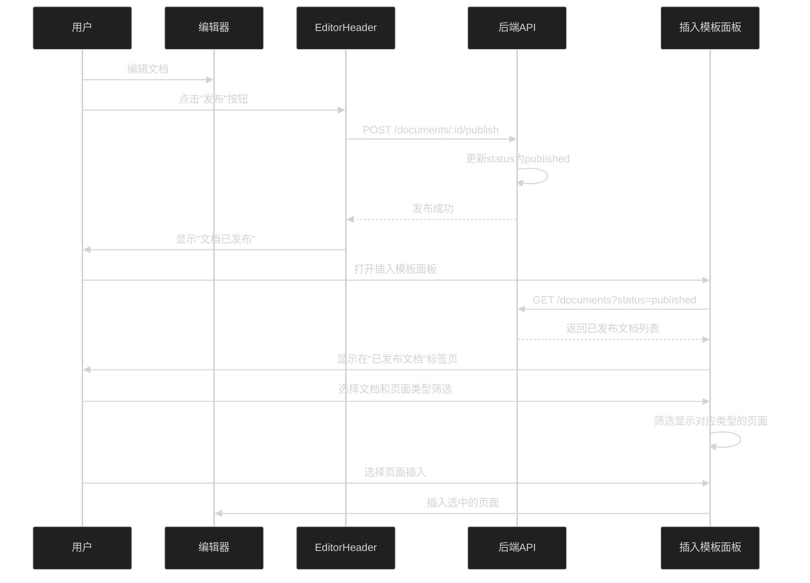

# 文档发布功能与插入面板集成方案

## 一、需求概述

1. **文档发布功能**：文档编辑时可以发布（类似模板发布）
2. **发布时检查**：文档发布**不需要**强制检查页面类型标注（与模板不同）
3. **插入面板集成**：已发布的文档可以在插入模板面板中使用
4. **页面类型筛选**：支持按页面类型筛选，但类型标注为可选（没有类型的页面只在"全部"中显示）

## 二、架构设计

### 2.1 数据流程




### 2.2 插入面板标签页设计

```mermaid
%%{init: {'theme':'dark'}}%%
flowchart TB
    Panel[插入模板面板]
    Tabs[标签页切换]
    Tab1[模板标签页]
    Tab2[已发布文档标签页]
    
    Tab1 --> TemplateList[模板列表<br/>左侧目录]
    Tab1 --> TemplateFilter[页面类型筛选<br/>全部/封面/目录/内容等]
    Tab1 --> TemplateSlides[模板页面列表]
    
    Tab2 --> DocumentList[已发布文档列表<br/>左侧目录]
    Tab2 --> DocumentFilter[页面类型筛选<br/>全部/封面/目录/内容等<br/>没有类型的页面只在全部中显示]
    Tab2 --> DocumentSlides[文档页面列表]
    
    Panel --> Tabs
    Tabs --> Tab1
    Tabs --> Tab2
    
    style Panel fill:#2d3748,stroke:#4299e1
    style Tab1 fill:#2d3748,stroke:#f6ad55
    style Tab2 fill:#2d3748,stroke:#48bb78
```




## 三、后端实现

### 3.1 文档发布接口

**文件**: `online-ppt-backend/src/routes/documents.js`**新增接口**: `POST /documents/:id/publish`

- 功能：将文档状态从 `draft` 改为 `published`
- **不需要**检查页面类型标注（与模板发布不同）
- 更新文档索引中的 status 和 updatedAt
- 返回发布结果

**参考模板发布接口**（但不包含类型检查）：

```javascript
router.post('/:id/publish', (req, res) => {
  // 1. 检查文档是否存在
  // 2. 更新 status 为 'published'
  // 3. 更新 updatedAt
  // 4. 返回成功响应
  // 注意：不需要检查页面类型标注
})
```


### 3.2 获取已发布文档列表

**现有接口**: `GET /documents`需要确保支持按 status 筛选（应该已经支持，但需要确认）

- 支持 `status=published` 参数筛选
- 返回已发布文档的元数据列表

## 四、前端实现

### 4.1 EditorHeader 添加文档发布按钮

**文件**: `online-ppt-web/src/views/Editor/EditorHeader/index.vue`**修改内容**：

- 在文档编辑模式下也显示"发布"按钮（目前只显示在模板模式）
- 发布按钮的点击处理调用文档发布接口
- 发布成功后显示提示消息

**当前代码**（第91-99行）：

```vue
<!-- 仅模板模式显示发布按钮 -->
<div 
  v-if="editMode === 'template'"
  class="menu-item template-btn publish-btn" 
  v-tooltip="'发布模板'" 
  @click="handlePublish" 
  :class="{ disabled: publishing }"
>
  <span class="text">{{ publishing ? '发布中...' : '发布' }}</span>
</div>
```

**修改为**：

```vue
<!-- 模板和文档模式都显示发布按钮 -->
<div 
  v-if="editMode === 'template' || editMode === 'document'"
  class="menu-item template-btn publish-btn" 
  :v-tooltip="editMode === 'template' ? '发布模板' : '发布文档'" 
  @click="handlePublish" 
  :class="{ disabled: publishing }"
>
  <span class="text">{{ publishing ? '发布中...' : '发布' }}</span>
</div>
```

**handlePublish 函数修改**：

```typescript
const handlePublish = async () => {
  // 支持 template 和 document 两种模式
  if ((editMode.value !== 'template' && editMode.value !== 'document') || !currentId.value || publishing.value) return
  
  try {
    publishing.value = true
    // 根据模式调用不同的发布接口
    const url = editMode.value === 'template' 
      ? `${SERVER_URL}/templates/${currentId.value}/publish`
      : `${SERVER_URL}/documents/${currentId.value}/publish`
    
    const resp = await axios.post(url)
    if (!resp?.success) {
      throw new Error(resp?.error || '发布失败')
    }
    
    const modeName = editMode.value === 'template' ? '模板' : '文档'
    message.success(`${modeName}已发布`)
  } catch (error: any) {
    // 错误处理
  } finally {
    publishing.value = false
  }
}
```


### 4.2 文档服务层添加发布接口

**文件**: `online-ppt-web/src/services/documentService.ts`**新增方法**: `publishDocument(id: string)`

```typescript
/**
    * 发布文档
    * 
    * @param id 文档ID
 */
export async function publishDocument(id: string): Promise<{
  success: boolean
  error?: string
}> {
  return axios.post(`${SERVER_URL}/documents/${id}/publish`)
}
```


### 4.3 插入模板面板改造

**文件**: `online-ppt-web/src/views/Editor/Thumbnails/Templates.vue`**主要改造**：

1. **添加标签页切换**：

                                                                                                                                                                                                - "模板"标签页（现有功能）
                                                                                                                                                                                                - "已发布文档"标签页（新增）

2. **加载已发布文档列表**：

                                                                                                                                                                                                - 调用 `getDocumentList({ status: 'published' })` 获取已发布文档
                                                                                                                                                                                                - 在左侧目录区域显示文档列表

3. **页面类型筛选逻辑**：

                                                                                                                                                                                                - 筛选时，如果 `slide.type` 存在且匹配，则显示
                                                                                                                                                                                                - 如果 `slide.type` 不存在或为空，只在 `activeType === 'all'` 时显示

**数据结构**：

```typescript
const activeTab = ref<'template' | 'document'>('template')
const templates = ref<SlideTemplate[]>([])  // 模板列表
const documents = ref<DocumentMetadata[]>([])  // 已发布文档列表
const activeCatalog = ref<string>('')  // 当前选中的模板/文档ID
```

**加载逻辑**：

```typescript
// 加载模板列表（现有）
const loadTemplates = async () => {
  templates.value = await getTemplateList()
  // 过滤出已发布的模板
  templates.value = templates.value.filter(t => t.status === 'published')
}

// 加载已发布文档列表（新增）
const loadDocuments = async () => {
  documents.value = await getDocumentList({ status: 'published' })
}
```

**页面筛选逻辑修改**：

```typescript
// 修改第27行的筛选条件
v-if="(slide.type === activeType || activeType === 'all' || !slide.type) && (activeType === 'all' || slide.type)"
```

更清晰的逻辑：

```typescript
const shouldShowSlide = (slide: Slide) => {
  if (activeType.value === 'all') return true
  if (!slide.type || slide.type === '') return false  // 没有类型的页面只在"全部"中显示
  return slide.type === activeType.value
}
```


### 4.4 changeCatalog 函数改造

**当前逻辑**（第84-95行）：

- 只支持加载模板数据

**改造后**：

```typescript
const changeCatalog = (id: string) => {
  loading.value = true
  activeCatalog.value = id
  
  if (activeTab.value === 'template') {
    // 加载模板数据（现有逻辑）
    api.getMockData(id).then(ret => {
      slides.value = ret.slides
      loading.value = false
      if (listRef.value) listRef.value.scrollTo(0, 0)
    })
  } else if (activeTab.value === 'document') {
    // 加载文档数据（新增）
    getDocument(id).then(ret => {
      slides.value = ret.documentData.slides
      loading.value = false
      if (listRef.value) listRef.value.scrollTo(0, 0)
    })
  }
}
```


## 五、关键实现细节

### 5.1 页面类型筛选规则

- **有类型的页面**：可以在对应类型筛选中显示（如 cover、content 等）
- **无类型的页面**：只在"全部"筛选中显示
- **筛选逻辑**：
  ```typescript
    const shouldShowSlide = (slide: Slide) => {
      if (activeType.value === 'all') return true  // "全部"显示所有页面
      if (!slide.type || slide.type === '') return false  // 无类型的页面不显示在特定类型筛选中
      return slide.type === activeType.value  // 有类型的页面按类型匹配
    }
  ```


### 5.2 标签页切换逻辑

- 切换标签页时，清空当前选中的目录和页面列表
- 切换到"模板"标签页：加载模板列表，默认选中第一个模板
- 切换到"已发布文档"标签页：加载已发布文档列表，默认选中第一个文档

### 5.3 目录区域显示

左侧目录区域根据当前标签页显示不同的内容：

- **模板标签页**：显示模板列表（catalog）
- **已发布文档标签页**：显示已发布文档列表（document）

## 六、实施步骤

### 步骤1：后端文档发布接口

1. 在 `online-ppt-backend/src/routes/documents.js` 中添加 `POST /:id/publish` 接口
2. 实现发布逻辑（更新 status 为 published，不需要检查页面类型）

### 步骤2：前端文档服务层

1. 在 `documentService.ts` 中添加 `publishDocument` 方法

### 步骤3：EditorHeader 发布按钮

1. 修改发布按钮显示条件，支持文档模式
2. 修改 `handlePublish` 函数，支持文档发布

### 步骤4：插入模板面板改造

1. 添加标签页切换 UI
2. 添加加载已发布文档列表的逻辑
3. 改造 `changeCatalog` 函数支持文档数据加载
4. 修改页面筛选逻辑，支持无类型页面只在"全部"中显示

### 步骤5：测试验证

1. 测试文档发布功能
2. 测试已发布文档在插入面板中的显示
3. 测试页面类型筛选功能（包括无类型页面的处理）

## 七、注意事项

1. **页面类型可选**：文档页面类型标注是可选的，插入面板筛选时需要考虑无类型页面的处理
2. **状态一致性**：确保发布后的文档状态正确更新，插入面板能正确筛选出已发布文档
3. **用户体验**：标签页切换要流畅，加载状态要清晰