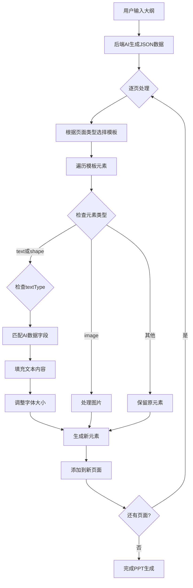
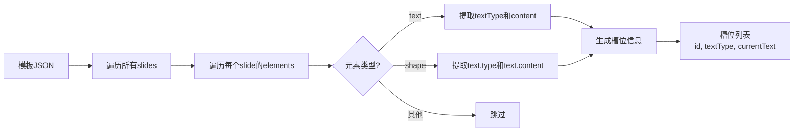
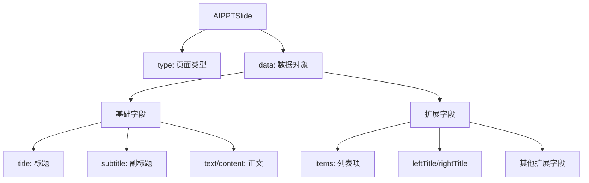
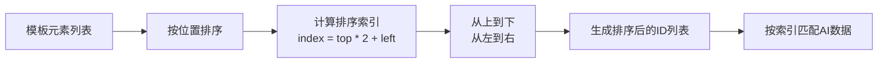
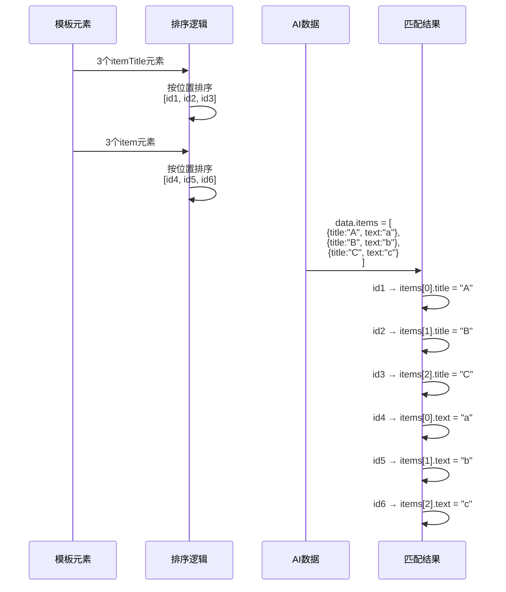
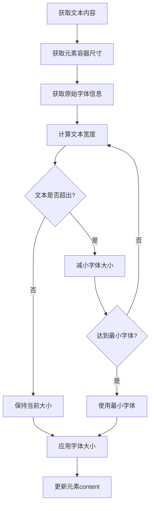
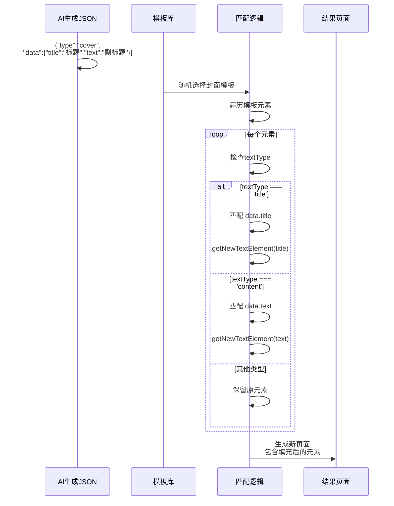

# AI JSON数据与模板插槽融合匹配逻辑

## 整体流程图



## 详细匹配逻辑

### 1. 模板插槽提取（后端）



### 2. AI JSON数据结构



### 3. 核心匹配逻辑（前端 useAIPPT.ts）

```mermaid
flowchart TD
    A[AI JSON数据] --> B{页面类型}
    B -->|cover| C[选择封面模板]
    B -->|content| D[选择内容页模板]
    B -->|transition| E[选择过渡页模板]
    B -->|其他| F[选择对应类型模板]
    
    C --> G[遍历模板元素]
    D --> G
    E --> G
    F --> G
    
    G --> H{元素textType?}
    H -->|title| I[匹配 data.title]
    H -->|subtitle| J[匹配 data.subtitle]
    H -->|content| K[匹配 data.content/text]
    H -->|itemTitle| L[匹配 data.items[].title]
    H -->|item| M[匹配 data.items[].text]
    H -->|itemNumber| N[生成序号]
    H -->|其他| O[匹配扩展类型]
    
    I --> P[getNewTextElement]
    J --> P
    K --> P
    L --> P
    M --> P
    N --> P
    O --> P
    
    P --> Q[调整字体大小适应容器]
    Q --> R[生成新元素]
    R --> S[替换模板元素]
```

## 具体匹配规则表

| 模板textType | AI JSON字段 | 匹配逻辑 | 示例 |
|-------------|------------|---------|------|
| `title` | `data.title` | 直接匹配 | `{"type":"cover","data":{"title":"PPT标题"}}` |
| `subtitle` | `data.subtitle` | 直接匹配（可选） | `{"type":"cover","data":{"subtitle":"副标题"}}` |
| `content` | `data.content` 或 `data.text` | 优先content，回退text | `{"type":"cover","data":{"text":"正文内容"}}` |
| `itemTitle` | `data.items[i].title` | 按位置索引匹配 | `{"type":"content","data":{"items":[{"title":"要点1"}]}}` |
| `item` | `data.items[i].text` | 按位置索引匹配 | `{"type":"content","data":{"items":[{"text":"说明"}]}}` |
| `itemNumber` | 自动生成 | 根据索引生成序号 | `1, 2, 3...` |
| `leftTitle` | `data.leftTitle` | 对比页专用 | `{"type":"comparison","data":{"leftTitle":"方案A"}}` |
| `rightTitle` | `data.rightTitle` | 对比页专用 | `{"type":"comparison","data":{"rightTitle":"方案B"}}` |
| `leftItem` | `data.leftItems[i]` | 对比页专用，按位置匹配 | `{"type":"comparison","data":{"leftItems":["优点1"]}}` |
| `rightItem` | `data.rightItems[i]` | 对比页专用，按位置匹配 | `{"type":"comparison","data":{"rightItems":["优点2"]}}` |
| `timeLabel` | `data.items[i].time` | 时间线页专用 | `{"type":"timeline","data":{"items":[{"time":"2020年"}]}}` |
| `statValue` | `data.items[i].value` | 统计页专用 | `{"type":"statistics","data":{"items":[{"value":"98%"}]}}` |
| `statLabel` | `data.items[i].label` | 统计页专用 | `{"type":"statistics","data":{"items":[{"label":"满意度"}]}}` |
| `quote` | `data.quote` | 引用页专用 | `{"type":"quote","data":{"quote":"名言"}}` |
| `author` | `data.author` | 引用页专用 | `{"type":"quote","data":{"author":"作者"}}` |

## 元素排序与索引匹配

### 排序规则



### 索引匹配示例（content页面）



## 字体自适应逻辑



## 完整示例：封面页匹配流程



## 关键代码逻辑

### 1. 检查元素textType
```typescript
const checkTextType = (el: PPTElement, type: TextType) => {
  return (el.type === 'text' && el.textType === type) || 
         (el.type === 'shape' && el.text && el.text.type === type)
}
```

### 2. 匹配并填充（cover页示例）
```typescript
if (item.type === 'cover') {
  const coverTemplate = coverTemplates[随机选择]
  const elements = coverTemplate.elements.map(el => {
    if (checkTextType(el, 'title') && item.data.title) {
      return getNewTextElement({ el, text: item.data.title, maxLine: 1 })
    }
    if (checkTextType(el, 'content') && item.data.text) {
      return getNewTextElement({ el, text: item.data.text, maxLine: 3 })
    }
    return el  // 不匹配则保留原元素
  })
}
```

### 3. 位置排序（content页items匹配）
```typescript
// 按位置排序：top * 2 + left
const sortedItemIds = template.elements
  .filter(el => checkTextType(el, 'item'))
  .sort((a, b) => {
    const aIndex = a.left + a.top * 2
    const bIndex = b.left + b.top * 2
    return aIndex - bIndex
  })
  .map(el => el.id)

// 按索引匹配
const index = sortedItemIds.findIndex(id => id === el.id)
const contentItem = item.data.items[index]
```

## 总结

1. **模板选择**：根据AI JSON的`type`字段选择对应类型的模板
2. **元素遍历**：遍历模板中的所有元素
3. **类型匹配**：根据元素的`textType`匹配AI JSON中对应的字段
4. **位置排序**：对于列表类元素，按位置排序后按索引匹配
5. **字体自适应**：根据容器大小自动调整字体
6. **元素替换**：用填充后的新元素替换模板元素，生成最终页面

