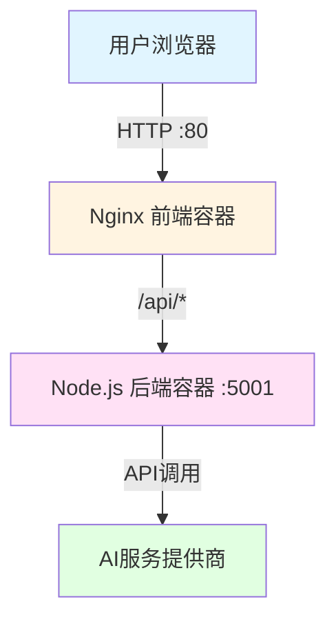

# 🐳 Docker 快速部署指南

## 📦 一键部署

```bash
# 1. 配置环境变量
cp .env.example .env
# 编辑.env文件，填入你的AI API密钥

# 2. 运行部署脚本
./deploy.sh

# 或者手动部署
docker-compose up -d --build
```

## 🎯 部署架构



## 📋 部署步骤详解

### 步骤1: 配置环境变量

创建`.env`文件并配置至少一个AI服务的API密钥：

```bash
# 示例：使用OpenAI
OPENAI_API_KEY=sk-your-api-key-here
```

### 步骤2: 启动服务

```bash
docker-compose up -d
```

### 步骤3: 验证部署

```bash
# 检查服务状态
docker-compose ps

# 检查健康状态
curl http://localhost:5001/health
curl http://localhost/health
```

## 🔧 配置说明

### 端口配置

- **前端**: 80端口 → http://localhost
- **后端**: 5001端口 → http://localhost:5001

### 环境变量

所有AI服务的API密钥都在`.env`文件中配置，支持：
- OpenAI
- 智谱AI
- 豆包
- 通义千问
- DeepSeek
- 月之暗面

## 🚀 常用命令

```bash
# 启动
docker-compose up -d

# 停止
docker-compose down

# 查看日志
docker-compose logs -f

# 重启
docker-compose restart

# 重新构建
docker-compose up -d --build
```

## 📖 详细文档

更多详细信息请查看 [DOCKER_DEPLOY.md](./DOCKER_DEPLOY.md)


