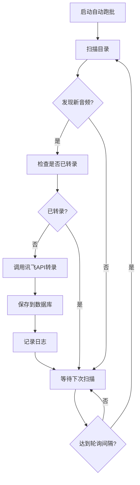

# 音频自动跑批功能使用指南

## ✅ 功能已完成

前后端已全部开发完成，可以立即使用！

---

## 🚀 快速开始

### 1. 打开自动跑批监控页面

```
http://localhost:3000/admin.html
→ 点击左侧导航"自动跑批监控"
```

### 2. 切换到音频跑批Tab

页面顶部有两个Tab：
- **📄 PPT跑批**（原有功能）
- **🎤 音频跑批**（新增功能）✨

点击"🎤 音频跑批"切换到音频转录监控。

---

## ⚙️ 配置步骤

### 第1步：设置扫描目录

在"跑批配置"区域：
1. **扫描目录**：输入音频文件所在目录
   - 示例：`E:/已转录`
   - 支持扫描子目录
   
2. **轮询间隔**：设置自动扫描的时间间隔
   - 默认：5分钟
   - 范围：1-1440分钟（1分钟到24小时）
   
3. **最大并发数**：同时转录的音频文件数量
   - 默认：1个
   - 范围：1-5个
   - 建议：1个（讯飞API有并发限制）

4. 点击"💾 保存配置"

### 第2步：启动自动跑批

点击"▶️ 启动自动转录"按钮。

---

## 📊 监控面板说明

### 控制面板
- **状态指示器**：
  - 🟢 绿色闪烁 = 运行中
  - ⚪ 灰色 = 已停止
  
- **控制按钮**：
  - ▶️ 启动自动转录
  - ⏸️ 停止自动转录
  - 🚀 立即执行一次（手动触发）
  - 🔄 刷新状态

### 统计卡片

| 卡片 | 说明 |
|------|------|
| **总音频文件** | 扫描目录中的音频文件总数 |
| **已转录** | 已完成转录的文件数量 |
| **待转录** | 等待转录的文件数量 |
| **正在处理** | 当前正在转录的文件数量 |
| **上次运行** | 最近一次扫描的时间 |
| **下次运行** | 下一次扫描的预计时间 |
| **总运行次数** | 累计执行的扫描次数 |
| **成功/失败** | 成功和失败的任务数量 |

### 实时日志

显示转录过程的详细日志：
- 🔵 **info**：普通信息（扫描开始、文件发现等）
- 🟢 **success**：成功消息（转录完成）
- 🟡 **warning**：警告信息
- 🔴 **error**：错误信息（转录失败）

---

## 🎯 使用场景

### 场景1：夜间批量转录

**适用**：有大量录音需要转录，不想手动操作

**操作**：
1. 将所有录音文件放到 `E:/待转录/` 目录
2. 配置扫描目录为 `E:/待转录`
3. 设置轮询间隔为 5 分钟
4. 下班前点击"启动自动转录"
5. 第二天上班时，所有文件已转录完成 ✅

### 场景2：实时监控转录

**适用**：销售人员不断上传新录音，需要实时转录

**操作**：
1. 配置扫描目录为共享文件夹（如 `\\server\recordings`）
2. 设置轮询间隔为 1 分钟
3. 启动自动转录
4. 每当有新文件上传，1分钟内自动开始转录 ✅

### 场景3：手动触发转录

**适用**：临时需要转录几个文件

**操作**：
1. 将文件放到扫描目录
2. 点击"🚀 立即执行一次"
3. 无需启动自动跑批，立即开始转录 ✅

---

## 🔍 工作流程



### 详细步骤

1. **扫描阶段**
   - 递归扫描配置的目录
   - 识别支持的音频格式（mp3, wav, m4a等）
   - 统计文件数量

2. **检查阶段**
   - 查询数据库，判断文件是否已转录
   - 过滤掉已转录的文件
   - 生成待处理队列

3. **转录阶段**
   - 按并发数限制处理文件
   - 调用Python脚本（讯飞API）
   - 实时记录日志

4. **保存阶段**
   - 解析转录结果（对话、说话人等）
   - 保存到 `transcriptions` 表
   - 更新统计信息

5. **等待阶段**
   - 等待下一个轮询间隔
   - 自动刷新监控面板

---

## 🐛 常见问题

### Q1: 点击"启动自动转录"后无反应？

**检查**：
1. 是否配置了扫描目录？
2. 扫描目录是否存在？
3. 查看日志是否有错误信息
4. 检查后端服务是否正常运行

### Q2: 统计显示"待转录"为0，但目录里有文件？

**原因**：
- 文件格式不支持（只支持 mp3, wav, m4a, flac, aac, wma, ogg）
- 文件已经转录过（数据库中有记录）
- 文件路径包含特殊字符

**解决**：
- 检查文件扩展名
- 查看"已转录"数量
- 重命名文件，去除特殊字符

### Q3: 转录失败，日志显示错误？

**常见错误**：
1. **讯飞API密钥错误**
   - 检查 `online-ppt-backend/.env` 中的配置
   
2. **Python脚本未找到**
   - 确保 `ai_backend/python/xunfei_transcription.py` 存在
   
3. **音频文件损坏**
   - 尝试用播放器打开文件
   - 重新导出音频文件

### Q4: 如何查看已转录的结果？

**方法1**：在"语音转文本"页面
- 点击左侧导航"语音转文本"
- 查看"转录历史"列表
- 点击记录查看详情

**方法2**：在"目录扫描"Tab
- 切换到"目录扫描"Tab
- 已转录的文件显示"✅ 已转录"
- 点击"查看"按钮查看详情

---

## 📈 性能优化建议

### 1. 并发数设置
- **小文件（<5MB）**：可设置 2-3 个并发
- **大文件（>10MB）**：建议 1 个并发
- **讯飞限制**：免费版有并发限制，建议 1 个

### 2. 轮询间隔
- **实时场景**：1-2 分钟
- **批量场景**：5-10 分钟
- **夜间任务**：10-30 分钟

### 3. 目录组织
```
E:/音频文件/
├── 待转录/          # 扫描目录
│   ├── 2025-01/
│   └── 2025-02/
├── 已转录/          # 手动移动
└── 失败/            # 转录失败的文件
```

---

## 🔐 安全建议

1. **目录权限**：确保Node.js进程有读取权限
2. **API密钥**：不要在前端暴露讯飞API密钥
3. **文件大小**：限制单个文件不超过500MB
4. **并发控制**：避免过高并发导致API限流

---

## 📞 技术支持

### 日志位置
- **前端日志**：浏览器控制台（F12）
- **后端日志**：Node.js终端输出
- **转录日志**：监控页面的"转录日志"区域

### 调试模式
```bash
# 启动服务器时查看详细日志
cd E:\dev-chat-ppt\ai_backend
node server/app.js

# 测试音频跑批API
curl http://localhost:3000/api/auto-process/audio/status
```

---

## 🎉 功能特点

✅ **自动化**：无需手动操作，自动扫描和转录  
✅ **实时监控**：可视化面板，实时查看进度  
✅ **智能去重**：自动识别已转录文件，避免重复  
✅ **并发控制**：支持多文件同时转录  
✅ **错误处理**：失败自动记录，便于排查  
✅ **日志追踪**：完整的处理日志，可追溯  
✅ **灵活配置**：轮询间隔、并发数可调整  
✅ **Tab切换**：与PPT跑批统一管理  

---

## 🚀 立即体验

1. 刷新浏览器（`Ctrl+F5`）
2. 打开 `http://localhost:3000/admin.html`
3. 点击"自动跑批监控"
4. 切换到"🎤 音频跑批"Tab
5. 配置扫描目录
6. 点击"启动自动转录"
7. 查看实时日志和统计信息

**享受自动化带来的便利！** 🎉

