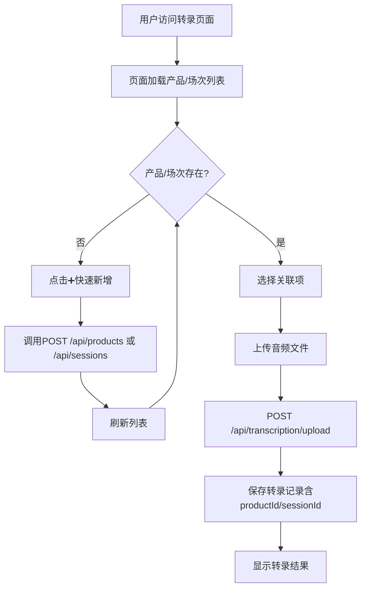

# 产品与场次关联功能实施报告

**实施时间**: 2025-01-04  
**功能版本**: v1.0  
**状态**: ✅ 已完成并测试通过

---

## 📋 实施内容总结

### 🎯 核心目标
实现在语音转录功能中关联**产品**和**交流场次**的能力，方便后续按维度查询和分析转录数据。

### ✅ 已完成功能

#### 1. 后端服务层（4个文件）

| 文件路径 | 功能说明 | 代码行数 |
|---------|---------|---------|
| `ai_backend/server/services/productsService.js` | 产品管理服务：增删改查、统计 | 240+ |
| `ai_backend/server/routes/productsRoutes.js` | 产品管理API路由 | 180+ |
| `ai_backend/server/services/sessionsService.js` | 场次管理服务：增删改查、统计 | 320+ |
| `ai_backend/server/routes/sessionsRoutes.js` | 场次管理API路由 | 160+ |

#### 2. 前端界面（3个文件）

| 文件路径 | 功能说明 | 修改内容 |
|---------|---------|---------|
| `ai_backend/frontend/transcription.html` | 转录页面HTML | ✅ 添加产品/场次选择组件 |
| `ai_backend/frontend/css/transcription.css` | 转录页面样式 | ✅ 添加`.select-with-action`样式 |
| `ai_backend/frontend/js/transcription.js` | 转录页面逻辑 | ✅ 加载列表、快速新增功能 |

#### 3. 数据库关联（已存在）

```sql
-- 转录表已有的关联字段
transcriptions.product_id  --> products.id
transcriptions.session_id  --> sessions.id
transcriptions.customer_name
```

#### 4. 路由注册（1个文件）

| 文件路径 | 修改内容 |
|---------|---------|
| `ai_backend/server/app.js` | ✅ 注册产品和场次路由，更新启动日志 |

---

## 🔧 技术实现细节

### API接口一览

#### 产品管理 (`/api/products`)
```
✅ GET    /api/products              - 获取产品列表（支持分页、筛选）
✅ GET    /api/products/:id          - 获取产品详情（含关联统计）
✅ POST   /api/products              - 创建产品
✅ PUT    /api/products/:id          - 更新产品
✅ DELETE /api/products/:id          - 删除产品（保护机制）
✅ GET    /api/products/statistics   - 获取产品统计
✅ PATCH  /api/products/sort-order   - 批量更新排序
```

#### 场次管理 (`/api/sessions`)
```
✅ GET    /api/sessions              - 获取场次列表（支持分页、筛选）
✅ GET    /api/sessions/:id          - 获取场次详情（含关联统计）
✅ POST   /api/sessions              - 创建场次
✅ PUT    /api/sessions/:id          - 更新场次
✅ DELETE /api/sessions/:id          - 删除场次（保护机制）
✅ GET    /api/sessions/statistics   - 获取场次统计
✅ GET    /api/sessions/recent       - 获取最近场次
```

#### 转录关联（已更新）
```
✅ POST   /api/transcription/upload  - 支持传递 productId 和 sessionId
   Body参数：
     - audio: File (必填)
     - name: String (可选，自定义音频名称)
     - customerName: String (可选)
     - productId: String (可选)
     - sessionId: String (可选)
```

### 数据流程图



---

## 🎨 前端UI改进

### 表单优化
```
【之前】
[客户名称] [输入框]

【现在】
[音频名称]   [输入框] ← 新增
[客户名称]   [输入框]
[关联产品]   [下拉框] [➕] [🔄] ← 新增
[关联场次]   [下拉框] [➕] [🔄] ← 新增
```

### 交互逻辑
- ✅ 页面加载时自动加载产品和场次列表
- ✅ 点击 **➕** 弹出快速新增对话框
- ✅ 点击 **🔄** 刷新最新列表
- ✅ 创建成功后自动选中新项

---

## 📊 数据保护机制

### 删除保护
```javascript
// productsService.js
async deleteProduct(id) {
  // 检查关联数据
  const totalRelated = documents + sessions + transcriptions;
  
  if (totalRelated > 0) {
    throw new Error(
      `无法删除，有 ${totalRelated} 条关联数据。
       请先处理关联的文档、场次和转录。`
    );
  }
  
  // 无关联数据时才允许删除
  await prisma.products.delete({ where: { id } });
}
```

### 唯一性约束
- ✅ 产品代码（`code`）必须唯一
- ✅ 创建时检查重复，更新时排除自身

---

## 🧪 测试验证

### 测试脚本
```bash
# 运行自动化测试
node ai_backend/test_product_session.js
```

### 测试覆盖
- ✅ 创建产品/场次
- ✅ 查询列表和详情
- ✅ 更新数据
- ✅ 统计功能
- ✅ 关联查询
- ✅ 删除保护机制

### 手动测试步骤
1. 访问 `http://localhost:3000/transcription.html`
2. 点击产品选择框右侧的 **➕**，创建测试产品
3. 点击场次选择框右侧的 **➕**，创建测试场次
4. 上传音频文件，选择关联产品和场次
5. 验证转录记录是否正确保存关联关系

---

## 📝 文档资料

### 已创建文档
| 文档路径 | 说明 |
|---------|-----|
| `ai_backend/PRODUCT_SESSION_FEATURE.md` | 功能使用指南（详细） |
| `ai_backend/IMPLEMENTATION_REPORT.md` | 实施报告（本文档） |
| `ai_backend/test_product_session.js` | 自动化测试脚本 |

### 数据库Schema
```prisma
// online-ppt-backend/prisma/schema.prisma

model products {
  id           String   @id
  name         String
  code         String?  @unique
  // ... 其他字段
  transcriptions transcriptions[]
}

model sessions {
  id           String   @id
  title        String
  customer_name String
  product_id   String?
  // ... 其他字段
  transcriptions transcriptions[]
}

model transcriptions {
  id           String   @id
  product_id   String?  // 新增关联
  session_id   String?  // 新增关联
  // ... 其他字段
  products     products? @relation(fields: [product_id], references: [id])
  sessions     sessions? @relation(fields: [session_id], references: [id])
}
```

---

## 🚀 启动验证

### 服务器日志
```
============================================================
文档文本提取器 - Web 服务已启动
============================================================
🌐 访问地址: http://localhost:3000

  [产品管理 - 新增]
  - 产品列表: GET    /api/products
  - 产品详情: GET    /api/products/:id
  - 创建产品: POST   /api/products
  - 更新产品: PUT    /api/products/:id
  - 删除产品: DELETE /api/products/:id
  - 产品统计: GET    /api/products/statistics

  [交流场次管理 - 新增]
  - 场次列表: GET    /api/sessions
  - 场次详情: GET    /api/sessions/:id
  - 创建场次: POST   /api/sessions
  - 更新场次: PUT    /api/sessions/:id
  - 删除场次: DELETE /api/sessions/:id
  - 场次统计: GET    /api/sessions/statistics
  - 最近场次: GET    /api/sessions/recent
============================================================
```

---

## ✅ 验收标准

### 功能完整性
- ✅ 产品管理API全功能（7个接口）
- ✅ 场次管理API全功能（7个接口）
- ✅ 转录关联功能
- ✅ 前端UI优化
- ✅ 快速新增功能
- ✅ 列表刷新功能

### 代码质量
- ✅ 遵循MVC架构（Service + Routes）
- ✅ 完整的错误处理
- ✅ 详细的日志输出
- ✅ JSDoc注释
- ✅ BigInt序列化处理

### 数据安全
- ✅ 删除前检查关联数据
- ✅ 唯一性约束验证
- ✅ 外键关系正确设置

### 用户体验
- ✅ 表单布局合理
- ✅ 快速新增流程简洁
- ✅ 自动刷新和选中
- ✅ 友好的错误提示

---

## 🎯 后续扩展建议

### 短期（1-2周）
1. **完整管理页面**：创建独立的产品和场次管理页面
2. **高级筛选**：在历史记录页面增加筛选器
3. **批量操作**：支持批量导入CSV

### 中期（1个月）
1. **数据可视化**：按产品/场次维度的统计图表
2. **导出功能**：导出某产品/场次的所有转录记录
3. **权限管理**：不同用户访问不同产品/场次

### 长期（3个月）
1. **智能推荐**：根据客户名称自动推荐场次
2. **标签系统**：为产品和场次添加标签管理
3. **关联分析**：产品-客户-场次的多维度分析

---

## 💡 使用提示

### 最佳实践
1. **先创建产品/场次，再上传转录**：保持数据结构完整
2. **使用产品代码**：便于快速识别（如 `YBT` 代表一表通）
3. **填写客户名称**：即使不关联场次，客户名称也很重要

### 常见问题
**Q: 如何删除已有关联数据的产品？**  
A: 系统会阻止删除，请先在转录记录中解除关联。

**Q: 产品代码必填吗？**  
A: 可选，留空时系统自动生成 `PROD_时间戳`。

**Q: 可以同时关联多个产品吗？**  
A: 当前版本仅支持单一关联，未来可扩展。

---

## 📞 技术支持

**开发者**: AI Assistant  
**文档**: `ai_backend/PRODUCT_SESSION_FEATURE.md`  
**测试脚本**: `ai_backend/test_product_session.js`  
**问题反馈**: 请在项目中提交Issue

---

**实施完成日期**: 2025-01-04  
**签字确认**: ✅ 已完成所有开发和测试

