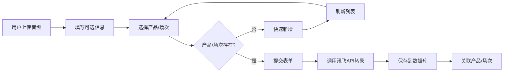

# 产品与场次管理功能使用指南

## 📋 功能概述

在语音转录模块中新增了**产品管理**和**交流场次管理**功能，支持在转录时关联产品和场次，方便后续数据分析和归类。

---

## 🎯 核心功能

### 1️⃣ 产品管理

#### 🌐 API接口
```
GET    /api/products              # 获取产品列表
GET    /api/products/:id          # 获取产品详情
POST   /api/products              # 创建产品
PUT    /api/products/:id          # 更新产品
DELETE /api/products/:id          # 删除产品
GET    /api/products/statistics   # 获取产品统计
```

#### 📊 数据库表: `products`
```sql
id              VARCHAR(50) PK     -- 产品ID
name            VARCHAR(255)       -- 产品名称 *必填
code            VARCHAR(100) UK    -- 产品代码（唯一）
description     TEXT               -- 产品描述
category        VARCHAR(50)        -- 产品分类
tags            JSON               -- 产品标签
icon            VARCHAR(500)       -- 产品图标URL
cover           VARCHAR(500)       -- 产品封面图URL
sort_order      INT                -- 排序字段
is_active       BOOLEAN            -- 是否启用
created_at      DATETIME           -- 创建时间
updated_at      DATETIME           -- 更新时间
```

#### 🔗 关联关系
- `documents` 表：PPT文档可以关联产品
- `sessions` 表：交流场次可以关联主要讨论的产品
- `transcriptions` 表：语音转录可以关联产品

---

### 2️⃣ 交流场次管理

#### 🌐 API接口
```
GET    /api/sessions              # 获取场次列表
GET    /api/sessions/:id          # 获取场次详情
POST   /api/sessions              # 创建场次
PUT    /api/sessions/:id          # 更新场次
DELETE /api/sessions/:id          # 删除场次
GET    /api/sessions/statistics   # 获取场次统计
GET    /api/sessions/recent       # 获取最近场次
```

#### 📊 数据库表: `sessions`
```sql
id              VARCHAR(50) PK     -- 场次ID
title           VARCHAR(255)       -- 会议主题 *必填
customer_name   VARCHAR(255)       -- 客户名称 *必填
session_date    DATETIME           -- 会议时间 *必填
duration        INT                -- 会议时长（分钟）
location        VARCHAR(255)       -- 会议地点
video_url       VARCHAR(500)       -- 视频录像URL
thumbnail       VARCHAR(500)       -- 视频缩略图URL
participants    JSON               -- 参与人员
product_id      VARCHAR(50) FK     -- 主要讨论的产品ID
industry        JSON               -- 行业
status          VARCHAR(20)        -- 状态：draft=草稿，completed=已完成
created_at      DATETIME           -- 创建时间
updated_at      DATETIME           -- 更新时间
created_by      VARCHAR(50)        -- 创建人ID
```

#### 🔗 关联关系
- `products` 表：场次可以关联主要讨论的产品
- `documents` 表：场次可以关联相关文档
- `transcriptions` 表：语音转录可以关联场次
- `session_concerns` 表：场次可以关联客户关心的问题
- `session_needs` 表：场次可以记录客户的潜在需求

---

### 3️⃣ 转录关联功能

在转录页面（`http://localhost:3000/transcription.html`）上传音频时，可以：

#### 表单字段
```
✅ 音频名称         - 自定义名称（可选，留空则使用原文件名）
✅ 客户名称         - 客户名称（可选）
✅ 关联产品         - 从下拉列表选择或快速新增
✅ 关联场次         - 从下拉列表选择或快速新增
```

#### 快速新增功能
- **➕ 快速新增产品**：点击产品选择框右侧的 ➕ 按钮，输入产品名称和代码即可创建
- **➕ 快速新增场次**：点击场次选择框右侧的 ➕ 按钮，输入会议主题、客户名称和日期即可创建
- **🔄 刷新列表**：点击 🔄 按钮可重新加载最新数据

---

## 🎨 前端界面改进

### 表单布局
```html
<div class="form-group">
  <label>关联产品</label>
  <div class="select-with-action">
    <select id="productSelect">
      <option value="">-- 无关联（可选）--</option>
      <!-- 动态加载产品列表 -->
    </select>
    <button class="btn-icon" title="快速新增产品">➕</button>
    <button class="btn-icon" title="刷新产品列表">🔄</button>
  </div>
</div>
```

### CSS样式
- `.select-with-action`：Flex布局，下拉框 + 按钮组合
- `.btn-icon`：图标按钮，Hover时高亮显示

---

## 📦 数据流程

### 转录上传流程


### 数据库存储
```javascript
transcriptions {
  id: "uuid",
  name: "客户沟通录音",           // 用户自定义或原文件名
  customer_name: "XX银行",       // 客户名称
  product_id: "product_123",     // 关联产品ID
  session_id: "session_456",     // 关联场次ID
  dialogues: [...],              // 对话内容
  status: "completed"
}
```

---

## 🔍 查询功能

### 产品维度查询
```javascript
GET /api/products/:id
// 返回产品信息及关联的统计
{
  id: "product_123",
  name: "一表通",
  _count: {
    documents: 15,        // 关联文档数
    sessions: 8,          // 关联场次数
    transcriptions: 12    // 关联转录数
  }
}
```

### 场次维度查询
```javascript
GET /api/sessions/:id
// 返回场次信息及关联数据
{
  id: "session_456",
  title: "XX银行产品交流会",
  customer_name: "XX银行",
  products: { name: "一表通" },
  _count: {
    documents: 3,         // 关联文档数
    transcriptions: 2     // 关联转录数
  }
}
```

### 转录历史筛选
```javascript
GET /api/transcription?productId=xxx&sessionId=yyy
// 支持按产品、场次筛选转录记录
```

---

## ⚠️ 注意事项

### 1. 数据完整性
- 产品和场次关联为**可选字段**（外键可为NULL）
- 删除产品/场次前，系统会检查是否有关联数据，有则禁止删除
- 建议先处理关联数据，再删除产品/场次

### 2. 快速新增限制
- 快速新增功能仅支持必填字段
- 如需填写更多信息（如描述、标签等），请使用完整的管理页面

### 3. 产品代码唯一性
- 产品代码（`code`）必须唯一
- 快速新增时，如果未填写代码，系统会自动生成 `PROD_时间戳`

---

## 🚀 使用建议

### 场景1：客户交流会议
1. 创建场次：`XX银行产品交流会 - 2025-01-04`
2. 上传会议录音，关联该场次
3. 后续可在场次详情页查看所有相关资料

### 场景2：产品介绍录音
1. 创建产品：`一表通`
2. 上传产品介绍录音，关联该产品
3. 后续可按产品查询所有转录记录

### 场景3：数据分析
```sql
-- 查询某产品的所有转录记录
SELECT * FROM transcriptions WHERE product_id = 'xxx';

-- 查询某客户的所有场次
SELECT * FROM sessions WHERE customer_name = 'XX银行';

-- 统计各产品的转录数量
SELECT product_id, COUNT(*) FROM transcriptions GROUP BY product_id;
```

---

## 📝 API调用示例

### 创建产品
```javascript
POST /api/products
{
  "name": "一表通",
  "code": "YBT",
  "category": "监管",
  "isActive": true
}
```

### 创建场次
```javascript
POST /api/sessions
{
  "title": "XX银行产品交流会",
  "customerName": "XX银行",
  "sessionDate": "2025-01-04T10:00:00Z",
  "productId": "product_123",
  "duration": 120
}
```

### 上传转录（关联产品和场次）
```javascript
POST /api/transcription/upload
FormData:
  audio: [音频文件]
  name: "客户沟通录音"
  customerName: "XX银行"
  productId: "product_123"
  sessionId: "session_456"
```

---

## 📊 实施效果

✅ **已完成**
- 产品管理Service + API
- 场次管理Service + API
- 转录页面UI改进
- 前端加载产品/场次列表
- 快速新增功能
- 关联关系存储

✅ **已支持**
- 关联查询（产品→转录、场次→转录）
- 统计功能（各维度的数据汇总）
- 级联删除保护（有关联数据时禁止删除）

---

## 🎯 后续扩展建议

1. **完整管理页面**：为产品和场次创建独立的管理页面（增删改查）
2. **批量操作**：支持批量导入产品/场次
3. **高级筛选**：在历史记录页面增加产品、场次筛选器
4. **数据可视化**：按产品/场次维度展示转录统计图表
5. **导出功能**：支持导出某产品/场次的所有转录记录

---

**更新时间**: 2025-01-04  
**版本**: v1.0

