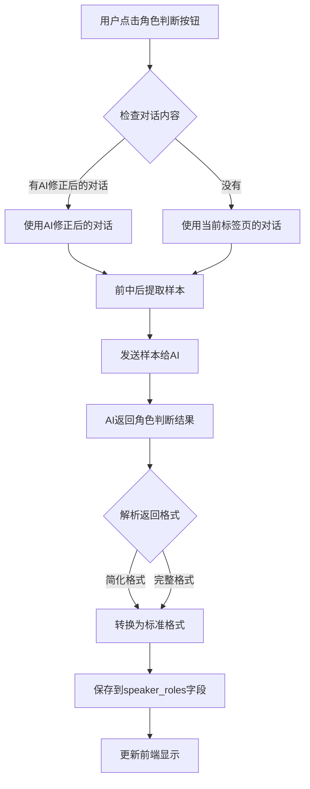

# 角色判断功能开发完成总结

## 📋 问题描述

1. **角色判断按钮点击没反应** - 需要修复前端点击事件
2. **新增提示词时场景类型没有"角色判断"** - 需要添加 `role_judgment` 场景类型
3. **角色判断逻辑优化** - 需要改为前中后提取样本，支持简化的JSON格式

## ✅ 已完成的功能

### 1. 添加场景类型支持

#### 后端修改
- **文件**: `ai_backend/server/routes/admin/systemSettingsRoutes.js`
- **修改内容**: 在场景类型列表中添加 `role_judgment` 和 `transcription_correction` 场景类型

```javascript
{
  code: 'transcription_correction',
  name: '语音转录纠错',
  description: '语音转录后的文本纠错和修正',
  icon: 'edit',
},
{
  code: 'role_judgment',
  name: '角色判断',
  description: '对话中说话人角色判断（客户方/我方）',
  icon: 'user',
}
```

#### 前端修改
- **文件**: `ai_backend/frontend/pages/prompt-templates.html`
  - 在提示词管理页面的场景类型选择框中添加 `role_judgment` 选项
  - 在场景筛选Tab中添加 `role_judgment` 标签页

- **文件**: `ai_backend/frontend/pages/model-config.html`
  - 在模型配置页面的场景类型选择框中添加 `role_judgment` 选项

### 2. 优化角色判断逻辑（前中后提取样本）

#### 修改内容
- **文件**: `ai_backend/server/services/transcriptionAiService.js`
- **方法**: `judgeRoles()`

**策略变更**:
- **之前**: 按4000字符分批处理所有对话
- **现在**: 如果对话数量 > 100条，则使用前中后提取样本策略

**实现逻辑**:
```javascript
// 前中后各提取15%的样本
const SAMPLE_RATIO = 0.15;
const frontSamples = dialogues.slice(0, frontCount);          // 前部
const middleSamples = dialogues.slice(middleStart, middleEnd); // 中部
const backSamples = dialogues.slice(totalDialogues - backCount); // 后部
```

**优势**:
- ✅ 减少AI调用成本（只发送样本，而不是全部对话）
- ✅ 提高处理速度（样本数量远小于全部对话）
- ✅ 保持判断准确性（前中后样本能够代表整体对话特征）

### 3. 支持简化的JSON返回格式

#### 修改内容
- **文件**: `ai_backend/server/services/transcriptionAiService.js`
- **方法**: `parseRoleJudgmentResponse()`, `validateRoleJudgmentResult()`

**支持的格式**:
1. **简化格式**（用户需求）:
   ```json
   {
     "SPEAKER_1": "客户方",
     "SPEAKER_2": "我方"
   }
   ```

2. **完整格式**（向后兼容）:
   ```json
   {
     "speakerRoles": {
       "SPEAKER_1": "customer",
       "SPEAKER_2": "our_side"
     }
   }
   ```

**角色名称映射**:
- `"客户方"` / `"客户"` → `"customer"`
- `"我方"` / `"我方/供应商"` / `"供应商"` → `"our_side"`
- `"未知"` → `"unknown"`

### 4. 更新角色判断提示词

#### 修改内容
- **文件**: `ai_backend/server/services/transcriptionAiService.js`
- **方法**: `getDefaultRoleJudgmentPrompt()`

**更新要点**:
- ✅ 明确输出格式要求：只输出JSON对象，不要任何解释文字
- ✅ 简化角色分类：只支持"客户方"和"我方"
- ✅ 强调一级规则优先：如果特征不明显，优先根据一级规则判断
- ✅ 明确判断原则：基于所有对话内容进行整体判断

**输出格式要求**:
```
格式：{"SPEAKER_1": "客户方", "SPEAKER_2": "我方", ...}
只输出JSON对象，不要任何解释文字
```

### 5. 修复前端角色判断按钮问题

#### 修改内容
- **文件**: `ai_backend/frontend/js/pages/transcription.js`
- **方法**: `startRoleJudgment()`

**修复内容**:
- ✅ 优先使用AI修正后的对话（符合用户需求）
- ✅ 如果没有AI修正后的对话，则使用当前标签页的对话
- ✅ 改进错误处理：添加HTTP状态码检查
- ✅ 改进用户体验：显示使用的对话来源提示

**逻辑流程**:
```javascript
1. 检查是否有AI修正后的对话 (st_correctedDialogues)
   - 如果有 → 使用AI修正后的对话
   - 如果没有 → 根据当前标签页选择对话

2. 调用后端API进行角色判断

3. 更新角色设置 (st_speakerRoles)

4. 重新渲染对话列表以显示角色标签
```

## 📊 数据流程



## 🎯 使用说明

### 1. 创建角色判断提示词

1. 进入 **提示词管理** 页面
2. 点击 **新增提示词** 按钮
3. 选择场景类型：**角色判断**
4. 填写提示词内容（可以使用默认模板）
5. 保存并启用

### 2. 配置角色判断模型

1. 进入 **模型配置** 页面
2. 点击 **新增模型** 按钮
3. 选择场景类型：**角色判断**
4. 配置模型参数
5. 设为默认模型

### 3. 使用角色判断功能

1. 在 **语音转文本** 页面加载转录记录
2. 完成 **AI错别字修正**（可选，但推荐）
3. 点击 **👥 角色判断** 按钮
4. 系统自动使用AI修正后的对话进行角色判断
5. 等待AI分析完成
6. 查看角色判断结果（说话人后面会显示角色标签）

## 📝 技术细节

### 前中后样本提取算法

```javascript
// 样本提取比例
const SAMPLE_RATIO = 0.15; // 前中后各15%

// 计算提取数量
const frontCount = Math.floor(totalDialogues * SAMPLE_RATIO);
const middleStart = Math.floor(totalDialogues / 2) - Math.floor(totalDialogues * SAMPLE_RATIO / 2);
const middleEnd = middleStart + Math.floor(totalDialogues * SAMPLE_RATIO);
const backCount = Math.floor(totalDialogues * SAMPLE_RATIO);

// 提取样本
const frontSamples = dialogues.slice(0, frontCount);
const middleSamples = dialogues.slice(middleStart, middleEnd);
const backSamples = dialogues.slice(totalDialogues - backCount);
```

### 角色值标准化

```javascript
const roleMapping = {
  '客户方': 'customer',
  '客户': 'customer',
  'customer': 'customer',
  '我方': 'our_side',
  '我方/供应商': 'our_side',
  '供应商': 'our_side',
  'our_side': 'our_side',
  '未知': 'unknown',
  'unknown': 'unknown'
};
```

## ⚠️ 注意事项

1. **优先使用AI修正后的对话**: 角色判断功能会自动优先使用AI修正后的对话，如果没有则使用当前标签页的对话
2. **样本提取策略**: 如果对话数量 > 100条，系统会自动使用前中后提取样本策略
3. **角色值存储**: 最终存储到数据库的格式为：`{"SPEAKER_1": "customer", "SPEAKER_2": "our_side"}`
4. **提示词要求**: AI返回格式必须严格遵循JSON格式，只输出JSON对象，不要任何解释文字

## 🔄 后续优化建议

1. **样本提取策略优化**: 可以根据对话特征（说话人切换频率、对话长度等）动态调整样本提取策略
2. **置信度评估**: 可以在提示词中添加置信度评估要求，帮助用户了解判断的可靠性
3. **批量处理优化**: 如果需要处理大量转录记录，可以考虑添加批量角色判断功能
4. **角色判断历史**: 可以记录角色判断的历史记录，方便回溯和对比

## ✅ 测试检查清单

- [x] 场景类型已添加到系统设置
- [x] 场景类型已添加到提示词管理页面
- [x] 场景类型已添加到模型配置页面
- [x] 角色判断逻辑改为前中后提取样本
- [x] AI返回格式解析支持简化格式
- [x] 角色名称映射正确（客户方→customer，我方→our_side）
- [x] 提示词已更新，明确输出格式要求
- [x] 前端按钮点击功能正常
- [x] 优先使用AI修正后的对话
- [x] 错误处理完善

---

**完成时间**: 2026-01-08  
**开发状态**: ✅ 已完成，待测试

