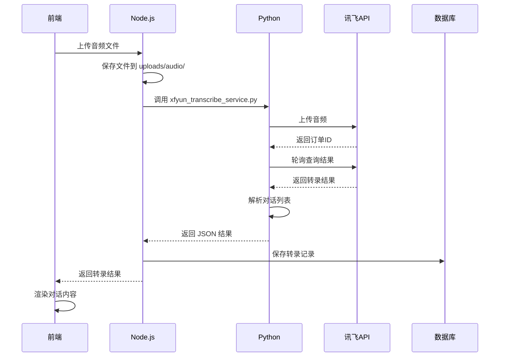

# 语音转文本功能使用文档

## 📋 功能概述

基于讯飞语音识别API实现的语音转文本功能，支持：
- ✅ 多种音频格式（MP3, WAV, M4A, FLAC, AAC, WMA, OGG）
- ✅ 多说话人角色自动分离
- ✅ 时间戳标注
- ✅ 完整对话记录存储
- ✅ 历史记录管理

---

## 🚀 快速开始

### 1. 启动服务

```bash
cd e:\dev-chat-ppt\ai_backend
node server/app.js
```

访问地址：`http://localhost:3000/transcription.html`

### 2. 上传音频

1. 点击"选择文件"或拖拽音频文件到上传区域
2. 可选：填写客户名称、关联场次、关联产品
3. 点击"开始转录"
4. 等待转录完成（时长取决于音频长度和服务器负载）

### 3. 查看结果

- **对话内容**：按时间顺序显示，带说话人标识
- **统计信息**：说话人数、对话数量、音频时长
- **复制/下载**：支持一键复制或下载TXT文件

---

## 📁 文件结构

```
ai_backend/
├── xfyun_transcribe_service.py    # Python 转录服务（封装讯飞API调用）
├── 转录音频.py                     # 原始转录脚本（已被复用）
├── server/
│   ├── services/
│   │   └── transcriptionService.js  # Node.js 转录服务层
│   └── routes/
│       └── transcriptionRoutes.js   # 转录路由
├── frontend/
│   ├── transcription.html           # 转录页面
│   ├── js/
│   │   └── transcription.js         # 前端逻辑
│   └── css/
│       └── transcription.css        # 样式
└── uploads/
    └── audio/                        # 音频文件存储目录
```

---

## 🔌 API 接口

### 1. 上传并转录

**接口**: `POST /api/transcription/upload`

**请求**:
- Content-Type: `multipart/form-data`
- Body:
  - `audio` (File, 必填): 音频文件
  - `customerName` (String, 可选): 客户名称
  - `sessionId` (String, 可选): 关联场次ID
  - `productId` (String, 可选): 关联产品ID

**响应**:
```json
{
  "success": true,
  "message": "转录成功",
  "data": {
    "id": "uuid",
    "name": "音频文件名",
    "dialogues": [
      {
        "timeRange": "00:00-00:05",
        "speaker": "SPEAKER_1",
        "text": "对话内容"
      }
    ],
    "speakerCount": 2,
    "duration": 180
  }
}
```

### 2. 获取转录列表

**接口**: `GET /api/transcription?page=1&pageSize=20`

**参数**:
- `page` (Number, 可选): 页码，默认1
- `pageSize` (Number, 可选): 每页数量，默认20
- `status` (String, 可选): 状态筛选
- `customerName` (String, 可选): 客户名称筛选

### 3. 获取转录详情

**接口**: `GET /api/transcription/:id`

### 4. 更新转录记录

**接口**: `PUT /api/transcription/:id`

**Body**:
```json
{
  "name": "新名称",
  "customerName": "客户名称",
  "sessionId": "场次ID",
  "productId": "产品ID"
}
```

### 5. 删除转录记录

**接口**: `DELETE /api/transcription/:id`

---

## 💾 数据库表结构

### `transcriptions` 表

| 字段名 | 类型 | 说明 |
|-------|------|------|
| id | VARCHAR(50) | 主键ID |
| name | VARCHAR(255) | 音频文件名称（可编辑） |
| original_file_name | VARCHAR(255) | 原始文件名 |
| audio_file_path | VARCHAR(500) | 音频文件存储路径 |
| audio_file_size | BIGINT | 文件大小（字节） |
| audio_format | VARCHAR(20) | 音频格式 |
| audio_duration | INT | 时长（秒） |
| result_file_path | VARCHAR(500) | 转录结果文件路径 |
| dialogues | TEXT | 对话列表（JSON） |
| full_text | TEXT | 完整文本（用于搜索） |
| speaker_count | INT | 说话人数量 |
| session_id | VARCHAR(50) | 关联场次ID |
| product_id | VARCHAR(50) | 关联产品ID |
| customer_name | VARCHAR(255) | 客户名称 |
| status | VARCHAR(20) | 状态 |
| created_at | DATETIME | 创建时间 |
| updated_at | DATETIME | 更新时间 |
| completed_at | DATETIME | 完成时间 |

---

## ⚙️ 配置说明

### 讯飞 API 凭证

在 `转录音频.py` 中配置（已填写）：
```python
APP_ID = "30fb0f0d"
API_KEY = "8a96101efefbab3880e7e491b78139de"
API_SECRET = "704fdea92fb9c8cec33d9f5705a06b69"
```

### Python 路径配置

如果 Python 不在系统 PATH 中，在 `transcriptionService.js` 中指定：
```javascript
this.pythonPath = 'C:\\Python\\python.exe';  // 修改为实际路径
```

或设置环境变量：
```bash
set PYTHON_PATH=C:\Python\python.exe
```

---

## 📝 转录流程



---

## 🐛 常见问题

### 1. 转录失败：Python 进程无法启动

**原因**: Python 未安装或不在 PATH 中

**解决**:
```bash
# 检查 Python
python --version

# 如果未安装，下载安装 Python 3.7+
# 或在 transcriptionService.js 中指定完整路径
```

### 2. 转录时间过长

**原因**: 讯飞服务器繁忙或音频文件过大

**说明**: 
- 音频时长与转录时间参考表（见讯飞文档）
- 5小时音频最长可能需要20分钟
- 建议上传5分钟以上的音频

### 3. 数据库连接失败

**原因**: Prisma Client 未生成或数据库配置错误

**解决**:
```bash
cd e:\dev-chat-ppt\online-ppt-backend
npx prisma generate
npx prisma db push
```

### 4. 音频格式不支持

**支持格式**: MP3, WAV, M4A, FLAC, AAC, WMA, OGG

**不支持**: AMR, APE 等格式，需先转换

---

## 🎯 下一步优化

1. **异步队列**: 使用 Bull 实现后台任务队列
2. **回调机制**: 改为讯飞回调API，避免轮询
3. **进度推送**: 使用 SSE 或 WebSocket 推送实时进度
4. **音频预览**: 添加音频播放器，支持边听边看
5. **批量转录**: 支持一次上传多个音频文件
6. **导出格式**: 支持导出 Word、PDF、SRT 字幕格式

---

## 📞 技术支持

- 讯飞API文档: https://www.xfyun.cn/doc/asr/ifasr_new/API.html
- 项目代码: `e:\dev-chat-ppt\ai_backend`
- 联系开发者: [你的联系方式]

---

**祝使用愉快！🎉**

