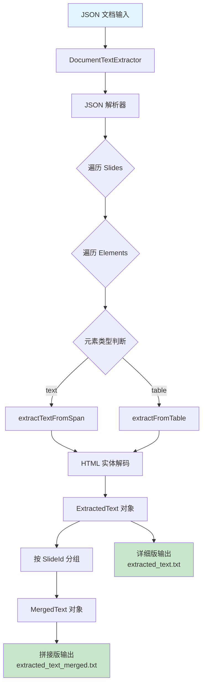
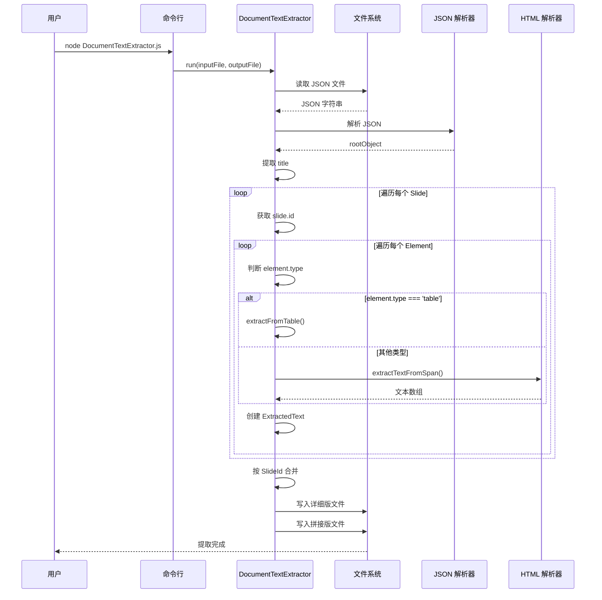
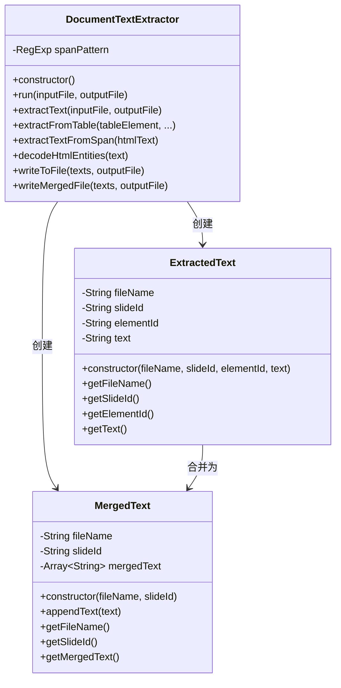
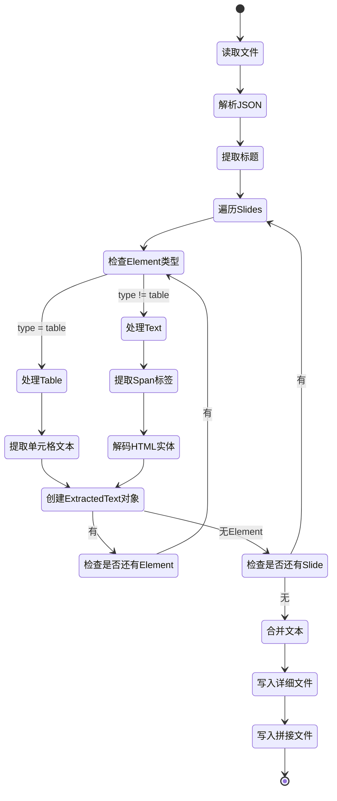
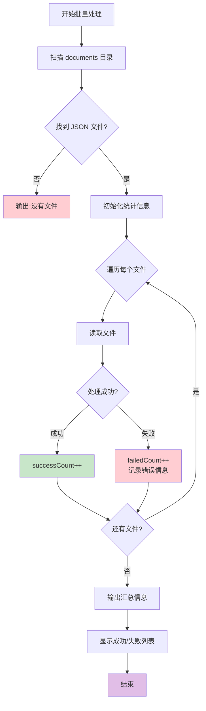
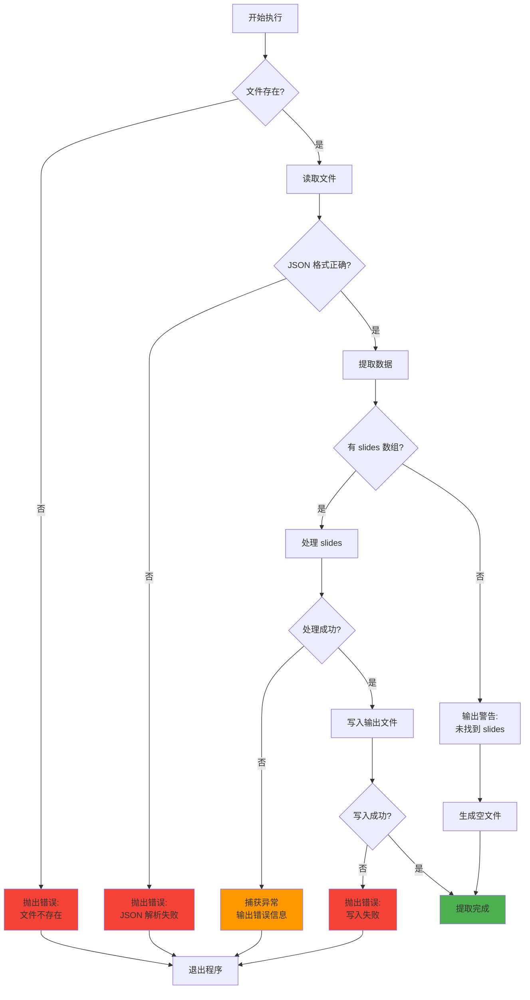
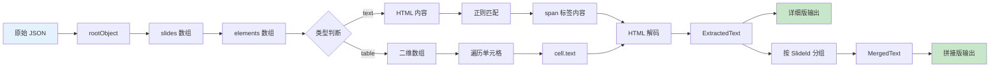
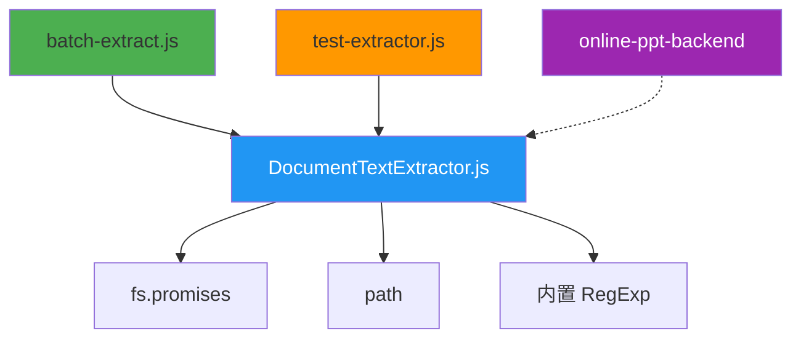
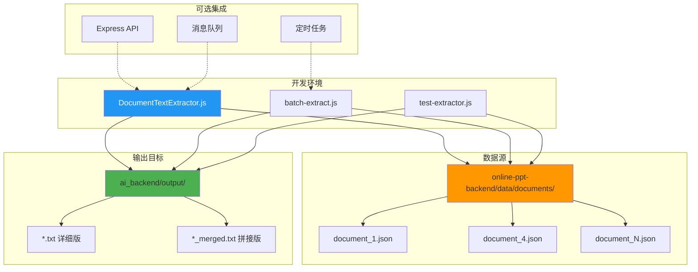

# 架构流程图

本文档使用 Mermaid 图表展示文档文本提取器的架构和流程。

## 1. 总体架构图



## 2. 数据处理流程



## 3. 类结构图



## 4. JSON 数据结构解析流程

```mermaid
graph LR
    A[JSON 文档] --> B[rootObject]
    B --> C[title]
    B --> D[slides[]]
    
    D --> E[slide]
    E --> F[slide.id]
    E --> G[slide.elements[]]
    
    G --> H[element]
    H --> I{element.type}
    
    I -->|text| J[element.text.content]
    I -->|text| K[element.content]
    I -->|table| L[element.data[][]]
    
    J --> M[span 标签解析]
    K --> M
    
    L --> N[cell.text]
    N --> O[纯文本]
    
    M --> O
    
    style C fill:#ffeb3b
    style F fill:#ffeb3b
    style O fill:#4caf50
```

## 5. 文本提取状态机



## 6. 批量处理流程



## 7. 错误处理流程



## 8. 数据转换管道



## 9. 模块依赖关系



## 10. 部署架构



## 使用说明

### 如何查看这些图表

1. **在 VS Code 中**：
   - 安装 Mermaid 扩展
   - 打开此文件即可看到渲染的图表

2. **在 GitHub 中**：
   - GitHub 原生支持 Mermaid
   - 直接查看 README.md 即可

3. **在线编辑器**：
   - 访问 [Mermaid Live Editor](https://mermaid.live/)
   - 复制代码块内容进行编辑

### 图表说明

- **图 1-3**：展示整体架构和核心流程
- **图 4-5**：详细展示数据结构和状态转换
- **图 6-7**：批量处理和错误处理流程
- **图 8-10**：数据转换、依赖关系和部署架构

---

**提示**：这些图表可以帮助你快速理解代码结构和执行流程，便于维护和扩展。

