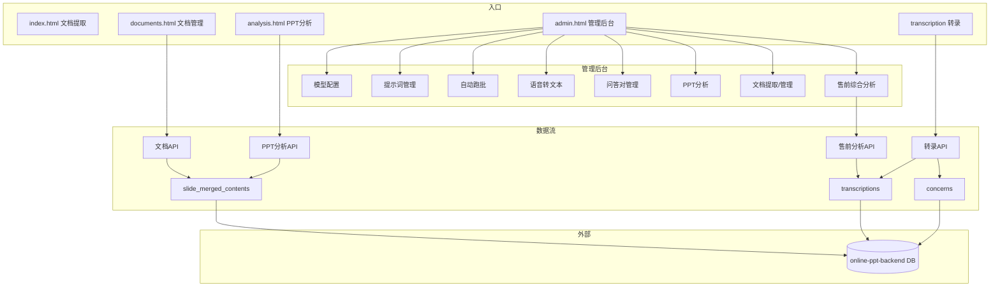

# AI Backend 功能列表

> 本文档梳理 ai_backend 项目已实现的所有功能，按模块分类，便于查阅与维护。  
> **最后更新**：2025-02-05

---

## 一、入口与导航

| 入口 | 路径/地址 | 说明 |
|------|------------|------|
| 文档文本提取器（Web 版） | `index.html` | JSON 文档上传、批量提取、历史记录、预览/下载 |
| 文档管理 | `documents.html` | 文档库管理、提取入口、与 AI 分析联动 |
| PPT AI 内容分析 | `analysis.html` | 单页测试、批量分析、结果表、统计、分类标准 |
| **AI 管理后台（统一入口）** | `admin.html` | 控制台 + 所有子功能入口（见下方模块） |

管理后台侧边栏导航包含：控制台、模型配置、提示词管理、自动跑批监控、语音转文本、问答对管理、PPT 分析、文档提取、文档管理、售前交流综合分析。

---

## 二、管理后台（/api/admin）

### 2.1 模型配置（/api/admin/models）

| 功能 | 方法 | 路径 | 说明 |
|------|------|------|------|
| 获取所有模型 | GET | `/api/admin/models` | 列表，支持分页/筛选 |
| 按场景获取模型 | GET | `/api/admin/models/scenes/:sceneType` | 按场景类型筛选 |
| 获取默认模型 | GET | `/api/admin/models/default/:sceneType` | 某场景的默认模型 |
| 获取单条 | GET | `/api/admin/models/:id` | 模型详情 |
| 创建模型 | POST | `/api/admin/models` | 新增，API 密钥加密存储 |
| 更新模型 | PUT | `/api/admin/models/:id` | 支持不修改密钥 |
| 设为默认 | PUT | `/api/admin/models/:id/set-default` | 指定场景默认模型 |
| 删除模型 | DELETE | `/api/admin/models/:id` | 软删或硬删（视实现） |
| 场景统计 | GET | `/api/admin/models/stats/scenes` | 各场景模型数量 |

**前端页面**：`#model-config`（admin 内）  
**能力**：多提供商（讯飞/OpenAI/通义/百度等）、按场景绑定、密钥脱敏与加密。

---

### 2.2 提示词模板（/api/admin/prompts）

| 功能 | 方法 | 路径 | 说明 |
|------|------|------|------|
| 获取所有提示词 | GET | `/api/admin/prompts` | 列表 |
| 按场景获取 | GET | `/api/admin/prompts/scenes/:sceneType` | 按场景筛选 |
| 获取单条 | GET | `/api/admin/prompts/:id` | 模板详情 |
| 创建模板 | POST | `/api/admin/prompts` | 支持变量 `{{var}}` |
| 更新模板 | PUT | `/api/admin/prompts/:id` | 全量更新 |
| 删除模板 | DELETE | `/api/admin/prompts/:id` | 删除 |
| 复制模板 | POST | `/api/admin/prompts/:id/duplicate` | 复制后编辑 |
| 测试渲染 | POST | `/api/admin/prompts/test/render` | 变量替换预览 |
| 提取变量 | POST | `/api/admin/prompts/test/extract` | 从内容中解析变量 |
| 场景统计 | GET | `/api/admin/prompts/stats/scenes` | 各场景模板数量 |

**前端页面**：`#prompt-templates`  
**能力**：多场景、版本管理、变量定义与测试。

---

### 2.3 系统设置（/api/admin/system）

| 功能 | 方法 | 路径 | 说明 |
|------|------|------|------|
| 场景列表 | GET | `/api/admin/system/scenes` | 所有场景类型 |
| 提供商列表 | GET | `/api/admin/system/providers` | 支持的 AI 提供商 |
| 系统统计 | GET | `/api/admin/system/stats` | 模型/提示词等汇总 |
| 健康检查 | GET | `/api/admin/system/health` | 服务健康状态 |

**前端**：控制台（dashboard）会用到统计与健康信息。

---

## 三、文档相关

### 3.1 文档管理（/api/documents）

| 功能 | 方法 | 路径 | 说明 |
|------|------|------|------|
| 文档列表 | GET | `/api/documents/list` | 分页，支持 status/category/keyword 筛选 |
| 单文档提取 | POST | `/api/documents/:id/extract` | 提取到 slide_merged_contents，支持 force 重提 |
| 提取状态 | GET | `/api/documents/:id/extract-status` | 是否已提取、条数等 |
| 批量提取 | POST | `/api/documents/batch-extract` | 多文档批量提取 |

**前端页面**：`documents.html`、admin 内 `#document-manage`  
**能力**：与 online-ppt-backend 文档库对接，将 PPT 内容提取到本地表供分析使用。

---

### 3.2 文档文本提取（Legacy / 独立入口）

| 功能 | 方法 | 路径 | 说明 |
|------|------|------|------|
| 单文件提取 | POST | `/api/extract` | 上传 JSON，输出详细版 + 拼接版 txt |
| 预览文件 | GET | `/api/preview?file=...` | 预览输出文件内容 |
| 历史列表 | GET | `/api/history` | 按日期聚合的提取历史 |

**前端页面**：`index.html`（文档文本提取器）  
**能力**：从 JSON 文档中提取标题、幻灯片、文本/表格，输出到 `output/` 目录，支持多文件、拖拽、历史与预览。

---

## 四、PPT 分析（/api/ppt-analysis）

| 功能 | 方法 | 路径 | 说明 |
|------|------|------|------|
| 发起分析 | POST | `/api/ppt-analysis/analyze/:documentId` | 对某文档做内容分析 |
| 查询分析任务 | GET | `/api/ppt-analysis/analyze/:documentId` | 任务状态/结果 |
| 分析结果 | GET | `/api/ppt-analysis/results/:documentId` | 按文档取结果 |
| 分类类别 | GET | `/api/ppt-analysis/categories` | 一级/二级分类树 |
| 单页分析 | POST | `/api/ppt-analysis/analyze-single` | 单页内容分析（测试用） |
| 统计 | GET | `/api/ppt-analysis/statistics/:documentId` | 页数、已分析、置信度等 |
| 提示词列表 | GET | `/api/ppt-analysis/prompts` | 分析用提示词 |
| 提示词 CRUD | POST/PUT/DELETE | `/api/ppt-analysis/prompts`、`/:id` | 增删改 |
| 启用/停用 | PATCH | `/api/ppt-analysis/prompts/:id/toggle` | 切换激活状态 |
| 单条纠正 | POST | `/api/ppt-analysis/correct-single` | 单条结果纠正 |

**前端页面**：`analysis.html`、admin 内 `#ppt-analysis`  
**能力**：基于提取后的幻灯片内容做 AI 分类（一级/二级）、置信度、批量分析（SSE 进度）、统计与分类标准展示。

---

## 五、语音转文本（/api/transcription）

### 5.1 转录任务

| 功能 | 方法 | 路径 | 说明 |
|------|------|------|------|
| 上传并转录 | POST | `/api/transcription/upload` | 上传音频，创建转录任务并执行 |
| 任务列表 | GET | `/api/transcription/` | 列表（含筛选） |
| 任务详情 | GET | `/api/transcription/:id` | 单条转录详情 |
| 更新任务 | PUT | `/api/transcription/:id` | 更新元数据（客户名、场次、产品等） |
| 删除任务 | DELETE | `/api/transcription/:id` | 删除转录记录 |
| 获取音频 | GET | `/api/transcription/:id/audio` | 下载或播放原音频 |

### 5.2 对话与编辑

| 功能 | 方法 | 路径 | 说明 |
|------|------|------|------|
| 合并对话 | POST | `/api/transcription/:id/merge-dialogues` | 合并多条为一条 |
| 重新合并 | POST | `/api/transcription/:id/re-merge` | 重新按规则合并 |
| 更新对话内容 | PUT | `/api/transcription/:id/dialogues` | 整批更新对话文本 |

### 5.3 AI 增强

| 功能 | 方法 | 路径 | 说明 |
|------|------|------|------|
| AI 纠错 | POST | `/api/transcription/:id/ai-correction` | 对转写文本做 AI 纠错 |
| 应用纠错 | PUT | `/api/transcription/:id/apply-corrections` | 将纠错结果写回 |
| 角色判断 | POST | `/api/transcription/:id/role-judgment` | AI 判断说话人角色 |
| 角色设置 | PUT | `/api/transcription/:id/role-settings` | 批量设置说话人角色 |

### 5.4 问答对

| 功能 | 方法 | 路径 | 说明 |
|------|------|------|------|
| 问答抽取 | POST | `/api/transcription/:id/qa-extraction` | 从对话中抽取问答对 |
| 问答对列表 | GET | `/api/transcription/:id/qa-pairs` | 查看某转录的问答对 |
| 问答分类 | POST | `/api/transcription/:id/qa-classification` | 对问答对做分类 |
| 单条关注点分类 | POST | `/api/transcription/concern/:concernId/classification` | 单条分类 |
| 批量关注点分类 | POST | `/api/transcription/concerns/batch-classification` | 批量分类 |
| 问答对优化 | POST | `/api/qa/concerns/:id/optimize` | 去语气词并据前4句/后4句补全问答对 |
| 批量问答对优化 | POST | `/api/qa/optimize-batch` | 批量优化多条问答对 |

### 5.5 扫描与批量

| 功能 | 方法 | 路径 | 说明 |
|------|------|------|------|
| 扫描配置 | GET/PUT | `/api/transcription/scan/config` | 目录、间隔、并发等 |
| 扫描文件列表 | GET | `/api/transcription/scan/files` | 扫描到的音频列表 |
| 提交扫描文件 | POST | `/api/transcription/scan/files` | 将扫描结果提交转录 |
| 扫描并转录 | POST | `/api/transcription/scan/transcribe` | 一键扫描并创建转录任务 |

**前端页面**：`transcription.html`、admin 内 `#transcription`  
**能力**：讯飞语音识别、多格式音频、多说话人、时间戳、对话编辑、AI 纠错、角色判断/设置、问答抽取与分类（对接 concern 分类体系）。

---

## 六、产品与场次（/api/products、/api/sessions）

### 6.1 产品（/api/products）

| 功能 | 方法 | 路径 | 说明 |
|------|------|------|------|
| 列表 | GET | `/api/products` | 支持分页、筛选 |
| 统计 | GET | `/api/products/statistics` | 产品维度统计 |
| 详情 | GET | `/api/products/:id` | 单条 |
| 创建 | POST | `/api/products` | 名称、代码、分类等 |
| 更新 | PUT | `/api/products/:id` | 更新 |
| 删除 | DELETE | `/api/products/:id` | 删除 |
| 排序 | PATCH | `/api/products/sort-order` | 拖拽排序 |

### 6.2 交流场次（/api/sessions）

| 功能 | 方法 | 路径 | 说明 |
|------|------|------|------|
| 列表 | GET | `/api/sessions` | 场次列表 |
| 统计 | GET | `/api/sessions/statistics` | 场次统计 |
| 最近场次 | GET | `/api/sessions/recent` | 最近 N 条，便于关联 |
| 详情 | GET | `/api/sessions/:id` | 单条 |
| 创建 | POST | `/api/sessions` | 可关联产品等 |
| 更新 | PUT | `/api/sessions/:id` | 更新 |
| 删除 | DELETE | `/api/sessions/:id` | 删除 |

**用途**：转录、文档、售前分析等处可关联产品与场次，便于统计与筛选。

---

## 七、自动跑批（/api/auto-process）

### 7.1 PPT 跑批（原有）

| 功能 | 方法 | 路径 | 说明 |
|------|------|------|------|
| 状态 | GET | `/api/auto-process/status` | 是否运行中 |
| 启动 | POST | `/api/auto-process/start` | 启动定时任务 |
| 停止 | POST | `/api/auto-process/stop` | 停止 |
| 配置 | GET/PUT | `/api/auto-process/config` | 跑批参数 |
| 统计 | GET | `/api/auto-process/statistics` | 成功/失败等 |
| 日志 | GET/DELETE | `/api/auto-process/logs` | 查看/清空日志 |
| 执行一次 | POST | `/api/auto-process/run-once` | 手动触发一次 |

### 7.2 音频跑批

| 功能 | 方法 | 路径 | 说明 |
|------|------|------|------|
| 状态 | GET | `/api/auto-process/audio/status` | 是否运行中 |
| 启动/停止 | POST | `/api/auto-process/audio/start`、`/stop` | 启停 |
| 配置 | GET/PUT | `/api/auto-process/audio/config` | 扫描目录、间隔、并发等 |
| 统计 | GET | `/api/auto-process/audio/statistics` | 已转录/待转录等 |
| 日志 | GET/DELETE | `/api/auto-process/audio/logs` | 查看/清空 |
| 执行一次 | POST | `/api/auto-process/audio/run-once` | 立即扫描并转录 |

### 7.3 问答跑批

| 功能 | 方法 | 路径 | 说明 |
|------|------|------|------|
| 状态 | GET | `/api/auto-process/qa/status` | 是否运行中 |
| 启动/停止 | POST | `/api/auto-process/qa/start`、`/stop` | 启停 |
| 配置 | GET/PUT | `/api/auto-process/qa/config` | 轮询间隔等 |
| 统计 | GET | `/api/auto-process/qa/statistics` | 成功/失败数 |
| 日志 | GET/DELETE | `/api/auto-process/qa/logs` | 查看/清空 |
| 执行一次 | POST | `/api/auto-process/qa/run-once` | 立即执行一次问答分类 |

**前端页面**：admin 内 `#auto-process`（Tab：PPT 跑批 / 音频跑批）  
**能力**：定时扫描目录、自动转录、自动问答分类，可配置、可查看日志与统计。

---

## 八、问答对管理（/api/qa）

| 功能 | 方法 | 路径 | 说明 |
|------|------|------|------|
| 测试 | GET | `/api/qa/test` | 连通性测试 |
| 分类类别 | GET | `/api/qa/categories` | 分类树（供前端展示） |
| 关注点列表 | GET | `/api/qa/concerns` | 问答对/关注点列表，支持筛选 |
| 更新分类 | PATCH | `/api/qa/concerns/:id/classification` | 单条更新分类/意图 |
| 单条优化 | POST | `/api/qa/concerns/:id/optimize` | 去语气词+前后文补全（Body: save?, modelName?, promptId?） |
| 批量优化 | POST | `/api/qa/optimize-batch` | Body: concernIds, save?, modelName?, promptId? |

**前端页面**：admin 内 `#qa-management`、转录页「问答对」列表  
**能力**：查看、筛选、修改问答对（concern）的分类与意图；**问答对优化**（去语气词、结合前4句/后4句补全主语与句子）；与转录中的问答抽取、分类联动。

---

## 九、售前交流综合分析（/api/presales-analysis）

| 功能 | 方法 | 路径 | 说明 |
|------|------|------|------|
| 分析（按参数） | POST | `/api/presales-analysis/analyze` | 按传入内容/ID 做综合分析 |
| 按转录分析 | POST | `/api/presales-analysis/analyze/transcription/:id` | 对某条转录做分析 |
| 转录分析结果 | GET | `/api/presales-analysis/results/transcription/:id` | 获取某转录的分析结果 |
| 转录列表 | GET | `/api/presales-analysis/transcriptions` | 可选转录列表（用于选择） |
| 按场次分析 | POST | `/api/presales-analysis/analyze/session/:id` | 对某场次下多转录综合分析 |
| 流式分析 | POST | `/api/presales-analysis/analyze/stream` | SSE 流式返回分析结果 |
| 测试 | GET | `/api/presales-analysis/test` | 连通性测试 |

**前端页面**：admin 内 `#presales-analysis`  
**能力**：基于单条转录或整场次的多条转录，做售前交流的汇总分析（可流式输出），结果可持久化到 DB（与 online-ppt-backend 的 presales 分析结果对接时在服务层实现）。

---

## 十、前端页面与入口汇总

| 页面文件 | 入口 | 主要功能 |
|----------|------|----------|
| `index.html` | 文档文本提取器 | JSON 上传、提取、历史、预览/下载 |
| `documents.html` | 文档管理 | 文档库列表、筛选、跳转 AI 分析 |
| `analysis.html` | PPT AI 内容分析 | 提示词、测试、批量分析、结果、统计、分类标准 |
| `admin.html` | AI 管理后台 | 控制台、模型、提示词、跑批、转录、问答、PPT、文档、售前分析 |
| `transcription.html` | 语音转文本（独立） | 上传转录、对话编辑、纠错、角色、问答抽取（可与 admin 内转录页一致或简化） |
| `pages/dashboard.html` | 控制台 | 统计卡片、场景分布 |
| `pages/model-config.html` | 模型配置 | 模型 CRUD、默认、场景 |
| `pages/prompt-templates.html` | 提示词管理 | 模板 CRUD、变量、测试 |
| `pages/auto-process.html` | 自动跑批 | PPT/音频/问答 Tab，配置、启停、日志 |
| `pages/transcription.html` | 语音转文本 | 同 transcription 能力（在 admin 内） |
| `pages/qa-management.html` | 问答对管理 | 关注点列表、分类修改 |
| `pages/ppt-analysis.html` | PPT 分析 | 文档选择、分析、结果、统计 |
| `pages/document-extract.html` | 文档提取 | 与文档管理/提取接口对接 |
| `pages/document-manage.html` | 文档管理 | 文档列表、提取、状态 |
| `pages/presales-analysis.html` | 售前综合分析 | 选择转录/场次、发起分析、查看结果 |

---

## 十一、后端服务与支撑

| 服务/工具 | 文件 | 说明 |
|-----------|------|------|
| 文档提取器 | `core/extractors/DocumentTextExtractor.js` | 从 JSON 解析标题、幻灯片、文本/表格，输出 txt |
| 文档服务 | `server/services/documentService.js` | 文档列表、提取、状态、批量提取（对接 DB） |
| PPT 分析服务 | `server/services/pptAnalysisService.js` | 分析任务、结果存储、分类、统计 |
| 转录服务 | `server/services/transcriptionService.js` | 转录任务、对话、与讯飞/Python 调用对接 |
| 转录 AI 服务 | `server/services/transcriptionAiService.js` | 纠错、角色判断、问答抽取与分类 |
| 音频扫描 | `server/services/audioScanService.js` | 扫描目录、发现待转录音频 |
| 音频自动跑批 | `server/services/audioAutoProcessService.js` | 定时扫描 + 自动转录 |
| 问答自动跑批 | `server/services/qaAutoProcessService.js` | 定时对未分类问答做分类 |
| 自动跑批 | `server/services/autoProcessService.js` | PPT 跑批逻辑 |
| 关注点分类 | `server/services/concernClassificationService.js` | 问答对/关注点 AI 分类 |
| 售前分析 | `server/services/presalesAnalysisService.js` | 售前综合分析、流式输出 |
| 产品/场次 | `server/services/productsService.js`、`sessionsService.js` | 产品与场次 CRUD |
| 模型/提示词 | `server/services/modelConfigService.js`、`promptTemplateService.js` | 管理后台模型与提示词 |
| AI 统一调用 | `server/services/aiService.js`、`aiServiceUnified.js` | 多模型、多场景统一调用 |
| 讯飞转录 | `python_services/transcription/xfyun_client.py`、`service.py` | 讯飞语音识别封装 |

---

## 十二、配置与脚本

| 类型 | 路径/文件 | 说明 |
|------|------------|------|
| 音频跑批配置 | `server/config/audioAutoProcessConfig.json` | 扫描目录、间隔、并发等 |
| 音频扫描配置 | `server/config/audioScanConfig.json` | 扫描规则 |
| 问答跑批配置 | `server/config/qaAutoProcessConfig.json` | 问答自动分类间隔等 |
| AI 模型配置 | `server/config/aiModels.js` | 模型默认配置（若使用） |
| 转录纠错提示词 | `prompts/transcription_correction_prompt.md` | AI 纠错用提示词 |
| PPT 分析提示词 | `server/prompts/pptAnalysisPrompt.js` | PPT 分类用提示词 |

---

## 十三、功能模块关系简图

---

以上为 **ai_backend** 当前已实现功能的完整列表，按模块与接口整理，便于新人上手和后续扩展。若某接口有分页、筛选等细节，以实际代码与接口文档为准。
