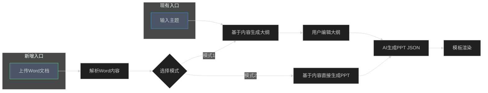

# 📄 Word文档上传功能方案设计

> 支持用户上传Word文档，基于文档内容生成PPT大纲或直接生成PPT

---

## 📋 需求分析

### 当前流程


### 新增需求



### 核心需求点

| 需求 | 描述 | 优先级 |
|------|------|--------|
| Word上传 | 支持.docx格式文件上传 | P0 |
| 内容提取 | 提取Word中的文本、标题层级 | P0 |
| 生成大纲 | 基于Word内容生成/优化大纲 | P0 |
| 直接生成PPT | 跳过大纲编辑，直接生成PPT | P1 |
| 兼容现有 | 不影响现有"输入主题"方式 | P0 |
| 图片提取 | 提取Word中的图片用于PPT | P2 |

---

## 🏗️ 技术方案

### 方案对比

| 方案 | 描述 | 优点 | 缺点 |
|------|------|------|------|
| **方案A：前端解析** | 使用mammoth.js在前端解析Word | 减轻服务器压力 | 大文件会卡顿，复杂格式支持差 |
| **方案B：后端解析** | 上传文件到后端，用Node.js解析 | 解析能力强，可扩展 | 需要文件上传 |
| **方案C：混合模式** | 前端预解析，后端精细处理 | 平衡体验和能力 | 实现复杂 |

### ✅ 推荐方案：方案B（后端解析）

**理由：**
1. Node.js有成熟的Word解析库（mammoth、docx）
2. 后端可以更好地处理大文件
3. 便于后续扩展（提取图片、表格、样式等）
4. 与现有AI服务流程一致

---

## 📐 详细设计

### 1. 系统架构

```mermaid
%%{init: {'theme':'dark'}}%%
flowchart TB
    subgraph Frontend["🖥️ 前端"]
        A[上传Word组件] --> B[预览/确认界面]
        B --> C[大纲编辑器]
        C --> D[PPT预览]
    end
    
    subgraph Backend["⚙️ 后端"]
        E[文件上传接口] --> F[Word解析服务]
        F --> G[AI大纲生成]
        G --> H[AI PPT生成]
    end
    
    subgraph Storage["💾 临时存储"]
        I[上传文件]
        J[提取的图片]
    end
    
    A -->|multipart/form-data| E
    F --> I
    F --> J
    G -->|流式| C
    H -->|流式| D
    
    style Frontend fill:#1a365d,stroke:#4299e1
    style Backend fill:#1a3a1a,stroke:#48bb78
    style Storage fill:#3a3a1a,stroke:#ecc94b
```



### 2. API设计

#### 2.1 Word文件上传与解析

**POST** `/tools/parse_word`

上传Word文件并解析内容。

**请求（multipart/form-data）：**

| 字段 | 类型 | 必填 | 说明 |
|------|------|------|------|
| file | File | ✅ | Word文件（.docx） |
| extractImages | boolean | ❌ | 是否提取图片，默认false |

**响应：**

```json
{
  "success": true,
  "data": {
    "title": "文档标题（从第一个H1提取）",
    "text": "纯文本内容",
    "markdown": "# 标题\n## 章节1\n内容...",
    "structure": [
      { "level": 1, "text": "标题", "children": [...] }
    ],
    "images": [
      { "id": "img_001", "base64": "data:image/png;base64,..." }
    ],
    "wordCount": 1500,
    "pageCount": 5
  }
}
```

#### 2.2 基于Word生成大纲

**POST** `/tools/aippt_outline`（扩展现有接口）

**请求参数（新增）：**

```json
{
  "content": "PPT主题或Word解析后的内容",
  "source": "word",
  "wordContent": {
    "title": "文档标题",
    "markdown": "# 标题\n## 章节1\n...",
    "text": "纯文本"
  },
  "language": "中文",
  "model": "GLM-4.5-Flash",
  "stream": true
}
```

| 参数 | 类型 | 必填 | 说明 |
|------|------|------|------|
| content | string | ✅ | 主题或概述 |
| source | string | ❌ | 来源：`topic`(默认) / `word` |
| wordContent | object | 条件 | source为word时必填 |
| language | string | ❌ | 语言，默认中文 |
| model | string | ❌ | AI模型 |
| stream | boolean | ❌ | 流式输出 |

#### 2.3 基于Word直接生成PPT

**POST** `/tools/aippt_from_word`

跳过大纲编辑，直接基于Word生成PPT JSON。

**请求参数：**

```json
{
  "wordContent": {
    "title": "文档标题",
    "markdown": "# 标题\n## 章节1\n...",
    "text": "纯文本"
  },
  "language": "中文",
  "style": "通用",
  "model": "GLM-4.5-Flash",
  "stream": true
}
```

### 3. 后端实现

#### 3.1 新增依赖

```json
// package.json 新增
{
  "dependencies": {
    "mammoth": "^1.6.0",
    "multer": "^1.4.5-lts.1"
  }
}
```

#### 3.2 项目结构变更

```
online-ppt-backend/
├── src/
│   ├── index.js
│   ├── config/
│   │   └── models.js
│   ├── routes/
│   │   ├── tools.js          # 现有路由
│   │   └── upload.js         # 🆕 文件上传路由
│   ├── services/
│   │   ├── aiService.js
│   │   └── wordService.js    # 🆕 Word解析服务
│   ├── prompts/
│   │   ├── outlinePrompt.js  # 修改：支持Word来源
│   │   ├── aipptPrompt.js
│   │   └── wordOutlinePrompt.js  # 🆕 Word大纲Prompt
│   └── uploads/              # 🆕 临时上传目录
└── package.json
```

#### 3.3 Word解析服务核心代码

```javascript
// src/services/wordService.js
import mammoth from 'mammoth'
import fs from 'fs/promises'
import path from 'path'

class WordService {
  /**
   * 解析Word文档
   * @param {string} filePath - 文件路径
   * @param {Object} options - 选项
   */
  async parseWord(filePath, options = {}) {
    const { extractImages = false } = options
    
    const buffer = await fs.readFile(filePath)
    
    // 转换为HTML
    const htmlResult = await mammoth.convertToHtml({ buffer })
    
    // 转换为Markdown
    const markdownResult = await mammoth.convertToMarkdown({ buffer })
    
    // 提取纯文本
    const textResult = await mammoth.extractRawText({ buffer })
    
    // 解析结构
    const structure = this.parseStructure(htmlResult.value)
    
    // 提取标题
    const title = this.extractTitle(structure, textResult.value)
    
    // 提取图片（可选）
    let images = []
    if (extractImages) {
      images = await this.extractImages(buffer)
    }
    
    return {
      title,
      text: textResult.value,
      markdown: markdownResult.value,
      html: htmlResult.value,
      structure,
      images,
      wordCount: textResult.value.length,
      warnings: htmlResult.messages
    }
  }
  
  /**
   * 解析文档结构（标题层级）
   */
  parseStructure(html) {
    // 使用正则提取标题层级
    const headingRegex = /<h([1-6])>(.*?)<\/h\1>/gi
    const structure = []
    let match
    
    while ((match = headingRegex.exec(html)) !== null) {
      structure.push({
        level: parseInt(match[1]),
        text: match[2].replace(/<[^>]*>/g, '').trim()
      })
    }
    
    return structure
  }
  
  /**
   * 提取文档标题
   */
  extractTitle(structure, text) {
    // 优先从H1提取
    const h1 = structure.find(item => item.level === 1)
    if (h1) return h1.text
    
    // 否则取第一行
    const firstLine = text.split('\n')[0]?.trim()
    return firstLine || '未命名文档'
  }
  
  /**
   * 提取图片
   */
  async extractImages(buffer) {
    const images = []
    
    await mammoth.convertToHtml({
      buffer,
      convertImage: mammoth.images.imgElement(async (image) => {
        const imageBuffer = await image.read()
        const base64 = imageBuffer.toString('base64')
        const mimeType = image.contentType
        
        images.push({
          id: `img_${images.length + 1}`,
          base64: `data:${mimeType};base64,${base64}`,
          contentType: mimeType
        })
        
        return { src: '' }
      })
    })
    
    return images
  }
}

export default new WordService()
```

#### 3.4 Word大纲生成Prompt

```javascript
// src/prompts/wordOutlinePrompt.js

export const wordOutlineSystemPrompt = `你是一位专业的PPT内容策划专家。

你的任务是根据用户提供的Word文档内容，生成一份适合做PPT的大纲。

## 工作流程

1. **理解文档**：仔细阅读文档内容，理解其核心主题和结构
2. **提炼要点**：从文档中提取关键信息，去除冗余内容
3. **重组结构**：按照PPT的逻辑重新组织内容，使其适合演示
4. **生成大纲**：输出Markdown格式的PPT大纲

## 输出格式

\`\`\`markdown
# PPT主标题

## 第一章节
### 页面1标题
- 要点1
- 要点2
- 要点3

## 第二章节
### 页面2标题
- 要点1
- 要点2
...
\`\`\`

## 注意事项

1. 不要简单复制文档内容，要提炼和重组
2. 每页PPT的要点控制在3-5个
3. 总页数控制在15-25页之间
4. 内容要适合演示，简洁有力
5. 只输出Markdown大纲，不要其他说明`

export function buildWordOutlineUserPrompt(wordContent, language = '中文') {
  return `请基于以下Word文档内容，生成PPT大纲：

【文档标题】${wordContent.title}

【文档内容】
${wordContent.markdown || wordContent.text}

【要求】
- 语言：${language}
- 提炼核心内容，适合演示
- 结构清晰，逻辑严谨
- 每页3-5个要点

请直接输出Markdown格式的大纲：`
}

export function buildWordOutlineMessages(wordContent, language = '中文', modelName = null) {
  // 复用 outlinePrompt.js 的模型兼容逻辑
  return [
    { role: 'system', content: wordOutlineSystemPrompt },
    { role: 'user', content: buildWordOutlineUserPrompt(wordContent, language) }
  ]
}
```

### 4. 前端实现

#### 4.1 新增依赖

```json
// package.json 新增（可选，用于前端预览）
{
  "dependencies": {
    "mammoth": "^1.6.0"
  }
}
```

#### 4.2 组件设计

```
src/
├── components/
│   └── WordUploader/           # 🆕 Word上传组件
│       ├── index.vue           # 主组件
│       ├── UploadArea.vue      # 拖拽上传区域
│       └── PreviewPanel.vue    # 内容预览面板
├── hooks/
│   └── useWordImport.ts        # 🆕 Word导入逻辑
└── services/
    └── index.ts                # 扩展API
```

#### 4.3 Word上传组件设计

```vue
<!-- src/components/WordUploader/index.vue -->
<template>
  <div class="word-uploader">
    <!-- 上传区域 -->
    <div 
      class="upload-area"
      :class="{ 'dragging': isDragging }"
      @dragover.prevent="isDragging = true"
      @dragleave="isDragging = false"
      @drop.prevent="handleDrop"
    >
      <div class="upload-icon">📄</div>
      <div class="upload-text">
        <p>拖拽Word文档到此处</p>
        <p>或 <span class="link" @click="triggerUpload">点击上传</span></p>
      </div>
      <p class="upload-hint">支持 .docx 格式</p>
      <input 
        ref="fileInput"
        type="file" 
        accept=".docx"
        @change="handleFileSelect"
        hidden
      />
    </div>

    <!-- 解析中状态 -->
    <div v-if="parsing" class="parsing-status">
      <div class="spinner"></div>
      <p>正在解析文档...</p>
    </div>

    <!-- 预览面板 -->
    <div v-if="parsedContent" class="preview-panel">
      <div class="preview-header">
        <h3>{{ parsedContent.title }}</h3>
        <span class="word-count">{{ parsedContent.wordCount }} 字</span>
      </div>
      
      <div class="preview-content">
        <div v-html="parsedContent.html"></div>
      </div>

      <div class="action-buttons">
        <Button @click="generateOutline">生成大纲</Button>
        <Button type="primary" @click="generatePPT">直接生成PPT</Button>
        <Button @click="reset">重新上传</Button>
      </div>
    </div>
  </div>
</template>
```

#### 4.4 API服务扩展

```typescript
// src/services/index.ts 新增

interface WordContent {
  title: string
  text: string
  markdown: string
  html?: string
  structure?: Array<{ level: number; text: string }>
  images?: Array<{ id: string; base64: string }>
  wordCount: number
}

interface ParseWordResponse {
  success: boolean
  data: WordContent
}

export default {
  // ... 现有方法 ...

  /**
   * 上传并解析Word文档
   */
  parseWord(file: File, extractImages = false): Promise<ParseWordResponse> {
    const formData = new FormData()
    formData.append('file', file)
    formData.append('extractImages', String(extractImages))
    
    return axios.post(`${SERVER_URL}/tools/parse_word`, formData, {
      headers: {
        'Content-Type': 'multipart/form-data'
      }
    })
  },

  /**
   * 基于Word生成大纲
   */
  AIPPT_Outline_FromWord({
    wordContent,
    language = '中文',
    model = 'GLM-4.5-Flash',
  }: {
    wordContent: WordContent
    language?: string
    model?: string
  }): Promise<Response> {
    return fetch(`${SERVER_URL}/tools/aippt_outline`, {
      method: 'POST',
      headers: {
        'Content-Type': 'application/json',
      },
      body: JSON.stringify({
        content: wordContent.title,
        source: 'word',
        wordContent: {
          title: wordContent.title,
          markdown: wordContent.markdown,
          text: wordContent.text,
        },
        language,
        model,
        stream: true,
      }),
    })
  },

  /**
   * 基于Word直接生成PPT
   */
  AIPPT_FromWord({
    wordContent,
    language = '中文',
    style = '通用',
    model = 'GLM-4.5-Flash',
  }: {
    wordContent: WordContent
    language?: string
    style?: string
    model?: string
  }): Promise<Response> {
    return fetch(`${SERVER_URL}/tools/aippt_from_word`, {
      method: 'POST',
      headers: {
        'Content-Type': 'application/json',
      },
      body: JSON.stringify({
        wordContent: {
          title: wordContent.title,
          markdown: wordContent.markdown,
          text: wordContent.text,
        },
        language,
        style,
        model,
        stream: true,
      }),
    })
  },
}
```

### 5. UI设计

#### 5.1 入口切换设计

```
┌─────────────────────────────────────────────────────┐
│                   AI 生成 PPT                        │
├─────────────────────────────────────────────────────┤
│                                                     │
│   ┌─────────────────┐  ┌─────────────────┐         │
│   │   📝 输入主题    │  │   📄 上传Word   │         │
│   │     (当前)      │  │     (新增)      │         │
│   └─────────────────┘  └─────────────────┘         │
│                                                     │
│  ─────────────────────────────────────────────────  │
│                                                     │
│   [当选择"输入主题"时]                              │
│   ┌─────────────────────────────────────────────┐  │
│   │  请输入PPT主题：                             │  │
│   │  ┌─────────────────────────────────────┐   │  │
│   │  │ 人工智能发展趋势                      │   │  │
│   │  └─────────────────────────────────────┘   │  │
│   │                           [生成大纲]        │  │
│   └─────────────────────────────────────────────┘  │
│                                                     │
│   [当选择"上传Word"时]                              │
│   ┌─────────────────────────────────────────────┐  │
│   │         ┌───────────────────┐               │  │
│   │         │    📄              │               │  │
│   │         │  拖拽文件到此处    │               │  │
│   │         │  或点击上传        │               │  │
│   │         └───────────────────┘               │  │
│   │                                             │  │
│   │  [生成大纲]  [直接生成PPT]                   │  │
│   └─────────────────────────────────────────────┘  │
│                                                     │
└─────────────────────────────────────────────────────┘
```

#### 5.2 Word预览设计

```
┌─────────────────────────────────────────────────────┐
│  📄 文档预览                              [重新上传] │
├─────────────────────────────────────────────────────┤
│                                                     │
│  标题：人工智能发展趋势研究报告                      │
│  字数：3,500 字  |  预计页数：18 页                  │
│                                                     │
│  ┌─────────────────────────────────────────────┐   │
│  │  # 人工智能发展趋势研究报告                   │   │
│  │                                             │   │
│  │  ## 1. 引言                                 │   │
│  │  人工智能（AI）作为当今最具变革性的技术...    │   │
│  │                                             │   │
│  │  ## 2. 技术现状                             │   │
│  │  ### 2.1 机器学习                           │   │
│  │  机器学习是AI的核心技术之一...               │   │
│  │  ...                                        │   │
│  └─────────────────────────────────────────────┘   │
│                                                     │
│  ┌─────────────┐  ┌─────────────────────┐          │
│  │  生成大纲   │  │  直接生成PPT (跳过大纲) │          │
│  └─────────────┘  └─────────────────────┘          │
│                                                     │
└─────────────────────────────────────────────────────┘
```

---

## 🔄 完整流程图

```mermaid
%%{init: {'theme':'dark'}}%%
flowchart TB
    Start([开始]) --> Choice{选择输入方式}
    
    Choice -->|输入主题| Topic[输入PPT主题]
    Choice -->|上传Word| Upload[上传Word文档]
    
    Topic --> API1[调用 /tools/aippt_outline]
    
    Upload --> Parse[调用 /tools/parse_word]
    Parse --> Preview[预览解析结果]
    Preview --> Mode{选择模式}
    
    Mode -->|生成大纲| API2[调用 /tools/aippt_outline<br/>source: word]
    Mode -->|直接生成| API3[调用 /tools/aippt_from_word]
    
    API1 --> Outline[显示/编辑大纲]
    API2 --> Outline
    
    Outline --> Confirm{确认大纲}
    Confirm -->|编辑| Outline
    Confirm -->|确认| API4[调用 /tools/aippt]
    
    API3 --> Render[模板渲染]
    API4 --> Render
    
    Render --> Editor[PPT编辑器]
    Editor --> End([完成])
    
    style Start fill:#4a5568,stroke:#a0aec0
    style End fill:#4a5568,stroke:#a0aec0
    style Upload fill:#2d3748,stroke:#68d391
    style API3 fill:#2d3748,stroke:#f6ad55
```



---

## 📅 实施计划

### 阶段一：基础功能（3天）

| 任务 | 工作量 | 说明 |
|------|--------|------|
| 后端：Word解析服务 | 1天 | mammoth集成、API开发 |
| 后端：Prompt设计 | 0.5天 | Word大纲生成Prompt |
| 前端：上传组件 | 1天 | 拖拽上传、预览 |
| 联调测试 | 0.5天 | 端到端测试 |

### 阶段二：优化增强（2天）

| 任务 | 工作量 | 说明 |
|------|--------|------|
| 图片提取 | 0.5天 | 提取Word中的图片 |
| 直接生成PPT | 1天 | 跳过大纲直接生成 |
| UI优化 | 0.5天 | 交互细节优化 |

### 阶段三：高级功能（可选）

| 任务 | 说明 |
|------|------|
| 表格提取 | 提取Word中的表格，转为PPT表格 |
| 样式保留 | 尽量保留Word中的字体、颜色等样式 |
| 批量处理 | 支持多个Word文件批量生成 |

---

## ✅ 验收标准

- [ ] 支持.docx格式文件上传
- [ ] 正确提取文档文本和结构
- [ ] 基于Word内容生成合理的大纲
- [ ] 支持"直接生成PPT"模式
- [ ] 现有"输入主题"功能不受影响
- [ ] 流式输出正常工作
- [ ] 错误处理友好（文件格式错误、解析失败等）

---

## 📝 备注

1. **文件大小限制**：建议限制10MB以内
2. **格式支持**：仅支持.docx（Office 2007+），不支持.doc（老版本）
3. **内容限制**：建议文档字数不超过50000字，超过可能导致AI处理超时
4. **图片处理**：提取的图片可用于PPT配图，但需要额外的存储方案

---

> 📌 **下一步**：确认方案后，我可以开始逐步实现代码。建议先实现"阶段一"的基础功能，验证流程可行后再继续扩展。
