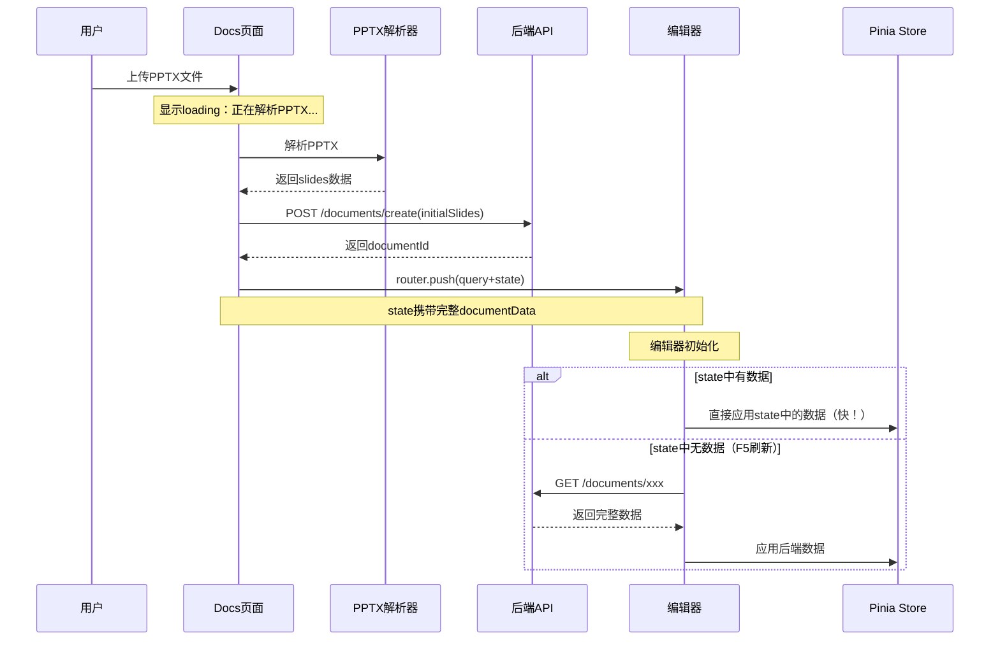

# 文档管理

> 本文档包含 PPT 文档相关的所有接口，基于现有代码整理。

**模块路径**：`/api/documents`  
**负责人**：待定  
**开发状态**：✅ 已实现  
**最后更新**：2025-12-29

---

## 1. 获取文档列表

### 基本信息
- **接口路径**：`GET /api/documents`
- **请求方式**：`GET`
- **接口说明**：分页查询文档列表，支持按状态、分类、关键词筛选
- **权限要求**：需要登录
- **开发状态**：✅ 已实现

### 请求参数

| 参数名 | 类型 | 必填 | 说明 | 示例 |
|--------|------|------|------|------|
| page | number | 否 | 页码，默认1 | 1 |
| pageSize | number | 否 | 每页数量，默认20 | 20 |
| status | string | 否 | 文档状态：draft/published/archived | "published" |
| category | string | 否 | 分类 | "work" |
| keyword | string | 否 | 搜索关键词（标题） | "年度报告" |

### 成功响应（200）
```json
{
  "success": true,
  "data": {
    "list": [
      {
        "id": "doc_abc123",
        "name": "2025年度工作报告",
        "cover": "https://cdn.example.com/covers/doc_abc123.webp",
        "sourceDocumentId": "template_1",
        "category": "work",
        "status": "published",
        "slideCount": 25,
        "fileSize": 2048576,
        "createdAt": "2025-10-20T14:30:00Z",
        "updatedAt": "2025-10-25T09:15:00Z",
        "lastOpenedAt": "2025-12-28T10:00:00Z",
        "customerName": "某某银行",
        "product": ["一表通", "风控云"],
        "industry": ["全国/股份制/政策性银行"],
        "audience": ["技术", "业务"],
        "language": "中文"
      }
    ],
    "total": 156,
    "page": 1,
    "pageSize": 20
  }
}
```

### 响应字段说明
| 字段名 | 类型 | 说明 |
|--------|------|------|
| success | boolean | 请求是否成功 |
| data.list | array | 文档列表 |
| data.total | number | 总数量 |
| data.page | number | 当前页码 |
| data.pageSize | number | 每页数量 |
| id | string | 文档ID |
| name | string | 文档名称 |
| cover | string | 封面图URL |
| sourceDocumentId | string | 源模板ID（基于哪个模板创建） |
| category | string | 分类 |
| status | string | 状态：draft-草稿/published-已发布/archived-已归档 |
| slideCount | number | 幻灯片数量 |
| fileSize | number | 文件大小（字节） |
| createdAt | string | 创建时间（ISO 8601格式） |
| updatedAt | string | 更新时间（ISO 8601格式） |
| lastOpenedAt | string | 最后打开时间（ISO 8601格式） |
| customerName | string | 客户名称 |
| product | string[] | 产品解决方案（多选） |
| industry | string[] | 行业（多选） |
| audience | string[] | 交流对象（多选） |
| language | string | 语言 |

### 前端对接
```typescript
// services/documentService.ts
import { SERVER_URL } from './index'
import axios from './config'

// 文档元信息接口
export interface DocumentMetadata {
  id: string
  name: string
  cover: string
  sourceDocumentId?: string
  category?: string
  status: 'draft' | 'published' | 'archived'
  slideCount: number
  fileSize: number
  createdAt: string
  updatedAt: string
  lastOpenedAt?: string
  // 业务字段
  customerName?: string
  product?: string[]
  industry?: string[]
  audience?: string[]
  language?: string
}

/**
 * 获取文档列表
 */
export async function getDocumentList(options: {
  page?: number
  pageSize?: number
  status?: 'draft' | 'published' | 'archived'
  category?: string
  keyword?: string
} = {}): Promise<DocumentMetadata[]> {
  const params = new URLSearchParams()
  if (options.page) params.append('page', options.page.toString())
  if (options.pageSize) params.append('pageSize', options.pageSize.toString())
  if (options.status) params.append('status', options.status)
  if (options.category) params.append('category', options.category)
  if (options.keyword) params.append('keyword', options.keyword)

  const url = `${SERVER_URL}/documents${params.toString() ? `?${params.toString()}` : ''}`
  const resp = await axios.get(url)
  
  if (!resp?.success || !resp.data?.list) {
    throw new Error(resp?.error || '获取文档列表失败')
  }

  return resp.data.list
}
```

---

## 2. 获取文档详情

### 基本信息
- **接口路径**：`GET /api/documents/{id}`
- **请求方式**：`GET`
- **接口说明**：获取指定文档的详细信息和内容数据
- **权限要求**：需要查看权限
- **开发状态**：✅ 已实现

### 路径参数
| 参数名 | 类型 | 必填 | 说明 |
|--------|------|------|------|
| id | string | 是 | 文档ID |

### 成功响应（200）
```json
{
  "success": true,
  "data": {
    "id": "doc_abc123",
    "name": "2025年度工作报告",
    "cover": "https://cdn.example.com/covers/doc_abc123.webp",
    "sourceDocumentId": "template_1",
    "category": "work",
    "status": "published",
    "slideCount": 25,
    "fileSize": 2048576,
    "createdAt": "2025-10-20T14:30:00Z",
    "updatedAt": "2025-10-25T09:15:00Z",
    "lastOpenedAt": "2025-12-28T10:00:00Z",
    "customerName": "某某银行",
    "product": ["一表通", "风控云"],
    "industry": ["全国/股份制/政策性银行"],
    "audience": ["技术", "业务"],
    "language": "中文",
    "documentData": {
      "title": "2025年度工作报告",
      "width": 1280,
      "height": 720,
      "theme": {
        "backgroundColor": "#ffffff",
        "themeColor": "#5b9bd5",
        "fontColor": "#333333",
        "fontName": "Microsoft Yahei"
      },
      "slides": [
        {
          "id": "slide_1",
          "elements": [
            {
              "type": "text",
              "id": "text_1",
              "left": 100,
              "top": 200,
              "width": 600,
              "height": 100,
              "content": "标题文本",
              "defaultFontName": "Microsoft Yahei",
              "defaultColor": "#333333"
            }
          ],
          "background": {
            "type": "solid",
            "color": "#ffffff"
          }
        }
      ]
    }
  }
}
```

### 响应字段说明
| 字段名 | 类型 | 说明 |
|--------|------|------|
| documentData | object | 文档完整数据 |
| documentData.title | string | 文档标题 |
| documentData.width | number | 幻灯片宽度 |
| documentData.height | number | 幻灯片高度 |
| documentData.theme | object | 主题配置 |
| documentData.slides | array | 幻灯片数组 |

### 前端对接
```typescript
// 文档完整数据接口
export interface DocumentData {
  title: string
  width: number
  height: number
  theme: any
  slides: any[]
}

/**
 * 获取文档详情
 */
export async function getDocument(id: string): Promise<{
  metadata: DocumentMetadata
  documentData: DocumentData
}> {
  const resp = await axios.get(`${SERVER_URL}/documents/${id}`)
  
  if (!resp?.success || !resp.data) {
    throw new Error(resp?.error || '获取文档详情失败')
  }

  const { documentData, ...restData } = resp.data
  return {
    metadata: restData as DocumentMetadata,
    documentData: documentData as DocumentData,
  }
}
```

---

## 3. 创建文档

### 基本信息
- **接口路径**：`POST /api/documents/create`
- **请求方式**：`POST`
- **接口说明**：创建新文档（空白/基于已有文档/基于PPTX文档）
- **权限要求**：需要登录
- **开发状态**：✅ 已实现

### 请求参数
| 参数名 | 类型 | 必填 | 说明 | 示例 |
|--------|------|------|------|------|
| name | string | 是 | 文档名称 | "新建演示文稿" |
| sourceDocumentId | string | 否 | 源文档ID（基于已有文档创建） | "document_7" |
| category | string | 否 | 分类，默认"uncategorized" | "work" |
| customerName | string | 否 | 客户名称 | "某某银行" |
| product | string[] | 否 | 产品解决方案（多选） | ["一表通", "风控云"] |
| industry | string[] | 否 | 行业（多选） | ["全国/股份制/政策性银行"] |
| audience | string[] | 否 | 交流对象（多选） | ["技术", "业务"] |
| language | string | 否 | 语言 | "中文" |
| initialSlides | array | 否 | 基于PPTX创建时的初始slides | [...] |

### 请求示例

#### 示例1：空白文档
```json
{
  "name": "产品发布会PPT",
  "category": "work",
  "customerName": "某某银行",
  "product": ["一表通"],
  "industry": ["全国/股份制/政策性银行"],
  "audience": ["业务"],
  "language": "中文"
}
```

#### 示例2：基于已有文档
```json
{
  "name": "产品发布会PPT",
  "sourceDocumentId": "document_7",
  "category": "work",
  "customerName": "某某银行",
  "product": ["一表通", "风控云"],
  "industry": ["全国/股份制/政策性银行"],
  "audience": ["技术", "业务"],
  "language": "中文"
}
```

#### 示例3：基于PPTX文档（新增）
```json
{
  "name": "产品介绍PPT",
  "category": "work",
  "customerName": "某某银行",
  "product": ["一表通"],
  "industry": ["城商行/农商行"],
  "audience": ["技术"],
  "language": "中文",
  "initialSlides": [
    {
      "id": "slide_1",
      "elements": [],
      "background": {
        "type": "solid",
        "color": "#ffffff"
      }
    }
  ]
}
```

### 成功响应（200）
```json
{
  "success": true,
  "data": {
    "id": "doc_xyz789"
  }
}
```

### 错误响应
```json
{
  "success": false,
  "error": "模板不存在"
}
```

### 业务逻辑说明

#### 创建方式说明

本接口支持三种创建方式，优先级为：**initialSlides > sourceDocumentId > 空白文档**

1. **空白文档**：不传 `sourceDocumentId` 和 `initialSlides`
   - 创建一个只包含空白首页的新文档
   
2. **基于已有文档**：传 `sourceDocumentId`，复制源文档的所有slides
   - 适用于基于现有文档创建副本的场景
   
3. **基于PPTX文档**（新增）：传 `initialSlides`，直接使用解析后的slides
   - 前端使用 `pptxParser` 解析PPTX文件
   - 将解析后的slides通过 `initialSlides` 传递给后端
   - 适用于从外部PPTX文件导入的场景

#### 数据流程（基于PPTX创建）



### 前端对接
```typescript
// 创建文档参数
export interface CreateDocumentParams {
  name: string
  sourceDocumentId?: string
  category?: string
  // 业务字段
  customerName?: string
  product?: string[]
  industry?: string[]
  audience?: string[]
  language?: string
  // 基于PPTX创建时的初始slides
  initialSlides?: any[]
}

/**
 * 创建文档
 */
export async function createDocument(params: CreateDocumentParams): Promise<{
  success: boolean
  data: { id: string }
  error?: string
}> {
  return axios.post(`${SERVER_URL}/documents/create`, {
    name: params.name,
    sourceDocumentId: params.sourceDocumentId,
    category: params.category || 'uncategorized',
    customerName: params.customerName,
    product: params.product,
    industry: params.industry,
    audience: params.audience,
    language: params.language,
    initialSlides: params.initialSlides,
  })
}
```

---

## 4. 更新文档

### 基本信息
- **接口路径**：`PUT /api/documents/{id}`
- **请求方式**：`PUT`
- **接口说明**：更新文档内容（保存幻灯片数据）
- **权限要求**：需要编辑权限
- **开发状态**：✅ 已实现
- **⚠️ 更新策略**：**全量替换**

### ⚠️ 重要说明：全量替换 vs 增量更新

此接口采用**全量替换**策略：
- ✅ **必须传递完整的 `documentData`**（包括所有 slides 和元素）
- ❌ **不支持增量更新**（如只更新某一页的某个元素）
- 💡 **原因**：简化后端逻辑，避免复杂的深度合并和冲突处理

**与其他接口的区别**：
| 接口 | 更新策略 | 适用场景 |
|------|---------|---------|
| `PUT /api/documents/{id}` | **全量替换** | 保存完整的幻灯片内容 |
| `PATCH /api/documents/{id}/rename` | **增量更新** | 只修改文档名称 |
| `POST /api/documents/{id}/publish` | **增量更新** | 只修改状态字段 |

### 路径参数
| 参数名 | 类型 | 必填 | 说明 |
|--------|------|------|------|
| id | string | 是 | 文档ID |

### 请求参数
| 参数名 | 类型 | 必填 | 说明 |
|--------|------|------|------|
| documentData | object | 是 | 文档完整数据（全量替换） |
| autoSave | boolean | 否 | 是否自动保存，默认false |

### 请求示例
```json
{
  "documentData": {
    "title": "2025年度工作报告",
    "width": 1280,
    "height": 720,
    "theme": {
      "backgroundColor": "#ffffff",
      "themeColor": "#5b9bd5"
    },
    "slides": [
      {
        "id": "slide_1",
        "elements": []
      }
    ]
  },
  "autoSave": false
}
```

### 成功响应（200）
```json
{
  "success": true,
  "data": {
    "updatedAt": "2025-12-28T10:30:00Z"
  }
}
```

### 业务逻辑

#### 1. 全量替换机制
- 后端会**完全替换**原有的 `documentData`，不会保留任何旧数据
- 前端必须在每次保存时传递**完整的文档结构**
- 示例：如果文档有 10 页，即使只修改第 3 页，也必须传递所有 10 页的完整数据

#### 2. 自动保存 vs 手动保存
- **自动保存**：`autoSave=true` 时不创建新版本，只更新内容
- **手动保存**：`autoSave=false` 时创建新版本快照（如果实现了版本管理）

#### 3. 并发控制
- 使用乐观锁或版本号防止冲突
- 建议前端在编辑前记录 `updatedAt` 时间戳，保存时校验是否被其他用户修改

#### 4. 前端实现建议
```typescript
// ❌ 错误示例：只传递修改的部分
await updateDocument(id, {
  documentData: {
    slides: [modifiedSlide] // 错误！会丢失其他幻灯片
  }
})

// ✅ 正确示例：传递完整数据
const fullDocument = await getDocument(id) // 先获取完整文档
fullDocument.documentData.slides[2] = modifiedSlide // 修改特定页
await updateDocument(id, {
  documentData: fullDocument.documentData // 保存完整数据
})
```

### 前端对接
```typescript
// 更新文档参数
export interface UpdateDocumentParams {
  documentData: DocumentData  // ⚠️ 必须是完整的文档数据（全量替换）
  autoSave?: boolean
}

/**
 * 更新文档（全量替换）
 * 
 * ⚠️ 注意：此接口会完全替换文档内容，必须传递完整的 documentData
 * 
 * @param id 文档ID
 * @param params 更新参数，documentData 必须包含完整的幻灯片数据
 */
export async function updateDocument(id: string, params: UpdateDocumentParams): Promise<{
  success: boolean
  data?: any
  error?: string
}> {
  return axios.put(`${SERVER_URL}/documents/${id}`, {
    documentData: params.documentData,
    autoSave: params.autoSave !== undefined ? params.autoSave : false,
  })
}
```

---

## 5. 删除文档

### 基本信息
- **接口路径**：`DELETE /api/documents/{id}`
- **请求方式**：`DELETE`
- **接口说明**：删除文档（软删除，移到回收站）
- **权限要求**：需要所有者权限
- **开发状态**：✅ 已实现

### 路径参数
| 参数名 | 类型 | 必填 | 说明 |
|--------|------|------|------|
| id | string | 是 | 文档ID |

### 成功响应（200）
```json
{
  "success": true
}
```

### 错误响应
```json
{
  "success": false,
  "error": "文档不存在或已被删除"
}
```

### 业务逻辑
1. 软删除，将 `status` 更改为 `archived`
2. 文件实际保留在回收站，可恢复
3. 回收站保留 30 天后永久删除

### 前端对接
```typescript
/**
 * 删除文档
 */
export async function deleteDocument(id: string): Promise<{
  success: boolean
  error?: string
}> {
  return axios.delete(`${SERVER_URL}/documents/${id}`)
}
```

---

## 6. 复制文档

### 基本信息
- **接口路径**：`POST /api/documents/{id}/duplicate`
- **请求方式**：`POST`
- **接口说明**：复制文档，创建副本
- **权限要求**：需要查看权限
- **开发状态**：✅ 已实现

### 路径参数
| 参数名 | 类型 | 必填 | 说明 |
|--------|------|------|------|
| id | string | 是 | 源文档ID |

### 成功响应（200）
```json
{
  "success": true,
  "data": {
    "id": "doc_copy_123"
  }
}
```

### 业务逻辑
1. 复制文档的所有内容和配置
2. 新文档名称自动加上 "副本-" 前缀
3. 新文档状态为 `draft`
4. 保持原文档的分类

### 前端对接
```typescript
/**
 * 复制文档
 */
export async function duplicateDocument(id: string): Promise<{
  success: boolean
  data: { id: string }
  error?: string
}> {
  return axios.post(`${SERVER_URL}/documents/${id}/duplicate`)
}
```

---

## 7. 编辑文档基础信息

### 基本信息
- **接口路径**：`PATCH /api/documents/{id}/metadata`
- **请求方式**：`PATCH`
- **接口说明**：编辑文档基础信息（名称和业务字段）
- **权限要求**：需要编辑权限
- **开发状态**：✅ 已实现
- **✅ 更新策略**：**增量更新**

### ✅ 重要说明：增量更新

此接口采用**增量更新**策略：
- ✅ **支持更新文档名称和业务字段**（客户名称、产品、行业、交流对象、语言）
- ✅ **无需传递完整数据**，只传递需要修改的字段
- ✅ **不影响文档内容**（slides 数据）
- 💡 **使用场景**：快速修改文档元数据，不涉及内容修改

**为什么使用 PATCH 而不是 PUT？**
- `PATCH` 语义上表示**部分更新**
- `PUT` 语义上表示**全量替换**

### 路径参数
| 参数名 | 类型 | 必填 | 说明 |
|--------|------|------|------|
| id | string | 是 | 文档ID |

### 请求参数
| 参数名 | 类型 | 必填 | 说明 | 示例 |
|--------|------|------|------|------|
| name | string | 是 | 文档名称 | "2025年度总结报告" |
| customerName | string | 否 | 客户名称 | "某某银行" |
| product | string[] | 否 | 产品解决方案（多选） | ["一表通", "风控云"] |
| industry | string[] | 否 | 行业（多选） | ["全国/股份制/政策性银行"] |
| audience | string[] | 否 | 交流对象（多选） | ["技术", "业务"] |
| language | string | 否 | 语言 | "中文" |

### 请求示例

#### 示例1：只修改名称
```json
{
  "name": "2025年度总结报告"
}
```

#### 示例2：修改名称和业务字段
```json
{
  "name": "产品发布会PPT",
  "customerName": "某某银行",
  "product": ["一表通", "风控云"],
  "industry": ["全国/股份制/政策性银行"],
  "audience": ["技术", "业务"],
  "language": "中文"
}
```

#### 示例3：清空某些字段
```json
{
  "name": "产品发布会PPT",
  "customerName": "",
  "product": [],
  "language": ""
}
```

### 成功响应（200）
```json
{
  "success": true,
  "data": {
    "id": "document_7",
    "name": "产品发布会PPT",
    "updatedAt": "2025-12-29T10:30:00Z"
  }
}
```

### 业务逻辑
1. 更新文档的 `name` 字段（必填）
2. 更新传递的业务字段（可选）
3. 同时更新 `updatedAt` 时间戳
4. 不影响文档内容（slides 数据）
5. 不影响其他元数据（category、status 等）
6. 空字符串或空数组会清空对应字段

### 前端对接
```typescript
// 修改文档基础信息参数
export interface UpdateDocumentMetadataParams {
  name: string
  customerName?: string
  product?: string[]
  industry?: string[]
  audience?: string[]
  language?: string
}

/**
 * 修改文档基础信息（原重命名接口）
 * 
 * ✅ 支持更新文档名称和业务字段
 * 
 * @param id 文档ID
 * @param params 更新参数
 */
export async function updateDocumentMetadata(id: string, params: UpdateDocumentMetadataParams): Promise<{
  success: boolean
  error?: string
}> {
  return axios.patch(`${SERVER_URL}/documents/${id}/metadata`, params)
}

/**
 * 重命名文档（兼容旧接口）
 * 
 * @param id 文档ID
 * @param name 新名称
 */
export async function renameDocument(id: string, name: string): Promise<{
  success: boolean
  error?: string
}> {
  return updateDocumentMetadata(id, { name })
}
```

### 兼容性说明

为保持向后兼容，旧的 `/rename` 接口仍然可用，会自动重定向到 `/metadata` 接口：

```typescript
// 旧接口（仍然可用）
PATCH /api/documents/{id}/rename
{ "name": "新名称" }

// 新接口（推荐使用）
PATCH /api/documents/{id}/metadata
{ "name": "新名称", "customerName": "某某银行", ... }
```

---

## 8. 发布文档

### 基本信息
- **接口路径**：`POST /api/documents/{id}/publish`
- **请求方式**：`POST`
- **接口说明**：将文档状态从草稿改为已发布
- **权限要求**：需要所有者权限
- **开发状态**：✅ 已实现

### 路径参数
| 参数名 | 类型 | 必填 | 说明 |
|--------|------|------|------|
| id | string | 是 | 文档ID |

### 成功响应（200）
```json
{
  "success": true,
  "data": {
    "id": "doc_abc123",
    "status": "published",
    "updatedAt": "2025-12-28T11:00:00Z"
  }
}
```

### 业务逻辑
1. 将文档 `status` 从 `draft` 更改为 `published`
2. 更新 `updatedAt` 时间戳
3. 如果文档已经是 `published` 状态，返回成功

### 前端对接
```typescript
/**
 * 发布文档
 */
export async function publishDocument(id: string): Promise<{
  success: boolean
  data?: { id: string; status: string; updatedAt: string }
  error?: string
}> {
  return axios.post(`${SERVER_URL}/documents/${id}/publish`)
}
```

---

## 业务逻辑说明

### 1. ⚠️ 更新策略：全量替换 vs 增量更新

本系统的接口采用两种不同的更新策略，请务必理解并正确使用：

#### 📋 全量替换接口（使用 PUT）

| 接口 | 路径 | 说明 |
|------|------|------|
| 更新文档 | `PUT /api/documents/{id}` | **必须传递完整的 documentData** |

**特点**：
- ✅ 后端会**完全替换**原有数据
- ❌ 不保留任何旧数据
- 💡 前端必须传递**完整的文档结构**（包括所有 slides）

**正确用法**：
```typescript
// 1. 先获取完整文档
const doc = await getDocument(id)

// 2. 修改需要的部分
doc.documentData.slides[2].elements[0].content = "新内容"

// 3. 保存完整数据（全量替换）
await updateDocument(id, { documentData: doc.documentData })
```

#### ✏️ 增量更新接口（使用 PATCH 或 POST）

| 接口 | 路径 | 说明 |
|------|------|------|
| 编辑文档基础信息 | `PATCH /api/documents/{id}/metadata` | 更新文档名称和业务字段 |
| 发布文档 | `POST /api/documents/{id}/publish` | 只更新 status 字段 |

**特点**：
- ✅ 只更新指定的字段
- ✅ 不影响其他字段和内容
- 💡 只需传递需要修改的字段

**正确用法**：
```typescript
// 修改名称和业务字段，无需传递完整数据
await updateDocumentMetadata(id, {
  name: "新名称",
  customerName: "某某银行",
  product: ["一表通"]
})

// 只修改状态，无需传递完整数据
await publishDocument(id)
```

#### 📌 为什么这样设计？

| 更新策略 | 优点 | 缺点 | 适用场景 |
|---------|------|------|---------|
| **全量替换** | 逻辑简单，无冲突 | 需要传递完整数据 | 内容编辑（幻灯片） |
| **增量更新** | 高效，精准 | 实现复杂 | 元数据修改（名称、状态） |

---

### 2. 文档状态流转
```
draft (草稿) → published (已发布) → archived (已归档/已删除)
```

### 3. 权限控制
- **owner（所有者）**：所有权限
- **editor（编辑者）**：查看、编辑、保存（如果实现协作功能）
- **viewer（查看者）**：仅查看（如果实现分享功能）

### 4. 文件存储
- 文档数据存储在服务器的 `data/documents/` 目录
- 封面图存储在 `data/covers/` 目录
- 支持 webp 格式封面图

### 5. 自动保存机制
- 前端每 30 秒触发一次自动保存（`autoSave=true`）
- 自动保存不创建历史版本，只更新内容
- 用户手动保存时（`autoSave=false`）才创建版本快照

### 6. 性能优化：Router State传递

**场景**：基于PPTX创建文档后跳转编辑器

**优化方案**：
- 前端通过 `router.push({ query: { documentId }, state: { documentData } })` 传递数据
- 编辑器优先使用 state 中的数据（秒开，无需等待后端响应）
- state 中无数据时从后端加载（F5刷新/直接访问场景）
- documentId 参数始终保留（用于保存功能和状态管理）

**性能提升**：
- 基于PPTX创建从 3.5s 降到 2.5s（提升约28%）
- 避免了"解析 → 保存 → 读取"的重复数据传输
- 用户体验：创建后立即进入编辑器，无明显等待

**实现细节**：
```typescript
// Docs页面：创建后跳转
router.push({
  path: '/ppt/editor',
  query: { documentId: resp.data.id },
  state: { 
    documentData: {
      title: '...',
      slides: [...],
      theme: {...}
    }
  }
})

// Editor页面：优先使用state数据
const stateData = history.state?.documentData
if (stateData) {
  slidesStore.setSlides(stateData.slides) // 秒开
} else {
  const data = await getDocument(documentId) // 降级方案
}
```

---

## 错误响应格式

所有接口统一使用以下错误响应格式：

```json
{
  "success": false,
  "error": "错误信息描述"
}
```

### 常见错误码

| HTTP状态码 | error 示例 | 说明 |
|-----------|-----------|------|
| 400 | 参数错误 | 请求参数格式错误或缺少必填参数 |
| 401 | 未授权 | token失效或未登录 |
| 403 | 无权限 | 没有操作该文档的权限 |
| 404 | 文档不存在 | 文档ID不存在或已被删除 |
| 500 | 服务器内部错误 | 服务器异常 |

---

## 变更记录

| 版本 | 更新时间 | 更新人 | 更新内容 |
|------|----------|--------|----------|
| v1.0 | 2025-12-28 | AI助手 | 基于现有代码整理，包含8个已实现接口 |
| v1.1 | 2025-12-29 | AI助手 | 新增业务字段（客户名称、产品、行业、交流对象、语言），支持基于PPTX创建文档，添加性能优化说明 |
| v1.2 | 2025-12-29 | AI助手 | 重命名接口升级为编辑基础信息接口，支持批量更新业务字段 |

---

## 备注

### 技术实现
- **后端框架**：Node.js + Express
- **数据存储**：文件系统（JSON文件）
- **封面图格式**：webp
- **时间格式**：ISO 8601 (如：2025-12-28T10:00:00Z)

### 待扩展功能
以下功能可在后续版本中实现：
- 🔲 版本历史管理
- 🔲 文档分享（生成分享链接）
- 🔲 协作者管理（多人编辑）
- 🔲 批量操作
- 🔲 文件夹管理
- 🔲 标签管理
- 🔲 回收站恢复

### 性能说明
- 单次查询最大返回 100 条记录
- 文档大小限制：50MB
- 封面图大小限制：2MB
- 并发编辑使用 WebSocket 实时同步（待实现）
