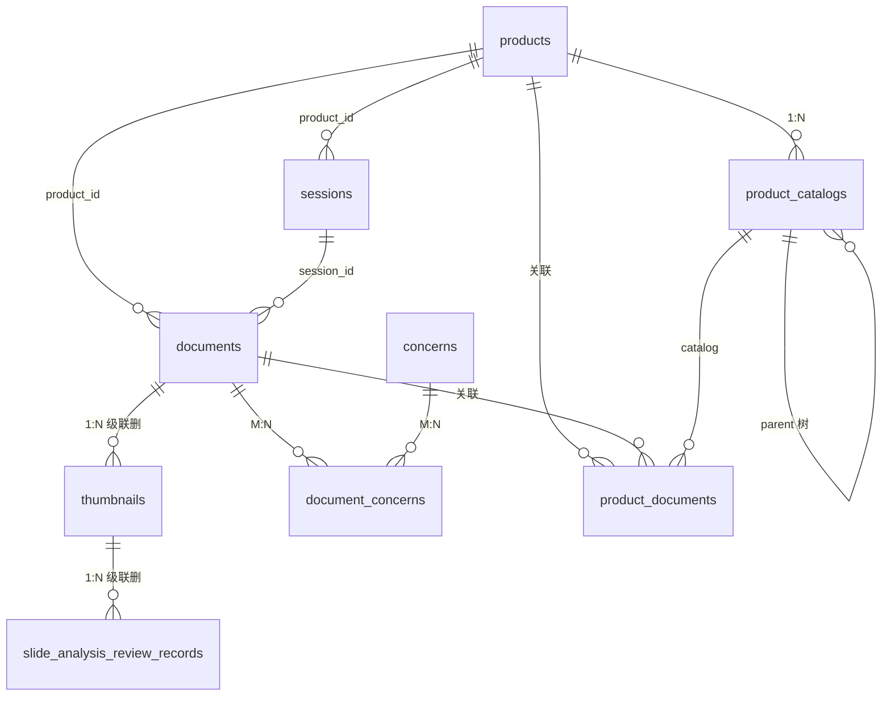
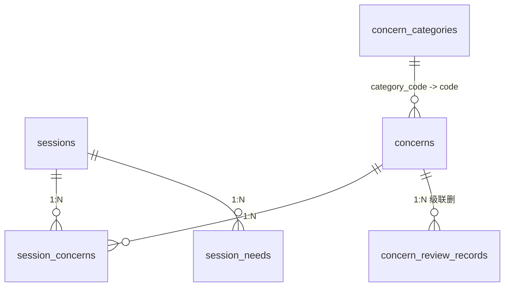
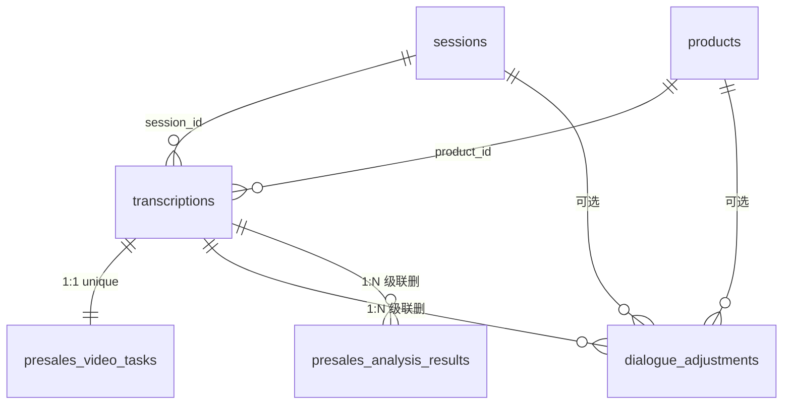
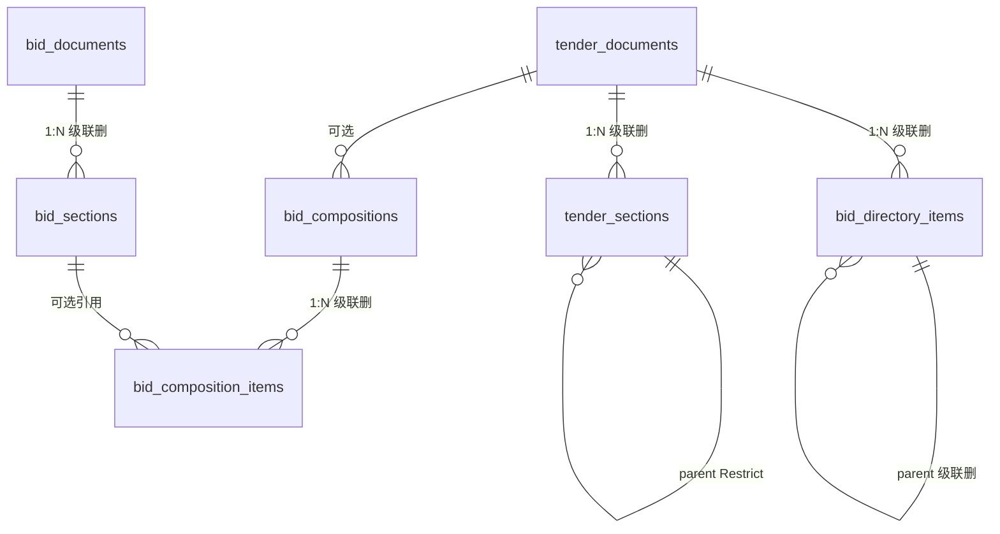
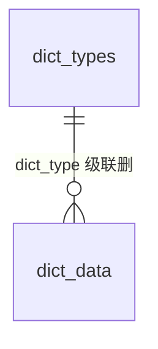
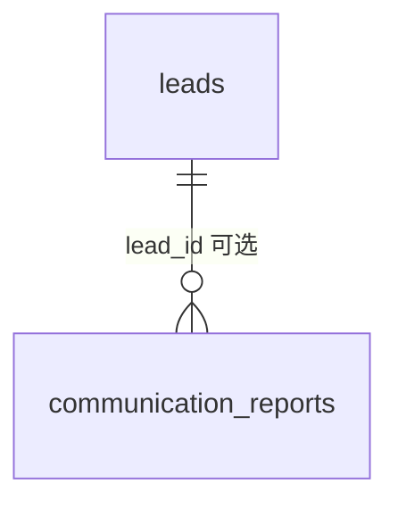

# online-ppt-backend 数据库表结构清单与关联图谱

> **数据源**：`online-ppt-backend/prisma/schema.prisma`  
> **数据库**：MySQL（Prisma `provider = "mysql"`）  
> **说明**：本文档与当前 Prisma 模型一致；部分表仅逻辑关联 `_id` 字段，未在 Prisma 中声明 `@relation`（文中已标注）。

**最后同步日期**：2026-03-27

---

## 一、全表总览（按业务模块）

| 序号 | 表名（模型） | 中文说明 | Prisma 外键关系 |
|------|----------------|----------|-----------------|
| **PPT / 文档** |
| 1 | `documents` | PPT 文档主表 | → `products`, `sessions` |
| 2 | `thumbnails` | 幻灯片缩略图 + AI 页类型 / 审核 | → `documents`（级联删） |
| 3 | `slide_analysis_review_records` | 缩略图 AI 分析审核历史 | → `thumbnails`（级联删） |
| 4 | `slide_merged_contents` | 幻灯片合并文本（全文检索） | 仅 `document_id` 逻辑关联 `documents` |
| 5 | `document_concerns` | 文档—关心问题 多对多 | → `documents`, `concerns`（级联删） |
| **产品 / 目录** |
| 6 | `products` | 产品 | 被多处引用 |
| 7 | `product_catalogs` | 产品目录（树） | 自关联 `parent_id`；→ `products` |
| 8 | `product_documents` | 产品—文档—目录 关联 | → `products`, `documents`, `product_catalogs` |
| **交流场次 / QA** |
| 9 | `sessions` | 客户交流场次 | → `products` |
| 10 | `session_concerns` | 场次—关心问题 | → `sessions`, `concerns` |
| 11 | `session_needs` | 场次潜在需求 | → `sessions` |
| 12 | `concern_categories` | 问答分类字典 | — |
| 13 | `concerns` | 关心问题 / 问答对 | → `concern_categories`（`category_code`→`code`） |
| 14 | `concern_review_records` | 问答审核历史 | → `concerns`（级联删） |
| **系统配置 / AI** |
| 15 | `prompt_templates` | 提示词模板 | — |
| 16 | `ai_model_configs` | AI 模型配置 | — |
| 17 | `dict_types` / `dict_data` | 数据字典 | `dict_data` → `dict_types` |
| **语音转录 / 售前** |
| 18 | `transcriptions` | 语音转录 | → `sessions`, `products` |
| 19 | `presales_video_tasks` | 售前视频生成主任务（1:1 转录） | → `transcriptions`（级联删） |
| 20 | `dialogue_adjustments` | 对话调整记录 | → `transcriptions`；可选 → `sessions`, `products` |
| 21 | `presales_analysis_results` | 售前综合分析结果 | → `transcriptions`（级联删） |
| **模板 / 扫描 / 用户** |
| 22 | `templates` | PPT 模板 | — |
| 23 | `file_scan_history` | 文件自动扫描历史 | `document_id` 无 `@relation` |
| 24 | `users` | 用户 | `department_id` 与 `departments` 关系已注释 |
| 25 | `audit_logs` | 审计日志 | `user_id` 字符串，无 FK |
| **招投标** |
| 26 | `tender_documents` | 招标文件 | — |
| 27 | `tender_sections` | 招标文件章节树 | → `tender_documents`；自关联 |
| 28 | `bid_directory_items` | AI 生成的投标目录树 | → `tender_documents`；自关联 |
| 29 | `bid_documents` | 历史投标文件 | — |
| 30 | `bid_sections` | 投标章节库 | → `bid_documents` |
| 31 | `bid_compositions` | 投标组合 | → `tender_documents`（可选） |
| 32 | `bid_composition_items` | 组合明细 | → `bid_compositions`；可选 → `bid_sections` |
| 33 | `bid_section_types` | 投标章节类型枚举 | — |
| 34 | `personal_documents` | 个人合并文档 | — |
| **外部同步 / 线索 / 报备** |
| 35 | `departments` | 部门（树字段存在，自关联已注释） | — |
| 36 | `lead_categories` | 线索分类 | — |
| 37 | `customer_types` | 客户类型 | — |
| 38 | `customers` | 客户 | 与 `customer_types` 关系已注释 |
| 39 | `leads` | 线索 | 与分类/客户关系已注释；→ `communication_reports` |
| 40 | `communication_reports` | 交流报备 | → `leads`（可选） |
| 41 | `communication_report_inbox` | 报备推送收件箱 | — |
| **爬取** |
| 42 | `scraping_infos` | 网站招标/中标爬取数据 | — |

---

## 二、外键与级联策略速查

| 子表 | 外键字段 | 父表 | onDelete |
|------|-----------|------|----------|
| thumbnails | document_id | documents | Cascade |
| slide_analysis_review_records | thumbnail_id | thumbnails | Cascade |
| document_concerns | document_id, concern_id | documents, concerns | Cascade |
| product_catalogs | parent_id | product_catalogs | Cascade |
| product_catalogs | product_id | products | Cascade |
| product_documents | product_id, document_id | products, documents | Cascade（catalog 可空） |
| product_documents | catalog_id | product_catalogs | 默认 Restrict |
| session_concerns | session_id, concern_id | sessions, concerns | Cascade |
| session_needs | session_id | sessions | Cascade |
| sessions | product_id | products | 默认 |
| documents | product_id, session_id | products, sessions | 默认 |
| concerns | category_code | concern_categories.code | 默认 |
| concern_review_records | concern_id | concerns | Cascade |
| transcriptions | session_id, product_id | sessions, products | 默认 |
| presales_video_tasks | transcription_id | transcriptions | Cascade |
| dialogue_adjustments | transcription_id | transcriptions | Cascade |
| dialogue_adjustments | session_id, product_id | sessions, products | 默认 |
| presales_analysis_results | transcription_id | transcriptions | Cascade |
| dict_data | dict_type | dict_types.dict_type | Cascade |
| tender_sections | tender_id | tender_documents | Cascade |
| tender_sections | parent_section_id | tender_sections | Restrict |
| bid_directory_items | tender_id | tender_documents | Cascade |
| bid_directory_items | parent_id | bid_directory_items | Cascade |
| bid_sections | bid_document_id | bid_documents | Cascade |
| bid_compositions | tender_id | tender_documents | 默认 |
| bid_composition_items | composition_id | bid_compositions | Cascade |
| bid_composition_items | section_id | bid_sections | 默认 |
| communication_reports | lead_id | leads | 默认 |

---

## 三、分表字段明细（与 Prisma 一致）

以下为各表字段清单；类型列为 **Prisma 类型**，括号内为 `@db` 映射（若有）。

### 3.1 `documents` — PPT 文档

| 字段 | 类型 | 说明 |
|------|------|------|
| id | String(50) PK | 文档 ID |
| name | String(255) | 名称 |
| cover | String(500)? | 封面 URL |
| category | String(50) | 分类，默认 uncategorized |
| status | String(20) | draft / published |
| tag | String(20) | public / practical |
| content_file_path | String(500) | 内容文件路径 |
| slide_count | Int | 幻灯片数 |
| file_size | BigInt | 字节 |
| customer_name | String(255)? | 客户名称 |
| product, industry, audience | Json? | 数组元数据 |
| audience_names | Text? | 交流对象姓名 |
| language | String(50)? | 语言 |
| product_id, session_id | String(50)? | 回传关联 |
| source_document_id, source_document_name | String? | 溯源 |
| created_at, updated_at | DateTime | 时间戳 |
| last_opened_at | DateTime? | 最后打开 |
| view_count | Int | 阅读次数 |
| created_by | String(50)? | 创建人 |

索引：`category`, `created_at`, `customer_name`, `product_id`, `session_id`, `status`, `created_by`。

### 3.2 `thumbnails` — 缩略图

| 字段 | 类型 | 说明 |
|------|------|------|
| id | String(100) PK | 缩略图 ID |
| document_id | String(50) FK | 文档 |
| slide_id | String(50) | 幻灯片 ID |
| slide_index | Int | 从 0 起 |
| url | String(500) | 图片 URL |
| width, height | Int | 像素 |
| size | Int? | 文件大小 |
| format | String(20) | 默认 jpeg |
| has_text, has_image | Boolean | 元数据 |
| element_count | Int | 元素数 |
| page_type, page_type_confidence | String? / Float? | AI 页类型 |
| analyzed_at | DateTime? | AI 分析时间 |
| review_status | String(20) | pending / approved / rejected |
| reviewed_at, reviewer_id | DateTime? / String? | 审核 |
| generated_at | DateTime | 生成时间 |

唯一：`(document_id, slide_id)`。

### 3.3 `slide_analysis_review_records`

| 字段 | 类型 | 说明 |
|------|------|------|
| id | String(50) PK | |
| thumbnail_id | String(100) FK | → thumbnails |
| action | String(20) | approve / reject / modify_approve |
| content_before, content_after | Json? | 修改前后 |
| reviewer_id | String(50)? | |
| review_time | DateTime | |
| remark | Text? | |

### 3.4 `slide_merged_contents`

| 字段 | 类型 | 说明 |
|------|------|------|
| id | String(50) PK | |
| document_id, slide_id | String(50) | 逻辑关联文档 |
| merged_content | Text | 合并文本 |
| content_length | Int | |
| slide_order | Int | 顺序 |
| file_name | String(255) | |
| extract_method | String(20) | auto / manual |
| created_at, updated_at | DateTime | |

唯一：`(document_id, slide_id)`；全文索引：`merged_content`。

### 3.5 `document_concerns`

| 字段 | 类型 | 说明 |
|------|------|------|
| id | String(50) PK | |
| document_id, concern_id | String(50) FK | |
| sort_order | Int | |
| created_at | DateTime | |

唯一：`(document_id, concern_id)`。

### 3.6 `products`

| 字段 | 类型 | 说明 |
|------|------|------|
| id | String(50) PK | |
| name | String(255) | |
| code | String(100)? UNIQUE | 产品代码 |
| description | Text? | |
| category | String(50)? | |
| tags | Json? | |
| icon, cover | String(500)? | |
| sort_order | Int | |
| is_active, is_featured | Boolean | |
| created_at, updated_at | DateTime | |

### 3.7 `product_catalogs`

| 字段 | 类型 | 说明 |
|------|------|------|
| id | String(50) PK | |
| product_id | String(50)? FK | 可空（共用目录） |
| parent_id | String(50)? FK | 树形父节点 |
| name | String(255) | |
| code | String(100)? | 对应 thumbnail.pageType 等 |
| description | Text? | |
| sort_order, level | Int | |
| is_active | Boolean | |
| created_at, updated_at | DateTime | |

### 3.8 `product_documents`

| 字段 | 类型 | 说明 |
|------|------|------|
| id | String(50) PK | |
| product_id, document_id | String(50) FK | |
| catalog_id | String(50)? FK | 二级目录 |
| version | String(20) | public / practical |
| slide_pages | Json? | 页码数组 |
| sort_order | Int | |
| created_at, updated_at | DateTime | |

唯一：`(product_id, document_id, catalog_id)`。

### 3.9 `sessions`

| 字段 | 类型 | 说明 |
|------|------|------|
| id | String(50) PK | |
| title | String(255) | 主题 |
| customer_name | String(255) | |
| session_date | DateTime | 会议时间 |
| duration | Int? | 分钟 |
| location, video_url, thumbnail | String? | |
| participants | Json? | |
| product_id | String(50)? FK | |
| industry | Json? | |
| status | String(20) | draft / completed |
| created_at, updated_at | DateTime | |
| created_by | String(50)? | |

### 3.10 `session_concerns` / `session_needs`

- **session_concerns**：id, session_id, concern_id, sort_order, created_at；唯一 `(session_id, concern_id)`。  
- **session_needs**：id, session_id, need(Text), priority, status, sort_order, created_at, updated_at。

### 3.11 `concern_categories`

| 字段 | 类型 | 说明 |
|------|------|------|
| id | String(50) PK | |
| code | String(50) UNIQUE | 分类代码 |
| name | String(255) | |
| type | String(20) | level / category / intent |
| parent_code | String(50)? | 层级 |
| level | Int | |
| description | Text? | |
| keywords | Json? | |
| sort_order | Int | |
| is_active | Boolean | |
| created_at, updated_at | DateTime | |

### 3.12 `concerns`

核心字段：question(Text), category, category_code, intent_code, priority, answer, status；优化备份 question_original, answer_original；转录相关 time_range*, question_speaker, answer_speaker, transcription_id；展示 likes, expert_*；审核 review_status, reviewed_at, reviewer_id；时间戳 created_at, updated_at。

### 3.13 `concern_review_records`

id, concern_id FK, action, reviewer_id, review_time, remark, content_before/after(Json), created_at。

### 3.14 `prompt_templates`

id, name, code UNIQUE, type, description, prompt(Text), is_active, sort_order, created_at, updated_at, variables(Json), version, scene_type。

### 3.15 `transcriptions`

含音频路径/格式/时长、dialogues/full_text(LongText)、讯飞 order_id、speaker 相关、业务维度（session_id, product_id, customer_name, industry, meeting_type 等）、status/progress/error、时间戳与 completed_at。全文索引：`full_text`。

### 3.16 `presales_video_tasks`

id, transcription_id UNIQUE FK, coze_file_id/name, local_dialogue_txt_path, execute_id, pipeline_status, analysis_content(LongText，分析完内容), video_address(视频地址), reserve_3..5, last_error, created_at, updated_at。

### 3.17 `dialogue_adjustments`

结构与转录类似副本字段 + adjusted_dialogues；FK：transcription_id（级联）, session_id, product_id；全文：`full_text`。

### 3.18 `presales_analysis_results`

id, transcription_id FK, model_id/name, prompt_code/name, analysis_result(LongText), dialogue_count, analysis_time, confidence(Decimal 3,2), status, error_message, 时间戳。

### 3.19 `ai_model_configs`

id, name, code UNIQUE, provider, model_name, api_url, api_key, api_secret, max_tokens, temperature, top_p, scene_type, is_default, extra_config(Json), supports_* , cost_per_1k_tokens(Decimal), total_calls, total_tokens, is_active, is_available, last_check_at, error_count, sort_order, created_at, updated_at, created_by, remark。

### 3.20 `dict_types` / `dict_data`

- **dict_types**：id, dict_type UNIQUE, dict_name, status, remark, sort_order, 时间戳。  
- **dict_data**：id, dict_type FK→dict_types.dict_type, dict_label, dict_value, dict_sort, css_class, list_class, is_default, status, remark, 时间戳；唯一 `(dict_type, dict_value)`。

### 3.21 `file_scan_history`

id, file_path UNIQUE, file_name, file_size, file_type, modified_time, processed_time, document_id?, status, error_message, scan_time, 时间戳。

### 3.22 `templates`

id, name, cover, category, origin, status, slide_count, content_file_path, created_by, updated_by, created_at, updated_at。

### 3.23 `users`

id, username UNIQUE, name, department_id, department_name, email UNIQUE?, password_hash?, role, status, cas_username UNIQUE?, last_login_at, login_count, created_by, created_at, updated_at。

### 3.24 `audit_logs`

id, user_id, username, action, resource, resource_id?, detail(Json), ip_address, user_agent, created_at。

### 3.25 招投标核心表（摘要）

- **tender_documents**：招标文件元数据、raw_text、raw_html_path、analysis_result/directory_json(Json)、status、项目字段、created_by、时间戳。  
- **tender_sections**：tender_id FK，title, level, sort_order, parent_section_id 自关联。  
- **bid_directory_items**：tender_id FK，树形 parent_id，title, level, default_content/html, user_content, content_status, section_type, scoring_weight, docx_file_path，时间戳。  
- **bid_documents**：投标文件拆分源文件，status 含 splitting 等，section_count，行业/项目类型等。  
- **bid_sections**：bid_document_id FK，title, content, html_content_path, content_length, section_type, level, sort_order, tags(Json), quality_score, is_reusable, docx_file_path, parent_section_id；全文 content/title。  
- **bid_compositions**：name, tender_id?, description, status, docx_file_path, template_name, created_by，时间戳。  
- **bid_composition_items**：composition_id FK Cascade，section_id?→bid_sections，title, custom_content, sort_order, level, source_type, docx_file_path，时间戳。  
- **personal_documents**：name, file_path, file_type, file_size, source_type, source_ids(Json), created_by，时间戳。  
- **bid_section_types**：Int id autoincrement，code UNIQUE, name, description, sort_order, is_active，时间戳。

### 3.26 外部同步与报备

- **departments**：树形字段 parent_id, level, sort_order 等（Prisma 自关联已注释）。  
- **lead_categories**, **customer_types**, **customers**, **leads**：主数据字段见 schema；多处与 leads/customers 的 `@relation` 已注释，仅 **leads** ↔ **communication_reports** 生效。  
- **communication_reports**：报备业务字段 + lead_id FK。  
- **communication_report_inbox**：sender, sent_at, content, created_at。

### 3.27 `scraping_infos`

自增 Int id；keyword, type, sub_type, title, 省市区, detail(Text), 发布时间/标书获取时间, 项目编号/预算/中标金额, 招标方式, 业主与联系人, 中标单位, 招标代理, bid_deadline, detail_url, product_related, reserve 字段，created_at, updated_at。

---

## 四、关联关系图谱（Mermaid）

> 下图按域拆分，便于在暗色主题下阅读；语法已按 Mermaid `erDiagram` 校验。

### 4.1 文档、缩略图、产品与场次

### 4.2 交流场次、问答分类与审核

### 4.3 转录、售前分析、视频任务、对话调整

<think>

### 4.4 招投标：招标、目录树、章节库与组合

### 4.5 数据字典与逻辑孤立表

以下模型在 Prisma 中**无指向其他表的 `@relation`**（或仅注释掉的关联）：`prompt_templates`、`ai_model_configs`、`templates`、`file_scan_history`（含 `document_id` 字符串）、`users`、`audit_logs`、`personal_documents`、`bid_section_types`、`scraping_infos`、`departments`、`lead_categories`、`customer_types`、`customers`、`communication_report_inbox`。

### 4.6 线索与交流报备

> **说明**：`leads` 与 `lead_categories`、`customers` 在 schema 中关系字段已注释，图中不画 FK；若库表已加外键需以实际迁移为准。

---

## 五、逻辑关联（无 Prisma 关系）

| 从表 | 字段 | 指向 | 说明 |
|------|------|------|------|
| slide_merged_contents | document_id | documents.id | 应用层保证一致性 |
| file_scan_history | document_id | documents.id | 可选 |
| concerns | transcription_id | transcriptions.id | 索引存在，无 `@relation` |

---

## 六、变更维护

- 修改 `schema.prisma` 后请同步更新本文档与 `npx prisma migrate` 迁移说明。
- 历史设计类说明见 `docs/database_schema.md`（可能与现网 Prisma 不一致，以本文档为准）。
