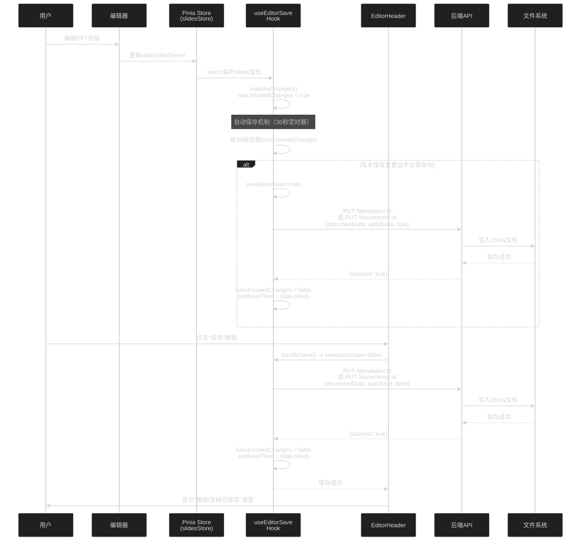
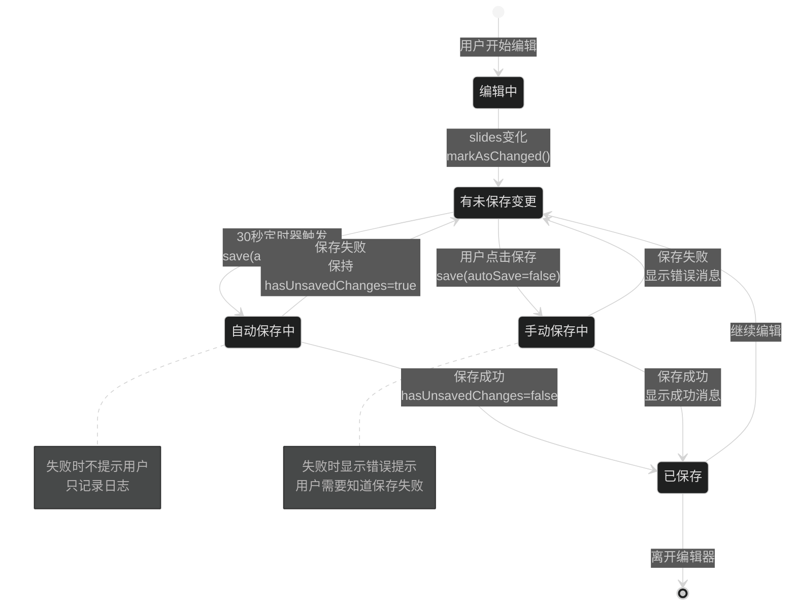

# PPT编辑器多层保存机制流程图

## 一、整体架构图

```mermaid
%%{init: {'theme':'dark'}}%%
graph TB
    subgraph "前端层"
        A[用户操作编辑器]
        B[Pinia Store<br/>slidesStore]
        C[useEditorSave Hook<br/>统一保存逻辑]
        D[EditorHeader<br/>UI交互层]
        G[IndexedDB 快照<br/>撤销/重做功能]
    end
    
    subgraph "本地存储（未使用）"
        H[templateDraftDB<br/>草稿缓存工具<br/>⚠️ 存在但未集成]
    end
    
    subgraph "后端层"
        E[Express API<br/>/templates/:id<br/>/documents/:id]
        F[文件系统<br/>data/templates/<br/>data/documents/]
    end
    
    A -->|编辑内容| B
    B -->|数据变化监听| C
    B -->|操作快照| G
    C -->|自动保存/手动保存| D
    D -->|触发保存| C
    C -->|PUT请求| E
    E -->|写入JSON文件| F
    
    H -.->|未使用| C
    
    style A fill:#4a5568,stroke:#68d391
    style B fill:#2d3748,stroke:#4299e1
    style C fill:#2d3748,stroke:#f6ad55
    style D fill:#2d3748,stroke:#9f7aea
    style G fill:#2d3748,stroke:#48bb78
    style H fill:#1a202c,stroke:#cbd5e0,stroke-dasharray: 5 5
    style E fill:#1a202c,stroke:#fc8181
    style F fill:#1a202c,stroke:#fbb6ce
```



## 二、数据流图



## 三、保存机制详细流程图

```mermaid
%%{init: {'theme':'dark'}}%%
flowchart TD
    Start([用户开始编辑]) --> Edit[编辑PPT内容]
    Edit --> UpdateStore[更新Pinia Store<br/>slidesStore.slides/title/theme]
    UpdateStore --> Watch[useEditorSave Hook<br/>watch监听slides变化]
    Watch --> MarkChanged[markAsChanged<br/>hasUnsavedChanges = true]
    
    MarkChanged --> AutoSaveTimer{30秒定时器<br/>检查保存条件}
    AutoSaveTimer -->|有变更且不在保存中| AutoSave[save函数<br/>autoSave=true]
    AutoSaveTimer -->|无变更或正在保存| Wait[继续等待]
    Wait --> AutoSaveTimer
    
    MarkChanged --> ManualSave{用户点击<br/>保存按钮?}
    ManualSave -->|是| ManualSaveFunc[save函数<br/>autoSave=false]
    
    AutoSave --> CheckMode{检查编辑模式}
    ManualSaveFunc --> CheckMode
    
    CheckMode -->|template模式| TemplateAPI[PUT /api/templates/:id<br/>body: templateData/data]
    CheckMode -->|document模式| DocumentAPI[PUT /api/documents/:id<br/>body: documentData/data]
    CheckMode -->|normal模式| SkipSave[跳过保存<br/>返回警告]
    
    TemplateAPI --> BackendSave[后端保存到文件系统<br/>data/templates/:id.json]
    DocumentAPI --> BackendSave
    BackendSave --> UpdateIndex[更新索引文件<br/>template-index.json<br/>document-index.json]
    UpdateIndex --> Success[返回成功响应]
    
    Success --> ResetFlag[hasUnsavedChanges = false<br/>lastSaveTime = Date.now]
    ResetFlag --> Finish([保存完成])
    
    AutoSave -.->|失败| LogError[记录日志<br/>不提示用户]
    ManualSaveFunc -.->|失败| ShowError[显示错误消息<br/>提示用户]
    
    style Start fill:#4a5568,stroke:#68d391
    style Edit fill:#2d3748,stroke:#4299e1
    style AutoSave fill:#2d3748,stroke:#f6ad55
    style ManualSaveFunc fill:#2d3748,stroke:#9f7aea
    style BackendSave fill:#1a202c,stroke:#fc8181
    style Finish fill:#4a5568,stroke:#68d391
    style LogError fill:#1a202c,stroke:#f56565
    style ShowError fill:#1a202c,stroke:#f56565
```



## 四、编辑模式识别流程

```mermaid
%%{init: {'theme':'dark'}}%%
flowchart LR
    Route[路由查询参数<br/>route.query] --> CheckTemplate{是否有<br/>templateId?}
    CheckTemplate -->|是| TemplateMode[template模式<br/>editMode = 'template']
    CheckTemplate -->|否| CheckDocument{是否有<br/>documentId?}
    CheckDocument -->|是| DocumentMode[document模式<br/>editMode = 'document']
    CheckDocument -->|否| NormalMode[normal模式<br/>editMode = 'normal']
    
    TemplateMode --> TemplateAPI[/api/templates/:id]
    DocumentMode --> DocumentAPI[/api/documents/:id]
    NormalMode --> NoSave[不保存到后端]
    
    style TemplateMode fill:#2d3748,stroke:#f6ad55
    style DocumentMode fill:#2d3748,stroke:#4299e1
    style NormalMode fill:#2d3748,stroke:#9f7aea
    style TemplateAPI fill:#1a202c,stroke:#fc8181
    style DocumentAPI fill:#1a202c,stroke:#fc8181
    style NoSave fill:#1a202c,stroke:#cbd5e0
```

## 五、状态管理图



## 六、关键组件交互图

```mermaid
%%{init: {'theme':'dark'}}%%
graph TB
    subgraph "EditorHeader组件"
        A1[保存按钮]
        A2[发布按钮]
        A3[返回按钮]
    end
    
    subgraph "useEditorSave Hook"
        B1[editMode<br/>computed属性]
        B2[currentId<br/>computed属性]
        B3[save函数]
        B4[自动保存定时器]
        B5[hasUnsavedChanges<br/>ref状态]
        B6[saving<br/>ref状态]
    end
    
    subgraph "Pinia Store"
        C1[slides<br/>幻灯片数据]
        C2[title<br/>标题]
        C3[theme<br/>主题]
    end
    
    subgraph "后端API"
        D1[PUT /templates/:id]
        D2[PUT /documents/:id]
    end
    
    A1 -->|调用| B3
    A2 -->|先保存再发布| B3
    B1 -->|根据URL参数| B2
    B3 -->|根据editMode| D1
    B3 -->|根据editMode| D2
    B4 -->|30秒检查| B5
    B5 -->|为true时| B3
    C1 -->|watch监听| B5
    C2 -->|getEditorData| B3
    C3 -->|getEditorData| B3
    
    style A1 fill:#2d3748,stroke:#9f7aea
    style B3 fill:#2d3748,stroke:#f6ad55
    style B4 fill:#2d3748,stroke:#4299e1
    style C1 fill:#1a202c,stroke:#68d391
    style D1 fill:#1a202c,stroke:#fc8181
    style D2 fill:#1a202c,stroke:#fc8181
```



## 七、数据持久化流程

```mermaid
%%{init: {'theme':'dark'}}%%
flowchart TD
    SaveRequest[保存请求] --> ExtractData[提取编辑器数据<br/>getEditorData]
    ExtractData --> GetData{获取数据}
    GetData --> Title[title: slidesStore.title]
    GetData --> Width[width: 1000]
    GetData --> Height[height: 562.5]
    GetData --> Theme[theme: slidesStore.theme]
    GetData --> Slides[slides: slidesStore.slides]
    
    Title --> BuildRequest[构建请求体]
    Width --> BuildRequest
    Height --> BuildRequest
    Theme --> BuildRequest
    Slides --> BuildRequest
    
    BuildRequest --> CheckMode{编辑模式?}
    CheckMode -->|template| TemplateBody[{templateData: data<br/>data: data<br/>autoSave: boolean}]
    CheckMode -->|document| DocumentBody[{documentData: data<br/>data: data<br/>autoSave: boolean}]
    
    TemplateBody --> PUTRequest[PUT请求]
    DocumentBody --> PUTRequest
    
    PUTRequest --> BackendRouter[后端路由处理]
    BackendRouter --> ValidateData[验证数据]
    ValidateData --> WriteFile[写入JSON文件<br/>data/templates/:id.json<br/>或<br/>data/documents/:id.json]
    WriteFile --> UpdateMeta[更新元数据索引<br/>计算fileSize和slideCount]
    UpdateMeta --> SaveIndex[保存索引文件<br/>template-index.json<br/>或<br/>document-index.json]
    SaveIndex --> ReturnResponse[返回成功响应]
    
    style SaveRequest fill:#4a5568,stroke:#68d391
    style BuildRequest fill:#2d3748,stroke:#4299e1
    style WriteFile fill:#1a202c,stroke:#fc8181
    style ReturnResponse fill:#4a5568,stroke:#68d391
```

## 八、关键特性说明

### 1. 多层架构
- **UI层**：EditorHeader 提供用户交互界面
- **Hook层**：useEditorSave 统一保存逻辑，支持多种模式
- **Store层**：Pinia Store 管理应用状态
- **API层**：后端接口处理数据持久化

### 2. 自动保存机制
- **触发条件**：仅在 template/document 模式下生效
- **检查频率**：每30秒检查一次
- **保存条件**：hasUnsavedChanges = true 且不在保存中
- **失败处理**：自动保存失败不提示用户，只记录日志

### 3. 手动保存机制
- **触发方式**：用户点击保存按钮
- **失败处理**：显示错误消息提示用户
- **状态更新**：保存成功后更新 lastSaveTime 和 hasUnsavedChanges

### 4. 编辑模式识别
- **template模式**：URL包含 templateId 参数
- **document模式**：URL包含 documentId 参数
- **normal模式**：无上述参数，不保存到后端

### 5. 数据同步
- **监听机制**：watch 监听 slidesStore.slides 变化
- **变更标记**：数据变化时自动标记 hasUnsavedChanges = true
- **状态重置**：保存成功后重置 hasUnsavedChanges = false

## 九、本地缓存说明

### ⚠️ 当前状态：未使用本地缓存

**实际情况：**
- ❌ `useEditorSave` Hook **未使用本地缓存**
- ❌ 数据**直接保存到后端服务器**，无本地备份
- ⚠️ 如果网络中断或后端服务异常，编辑内容可能丢失

**项目中存在的本地缓存工具：**
- ✅ `templateDraftDB.ts` - 模板草稿本地缓存工具（IndexedDB）
- ✅ `IndexedDB 快照` - 用于撤销/重做功能（仅存储操作历史，不用于持久化）

### 💡 建议改进方案

如果需要增加本地缓存，可以考虑以下方案：

1. **保存前先写入本地缓存**
   - 每次保存时，先将数据写入 IndexedDB
   - 再发送请求到后端
   - 后端保存成功后再清除本地缓存

2. **失败时从本地恢复**
   - 后端保存失败时，提示用户使用本地缓存恢复
   - 支持离线编辑模式

3. **定期本地备份**
   - 除了30秒自动保存到后端，也可以每5-10秒保存到本地
   - 防止意外关闭浏览器导致数据丢失
