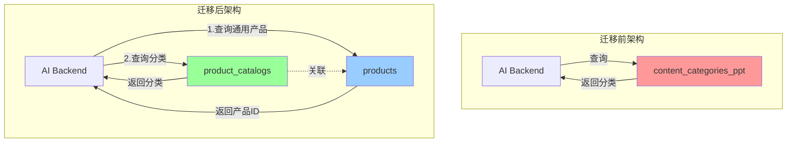
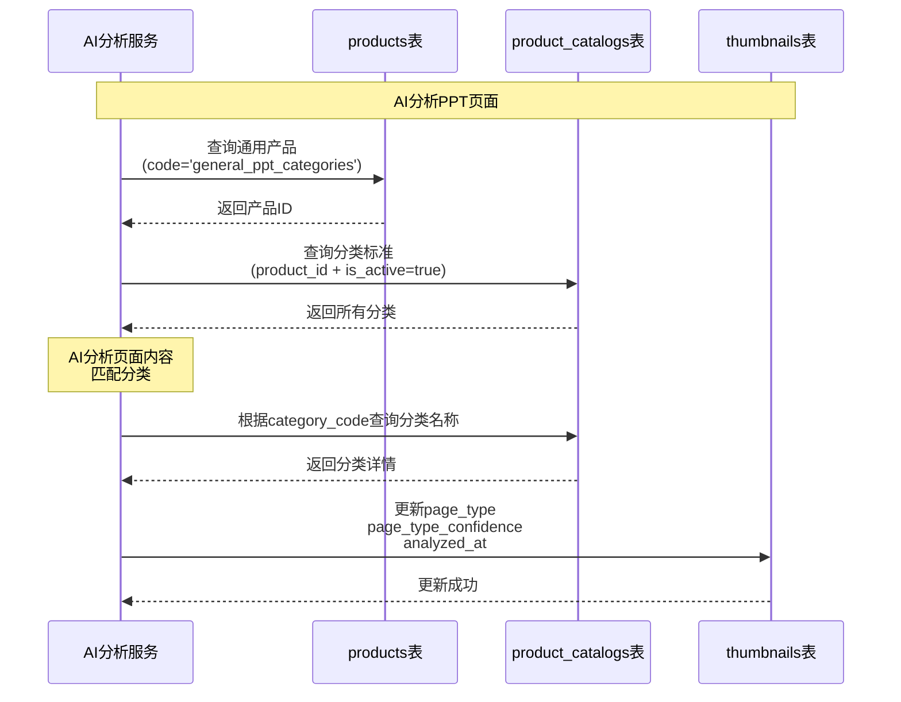
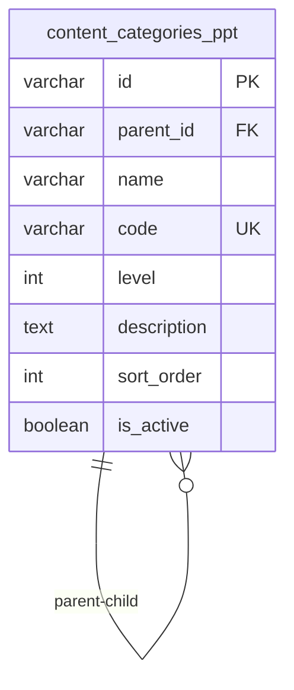
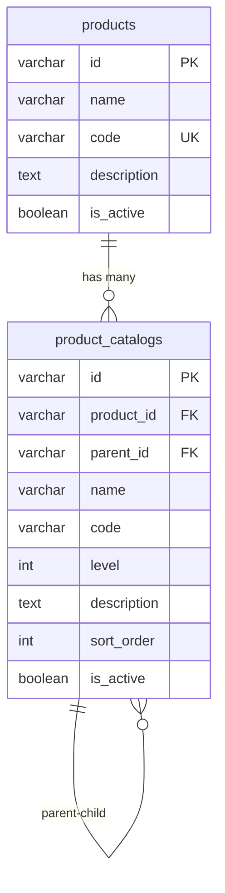
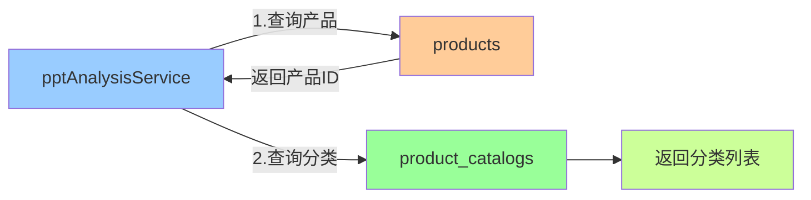
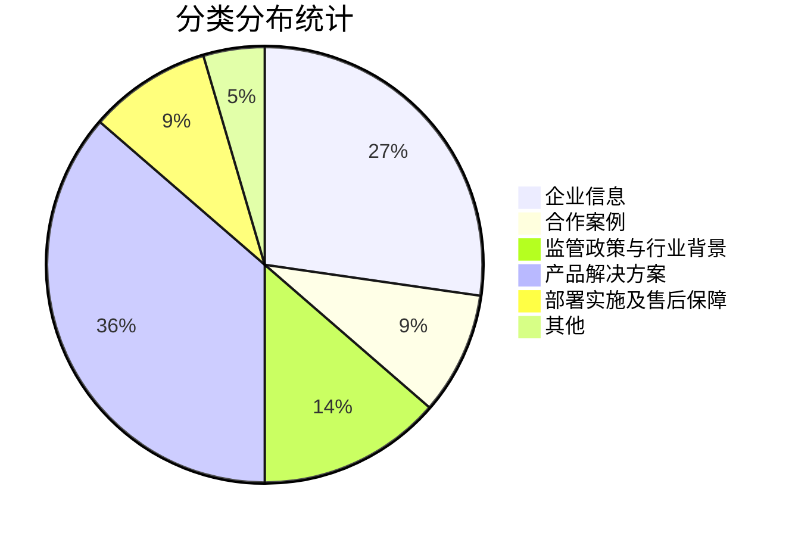
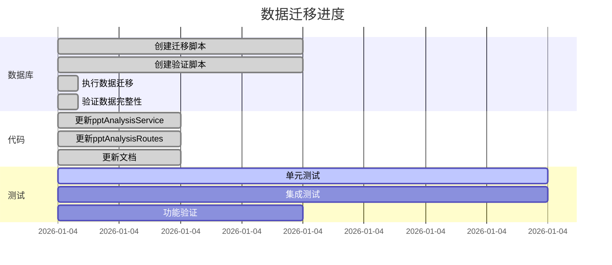

# 数据迁移架构图

## 📊 迁移前后对比

## 🔄 数据流转图

## 🏗️ 数据库结构变化

### 迁移前：独立的分类表

### 迁移后：关联产品的目录体系

## 📂 代码调用链变化

### 迁移前：单表查询

### 迁移后：两步查询

## 🔍 分类结构可视化

```mermaid
graph TD
    Root[通用PPT内容分类<br/>general_ppt_categories]
    
    Root --> L1_1[企业信息<br/>enterprise_info]
    Root --> L1_2[合作案例<br/>cooperation_cases]
    Root --> L1_3[监管政策与行业背景<br/>regulatory_policy_industry]
    Root --> L1_4[产品解决方案<br/>product_solutions]
    Root --> L1_5[部署实施及售后保障<br/>deployment_after_sales]
    Root --> L1_6[其他<br/>other]
    
    L1_1 --> L2_1_1[企业基础信息]
    L1_1 --> L2_1_2[企业资质认证]
    L1_1 --> L2_1_3[业务条线介绍]
    L1_1 --> L2_1_4[业务咨询实力]
    L1_1 --> L2_1_5[技术研发实力]
    L1_1 --> L2_1_6[工程交付实力]
    
    L1_2 --> L2_2_1[监管合作]
    L1_2 --> L2_2_2[机构合作]
    
    L1_3 --> L2_3_1[监管发文与背景分析]
    L1_3 --> L2_3_2[行业发展趋势]
    L1_3 --> L2_3_3[监管相关要求]
    
    L1_4 --> L2_4_1[客户痛点/难点]
    L1_4 --> L2_4_2[解决方案概述]
    L1_4 --> L2_4_3[产品架构设计]
    L1_4 --> L2_4_4[产品功能详解]
    L1_4 --> L2_4_5[Demo 与交互演示]
    L1_4 --> L2_4_6[产品优势说明]
    L1_4 --> L2_4_7[产品应用场景]
    L1_4 --> L2_4_8[软硬件资源需求]
    
    L1_5 --> L2_5_1[实施服务流程]
    L1_5 --> L2_5_2[售后服务保障]
    
    L1_6 --> L2_6_1[其他内容]
    
    style Root fill:#ff9999
    style L1_1 fill:#99ccff
    style L1_2 fill:#99ccff
    style L1_3 fill:#99ccff
    style L1_4 fill:#99ccff
    style L1_5 fill:#99ccff
    style L1_6 fill:#99ccff
```

## 📊 迁移统计图

## ✅ 迁移进度看板

## 🎯 迁移效果对比

| 指标 | 迁移前 | 迁移后 | 变化 |
|-----|-------|-------|-----|
| **数据表数量** | 1 个独立表 | 2 个关联表 | 架构更规范 |
| **查询步骤** | 1 步 | 2 步 | 增加1次查询 |
| **扩展性** | ⭐⭐ | ⭐⭐⭐⭐⭐ | 支持多产品分类 |
| **数据完整性** | ✅ | ✅ | 保持一致 |
| **代码复杂度** | 简单 | 稍复杂 | 可通过缓存优化 |
| **维护性** | ⭐⭐⭐ | ⭐⭐⭐⭐⭐ | 统一架构 |

---

**图表生成时间**: 2026-01-04

