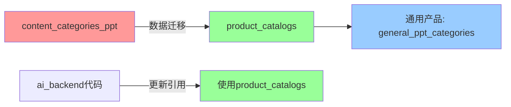

# 数据迁移指南：content_categories_ppt → product_catalogs

## 📋 迁移概览

本次迁移将 `content_categories_ppt` 表的数据迁移到 `product_catalogs` 表，并更新所有相关代码。



## 🎯 迁移目标

### 数据层
- ✅ 创建通用产品（`general_ppt_categories`）
- ✅ 迁移所有分类数据到 `product_catalogs`
- ✅ 保持层级关系和所有字段

### 代码层
- ✅ 更新 `pptAnalysisService.js` - 从 `product_catalogs` 读取分类
- ✅ 更新 `pptAnalysisRoutes.js` - 从 `product_catalogs` 读取分类
- ✅ 更新文档 - 更新所有引用

## 🚀 迁移步骤

### 步骤 1: 执行数据迁移

```bash
cd online-ppt-backend
node prisma/migrate-content-categories-to-product-catalogs.js
```

**预期输出**：
```
🚀 开始数据迁移：content_categories_ppt → product_catalogs
============================================================

📦 步骤 1: 检查/创建"通用产品"...
✅ 创建通用产品: 通用PPT内容分类 (xxx-xxx-xxx)

📋 步骤 2: 读取 content_categories_ppt 数据...
📊 共找到 30 条分类数据
   ├─ 一级分类: 6 条
   └─ 二级分类: 24 条

📤 步骤 4: 开始迁移数据...
  🔹 迁移一级分类...
     ✅ 企业信息 (enterprise_info)
     ✅ 合作案例 (cooperation_cases)
     ...
  🔹 迁移二级分类...
     ✅ 企业基础信息 (enterprise_basic_info)
     ...

✅ 步骤 5: 验证迁移结果...
📊 迁移结果统计:
   ├─ 源表总数: 30
   ├─ 目标表总数: 30
   ├─ 一级分类: 6 → 6
   └─ 二级分类: 24 → 24

🎉 数据迁移成功！
```

### 步骤 2: 验证数据完整性

```bash
node prisma/verify-product-catalogs.js
```

**验证项**：
- ✅ 通用产品存在
- ✅ 层级关系正确
- ✅ code 唯一性
- ✅ 数据完整性（数量一致）
- ✅ 字段完整性

**预期输出**：
```
🔍 验证 product_catalogs 数据完整性
============================================================

📦 1. 检查通用产品...
✅ 通用产品: 通用PPT内容分类 (xxx-xxx-xxx)

📊 2. 数据统计...
   总数: 30
   ├─ 一级目录: 6
   └─ 二级目录: 24

🔗 3. 验证层级关系...
   ✅ 所有二级目录的父级关系正确

🔑 4. 验证 code 唯一性...
   ✅ 所有 code 唯一 (共 30 个)

🔄 6. 对比源表 content_categories_ppt...
   源表总数: 30
   目标表总数: 30
   ✅ 数量一致
   ✅ 所有 code 完全匹配

============================================================
📊 验证总结:
   ✅ 通用产品存在
   ✅ 层级关系正确
   ✅ code 唯一性正确
   ✅ 数据完整性一致
   ✅ 字段完整性正确

🎉 所有验证通过！数据迁移完整且正确
```

### 步骤 3: 测试 AI 分析功能

#### 3.1 启动 AI 后端服务

```bash
cd ai_backend
npm start
```

#### 3.2 测试分类标准读取

```bash
# 测试接口：获取所有分类标准
curl http://localhost:3002/api/ppt-analysis/categories
```

**预期响应**：
```json
{
  "success": true,
  "data": [
    {
      "id": "xxx",
      "product_id": "通用产品ID",
      "name": "企业信息",
      "code": "enterprise_info",
      "level": 1,
      "description": "...",
      "sort_order": 1
    },
    ...
  ]
}
```

#### 3.3 测试单页分析

```bash
# 测试接口：分析单个页面
curl -X POST http://localhost:3002/api/ppt-analysis/analyze-single \
  -H "Content-Type: application/json" \
  -d '{
    "slideText": "公司简介：成立于2010年，专注金融科技...",
    "slideIndex": 0,
    "slideId": "slide_001",
    "modelName": "custom-openai"
  }'
```

**预期响应**：
```json
{
  "success": true,
  "result": {
    "category_code": "enterprise_basic_info",
    "confidence": 0.95,
    "reason": "...",
    "categoryName": "企业基础信息",
    "categoryDescription": "..."
  }
}
```

### 步骤 4: 测试完整文档分析

```bash
# 测试接口：分析整个文档
curl -X POST http://localhost:3002/api/ppt-analysis/analyze/doc_xxx \
  -H "Content-Type: application/json" \
  -d '{"modelName": "custom-openai"}'
```

**观察日志**：
```
[PPT分析] 开始分析文档: doc_xxx
[PPT分析] 使用模型: custom-openai
[PPT分析] 共找到 20 个页面需要分析
[PPT分析] 正在分析页面 1 (slide_001)...
[PPT分析] 页面 1 分析完成: enterprise_basic_info (置信度: 0.95)
...
[PPT分析] 文档分析完成!
[PPT分析] 成功: 18, 失败: 0, 跳过: 2
```

## ✅ 迁移检查清单

### 数据库层面
- [ ] 通用产品已创建（code: `general_ppt_categories`）
- [ ] 所有分类数据已迁移到 `product_catalogs`
- [ ] 一级分类数量一致（6条）
- [ ] 二级分类数量一致（24条）
- [ ] 层级关系正确（parent_id映射正确）
- [ ] 所有 code 唯一且一致

### 代码层面
- [ ] `pptAnalysisService.js` 已更新（getAllCategories、getAnalysisResults）
- [ ] `pptAnalysisRoutes.js` 已更新（/analyze-single、/statistics/:documentId）
- [ ] `prompts/README.md` 已更新文档说明
- [ ] `IMPLEMENTATION_SUMMARY.md` 已更新架构说明
- [ ] `PPT_ANALYSIS_README.md` 已更新使用说明

### 功能测试
- [ ] 获取分类标准接口正常
- [ ] 单页分析功能正常
- [ ] 批量分析功能正常
- [ ] 分类统计功能正常
- [ ] 分类名称显示正常

## 🔄 回滚方案

如果迁移出现问题，可以按以下步骤回滚：

### 1. 数据库回滚

```bash
# 删除迁移的数据
cd online-ppt-backend

# 执行 SQL
npx prisma studio
# 在 product_catalogs 表中删除 product_id = '通用产品ID' 的所有记录

# 或使用 Prisma
node -e "
const { PrismaClient } = require('@prisma/client');
const prisma = new PrismaClient();
(async () => {
  const product = await prisma.products.findFirst({ where: { code: 'general_ppt_categories' } });
  await prisma.product_catalogs.deleteMany({ where: { product_id: product.id } });
  console.log('已删除迁移数据');
  await prisma.\$disconnect();
})();
"
```

### 2. 代码回滚

```bash
# 使用 git 回滚代码更改
git checkout HEAD -- ai_backend/
```

### 3. 验证回滚

- 确认 `content_categories_ppt` 表数据完整
- 确认 AI 分析功能使用旧表
- 测试所有功能正常

## 📊 迁移对比

| 项目 | 迁移前 | 迁移后 |
|-----|-------|-------|
| **数据表** | `content_categories_ppt` | `product_catalogs` |
| **关联产品** | 无 | `general_ppt_categories` |
| **字段数量** | 9个字段 | 11个字段（新增product_id） |
| **层级支持** | ✅ 支持 | ✅ 支持 |
| **代码引用** | 直接查询 | 需先获取产品ID |
| **扩展性** | ❌ 无法按产品分类 | ✅ 支持多产品分类 |

## 🎯 迁移优势

### 1. 架构统一
- 所有产品目录统一使用 `product_catalogs` 表
- 便于后续扩展（如为不同产品定义不同的分类标准）

### 2. 数据关联
- 分类标准与产品关联
- 支持多产品、多分类体系

### 3. 功能扩展
- 可为特定产品定制分类标准
- 支持分类标准版本管理

## ⚠️ 注意事项

### 1. 通用产品ID
- 记录通用产品ID：`_______________`
- 所有分类查询都需要先获取此ID

### 2. 代码更新
- 所有查询 `content_categories_ppt` 的地方都需要更新
- 需要先查询通用产品，再查询分类

### 3. 性能考虑
- 增加了一次产品查询，可考虑缓存产品ID
- 建议在应用启动时缓存通用产品信息

### 4. 旧表保留
- `content_categories_ppt` 表暂时保留
- 确认迁移无误后，可以考虑删除（建议保留1-2周）

## 📞 问题排查

### 问题 1: 找不到通用产品

**现象**：
```
Error: 未找到通用PPT分类产品
```

**解决**：
```bash
# 检查产品是否存在
cd online-ppt-backend
npx prisma studio
# 在 products 表中查找 code = 'general_ppt_categories' 的记录

# 如果不存在，手动创建
node -e "
const { PrismaClient } = require('@prisma/client');
const prisma = new PrismaClient();
(async () => {
  await prisma.products.create({
    data: {
      id: require('crypto').randomUUID(),
      name: '通用PPT内容分类',
      code: 'general_ppt_categories',
      description: '通用的PPT内容分类标准',
      category: 'system',
      is_active: true,
      created_at: new Date(),
      updated_at: new Date()
    }
  });
  console.log('通用产品已创建');
  await prisma.\$disconnect();
})();
"
```

### 问题 2: 分类数据为空

**现象**：
```
分类标准数据为空,请先初始化分类数据
```

**解决**：
```bash
# 重新运行迁移脚本
cd online-ppt-backend
node prisma/migrate-content-categories-to-product-catalogs.js
```

### 问题 3: 分类名称显示"未知分类"

**原因**：
- code 不匹配
- 产品ID不正确

**解决**：
```bash
# 验证数据完整性
node prisma/verify-product-catalogs.js

# 检查 code 是否一致
```

## 📝 后续优化建议

### 1. 性能优化
```javascript
// 在应用启动时缓存通用产品ID
let cachedGeneralProductId = null;

async function getGeneralProductId() {
  if (!cachedGeneralProductId) {
    const product = await prisma.products.findFirst({
      where: { code: 'general_ppt_categories' }
    });
    cachedGeneralProductId = product?.id;
  }
  return cachedGeneralProductId;
}
```

### 2. 配置化
```javascript
// 在配置文件中定义
const CONFIG = {
  GENERAL_PRODUCT_CODE: 'general_ppt_categories'
};
```

### 3. 错误处理增强
```javascript
async function getAllCategories() {
  const productId = await getGeneralProductId();
  
  if (!productId) {
    throw new Error('系统配置错误：未找到通用PPT分类产品，请联系管理员');
  }
  
  const categories = await prisma.product_catalogs.findMany({
    where: { product_id: productId, is_active: true },
    orderBy: [{ level: 'asc' }, { sort_order: 'asc' }]
  });
  
  if (categories.length === 0) {
    throw new Error('分类标准数据为空，请先运行数据迁移脚本');
  }
  
  return categories;
}
```

## 🎉 迁移完成

如果所有测试通过，恭喜你完成了数据迁移！

**下一步**：
1. 更新前端代码（如有需要）
2. 通知团队成员迁移完成
3. 监控生产环境运行情况
4. 1-2周后考虑删除 `content_categories_ppt` 表

---

**最后更新**: 2026-01-04

