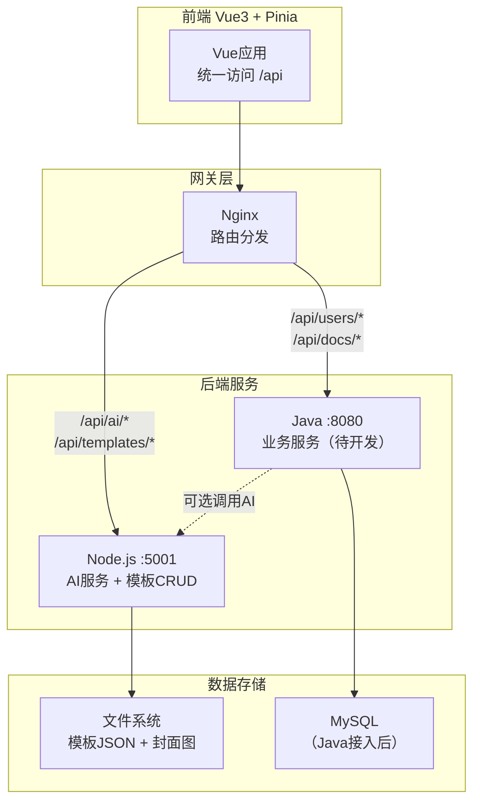
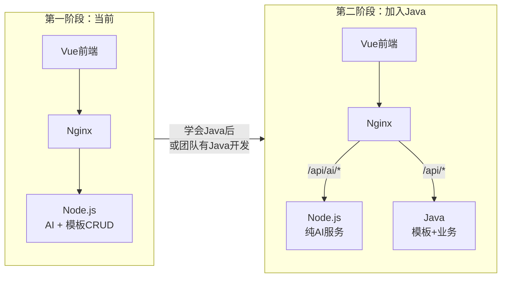
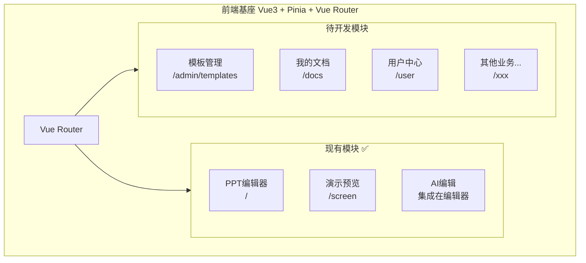
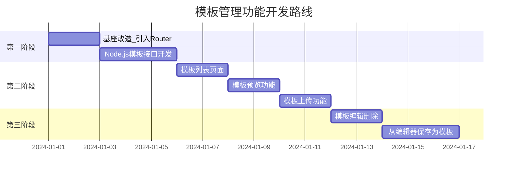
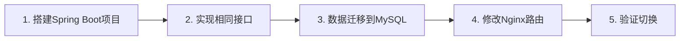

# PPT基座项目整合与模板管理规划

## 一、整体架构设计

### 1.1 目标架构（Nginx网关分发模式）



### 1.2 架构决策说明

| 决策点 | 选择 | 理由 |

|--------|------|------|

| **网关** | Nginx路由分发 | 前端只知一个地址，便于扩展 |

| **AI服务** | 保留Node.js | 流式响应(SSE)处理更方便 |

| **模板CRUD** | 先Node.js，后迁移Java | 快速验证，你是前端更熟悉JS |

| **AI请求路径** | 前端 → Nginx → Node | 不经过Java转发，避免流式响应复杂度 |

| **数据存储** | 先文件系统，后MySQL | 渐进式升级 |

### 1.3 分阶段演进路线



### 1.4 前端模块规划



### 1.5 核心原则

1. **AI服务不走Java转发** —— 流式响应(SSE)让Node直接处理更简单
2. **先快速验证再迁移** —— 模板CRUD先用Node实现，跑通后再迁Java
3. **接口设计保持一致** —— 迁移时前端只需改Nginx路由配置
4. **职责分离** —— Node专注AI，Java专注业务（未来）

---

## 二、模板管理功能设计

### 2.1 功能需求

| 功能 | 描述 | 优先级 |

|------|------|--------|

| 模板列表 | 分页展示所有模板 | P0 |

| 模板预览 | 查看模板全部页面 | P0 |

| 模板上传 | 上传JSON格式模板 | P0 |

| 模板编辑 | 修改模板名称、封面、分类 | P1 |

| 模板删除 | 删除模板 | P1 |

| 模板制作 | 在编辑器中制作并保存为模板 | P2 |

### 2.2 数据结构设计

```typescript
// 模板实体
interface Template {
  id: string              // 唯一标识
  name: string            // 模板名称
  cover: string           // 封面图URL
  category: string        // 分类: business/education/creative...
  origin: string          // 来源: official/community/user
  slides: Slide[]         // 模板页面数据
  createdAt: Date
  updatedAt: Date
  createdBy?: string      // 创建人（可选，用户系统接入后）
}
```

### 2.3 实现方案（已确定）

**采用方案：Node.js快速实现 → 后续迁移Java**

| 阶段 | 技术栈 | 存储 | 说明 |

|------|--------|------|------|

| 第一阶段（现在） | Node.js Express | 文件系统 | 快速实现，你更熟悉JS |

| 第二阶段（未来） | Java Spring Boot | MySQL | 学会Java后迁移，或团队接手 |

**迁移保障设计**：

1. 接口路径统一为 `/api/templates/*`
2. 请求/响应格式保持一致
3. 迁移时只需修改Nginx路由，前端代码零改动
```nginx
# 第一阶段 Nginx配置
location /api/templates {
    proxy_pass http://node-backend:5001;
}

# 第二阶段 Nginx配置（迁移后）
location /api/templates {
    proxy_pass http://java-backend:8080;
}
```


---

## 三、模板管理具体实现（方案B）

### 3.1 后端接口设计（Node.js扩展）

在 `online-ppt-backend/src/routes/` 新增 `templates.js`：

| 接口 | 方法 | 路径 | 说明 |

|------|------|------|------|

| 获取模板列表 | GET | /templates | 分页、筛选 |

| 获取模板详情 | GET | /templates/:id | 包含slides数据 |

| 创建模板 | POST | /templates | 上传模板JSON |

| 更新模板 | PUT | /templates/:id | 修改元信息 |

| 删除模板 | DELETE | /templates/:id | 软删除 |

| 上传封面 | POST | /templates/:id/cover | 图片上传 |

### 3.2 前端页面设计

在 `online-ppt-web/src/views/` 新增模板管理模块：

```
views/
├── Editor/           # 现有PPT编辑器
├── Screen/           # 现有演示模块
├── Admin/            # 新增：管理后台
│   ├── index.vue           # 后台布局
│   ├── TemplateList.vue    # 模板列表
│   ├── TemplateEdit.vue    # 模板编辑
│   └── TemplatePreview.vue # 模板预览
└── ...
```

### 3.3 路由配置

新增 `src/router/index.ts`：

```typescript
const routes = [
  { path: '/', component: Editor },           // 现有编辑器
  { path: '/screen', component: Screen },     // 现有演示
  { path: '/admin', component: AdminLayout, children: [
    { path: 'templates', component: TemplateList },
    { path: 'templates/:id', component: TemplateEdit },
  ]},
]
```

---

## 四、基座项目改造要点

### 4.1 引入Vue Router

当前项目是单页面，需要添加路由支持多页面：

1. 安装 `vue-router`
2. 创建路由配置
3. 修改 `App.vue` 为路由出口
4. 现有Editor作为默认路由

### 4.2 服务层抽象

现有 `src/services/templateService.ts` 已做好抽象准备，只需：

1. 添加后端API调用
2. 切换数据源（从本地mock到API）

### 4.3 权限预留

虽然当前不做认证，但结构上预留：

```typescript
// src/utils/auth.ts
export function isAdmin(): boolean {
  // 暂时返回true，后续对接认证
  return true
}
```

---

## 五、实施路线图



---

## 六、关键文件清单

| 文件 | 操作 | 说明 |

|------|------|------|

| `package.json` | 修改 | 添加vue-router依赖 |

| `src/router/index.ts` | 新增 | 路由配置 |

| `src/App.vue` | 修改 | 改为RouterView |

| `src/views/Admin/*` | 新增 | 管理后台页面 |

| `src/services/templateService.ts` | 修改 | 对接后端API |

| `online-ppt-backend/src/routes/templates.js` | 新增 | 模板CRUD接口 |

| `online-ppt-backend/src/services/templateService.js` | 新增 | 模板数据存储 |

---

## 七、后续扩展预留

| 后续需求 | 扩展方式 |

|----------|----------|

| 用户认证 | 添加登录页 + token拦截器 |

| PPT保存 | 新增documents接口 + 我的文档页 |

| 其他模块 | 在Admin下新增路由和页面 |

---

## 八、Java迁移指南（未来）

当你学会Java或团队有Java开发时，按以下步骤迁移：

### 8.1 迁移范围

| 模块 | 迁移到Java | 保留在Node |

|------|------------|------------|

| 模板CRUD | 是 | - |

| 用户认证 | 是 | - |

| PPT保存 | 是 | - |

| AI生成PPT | - | 是（流式响应） |

| AI对话编辑 | - | 是（流式响应） |

| 图片推荐 | - | 是 |

### 8.2 迁移步骤



1. **搭建Spring Boot项目**

   - 创建 `online-ppt-java` 项目
   - 配置MySQL数据源
   - 实现模板CRUD接口（路径保持 `/api/templates/*`）

2. **接口规范保持一致**
```java
// Java接口需与Node.js保持一致
GET    /api/templates          // 获取列表
GET    /api/templates/:id      // 获取详情
POST   /api/templates          // 创建
PUT    /api/templates/:id      // 更新
DELETE /api/templates/:id      // 删除
```

3. **修改Nginx路由**
```nginx
# 修改前（指向Node）
location /api/templates {
    proxy_pass http://node-backend:5001;
}

# 修改后（指向Java）
location /api/templates {
    proxy_pass http://java-backend:8080;
}

# AI接口保持不变
location /api/ai {
    proxy_pass http://node-backend:5001;
}
```

4. **前端零改动** —— 因为接口规范一致，前端代码无需修改